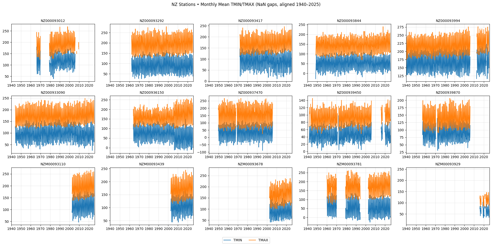
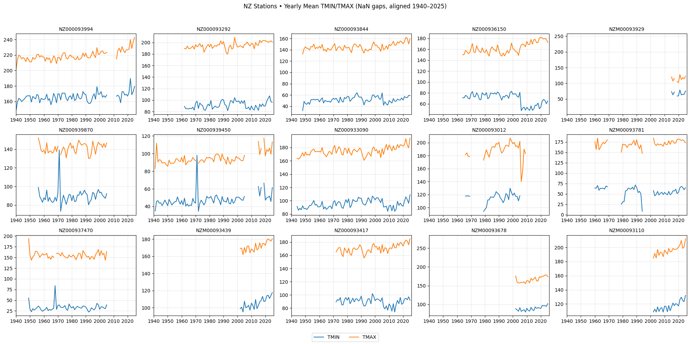
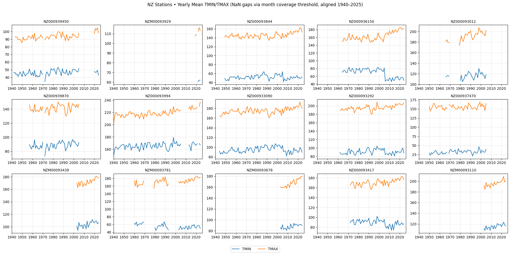
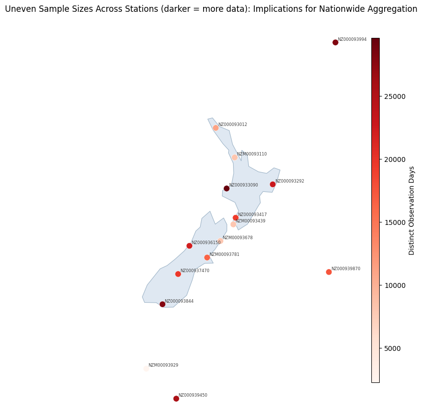
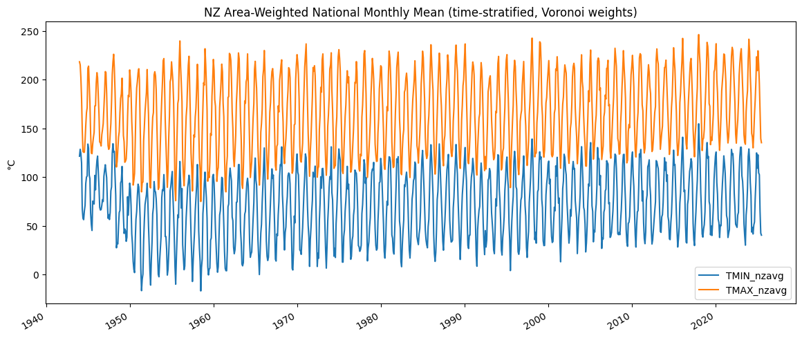
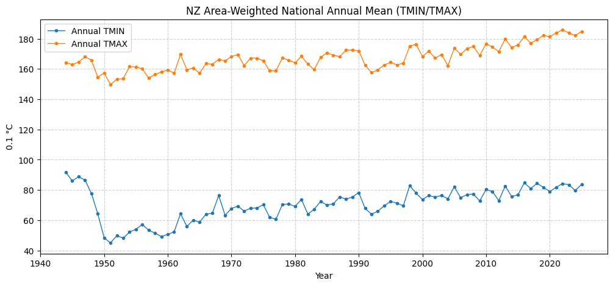
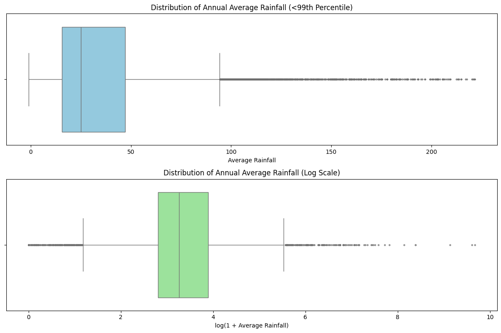
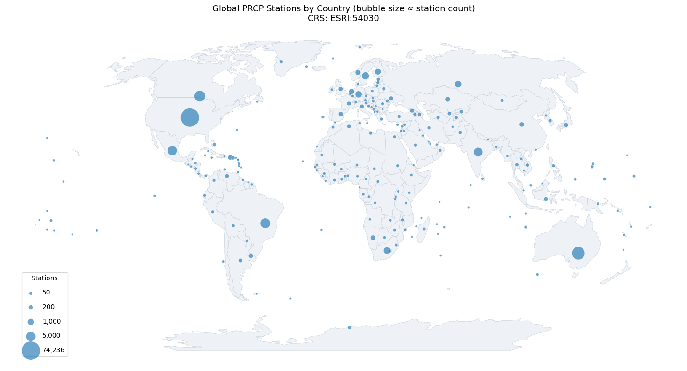
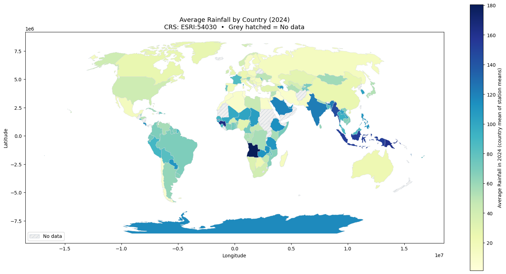
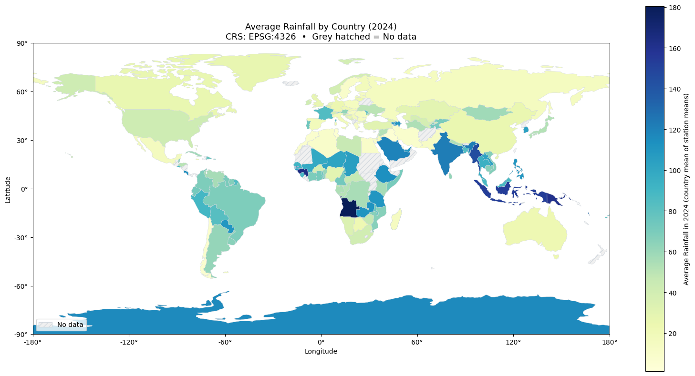

```python
# Run this cell to import pyspark and to define start_spark() and stop_spark()

import findspark

findspark.init()

import getpass
import random
import re

import pandas
import pyspark
from IPython.display import HTML, display
from pyspark import SparkContext
from pyspark.sql import SparkSession

# Constants used to interact with Azure Blob Storage using the hdfs command or Spark

global username

username = re.sub("@.*", "", getpass.getuser())

global azure_account_name
global azure_data_container_name
global azure_user_container_name
global azure_user_token

azure_account_name = "madsstorage002"
azure_data_container_name = "campus-data"
azure_user_container_name = "campus-user"
azure_user_token = r"sp=racwdl&st=2025-08-01T09:41:33Z&se=2026-12-30T16:56:33Z&spr=https&sv=2024-11-04&sr=c&sig=GzR1hq7EJ0lRHj92oDO1MBNjkc602nrpfB5H8Cl7FFY%3D"


# Functions used below


def dict_to_html(d):
    """Convert a Python dictionary into a two column table for display."""

    html = []

    html.append(f'<table width="100%" style="width:100%; font-family: monospace;">')
    for k, v in d.items():
        html.append(f'<tr><td style="text-align:left;">{k}</td><td>{v}</td></tr>')
    html.append(f"</table>")

    return "".join(html)


def show_as_html(df, n=20):
    """Leverage existing pandas jupyter integration to show a spark dataframe as html.

    Args:
        n (int): number of rows to show (default: 20)
    """

    display(df.limit(n).toPandas())


def display_spark():
    """Display the status of the active Spark session if one is currently running."""

    if "spark" in globals() and "sc" in globals():

        name = sc.getConf().get("spark.app.name")

        html = [
            f"<p><b>Spark</b></p>",
            f'<p>The spark session is <b><span style="color:green">active</span></b>, look for <code>{name}</code> under the running applications section in the Spark UI.</p>',
            f"<ul>",
            f'<li><a href="http://localhost:{sc.uiWebUrl.split(":")[-1]}" target="_blank">Spark Application UI</a></li>',
            f"</ul>",
            f"<p><b>Config</b></p>",
            dict_to_html(dict(sc.getConf().getAll())),
            f"<p><b>Notes</b></p>",
            f"<ul>",
            f"<li>The spark session <code>spark</code> and spark context <code>sc</code> global variables have been defined by <code>start_spark()</code>.</li>",
            f"<li>Please run <code>stop_spark()</code> before closing the notebook or restarting the kernel or kill <code>{name}</code> by hand using the link in the Spark UI.</li>",
            f"</ul>",
        ]
        display(HTML("".join(html)))

    else:

        html = [
            f"<p><b>Spark</b></p>",
            f'<p>The spark session is <b><span style="color:red">stopped</span></b>, confirm that <code>{username} (notebook)</code> is under the completed applications section in the Spark UI.</p>',
            f"<ul>",
            f'<li><a href="http://mathmadslinux2p.canterbury.ac.nz:8080/" target="_blank">Spark UI</a></li>',
            f"</ul>",
        ]
        display(HTML("".join(html)))


# Functions to start and stop spark


def start_spark(
    executor_instances=2, executor_cores=1, worker_memory=1, master_memory=1
):
    """Start a new Spark session and define globals for SparkSession (spark) and SparkContext (sc).

    Args:
        executor_instances (int): number of executors (default: 2)
        executor_cores (int): number of cores per executor (default: 1)
        worker_memory (float): worker memory (default: 1)
        master_memory (float): master memory (default: 1)
    """

    global spark
    global sc

    cores = executor_instances * executor_cores
    partitions = cores * 4
    port = 4000 + random.randint(1, 999)

    spark = (
        SparkSession.builder.config(
            "spark.driver.extraJavaOptions",
            f"-Dderby.system.home=/tmp/{username}/spark/",
        )
        .config("spark.dynamicAllocation.enabled", "false")
        .config("spark.executor.instances", str(executor_instances))
        .config("spark.executor.cores", str(executor_cores))
        .config("spark.cores.max", str(cores))
        .config("spark.driver.memory", f"{master_memory}g")
        .config("spark.executor.memory", f"{worker_memory}g")
        .config("spark.driver.maxResultSize", "0")
        .config("spark.sql.shuffle.partitions", str(partitions))
        .config(
            "spark.kubernetes.container.image",
            "madsregistry001.azurecr.io/hadoop-spark:v3.3.5-openjdk-8",
        )
        .config("spark.kubernetes.container.image.pullPolicy", "IfNotPresent")
        .config("spark.kubernetes.memoryOverheadFactor", "0.3")
        .config("spark.memory.fraction", "0.1")
        .config(
            f"fs.azure.sas.{azure_user_container_name}.{azure_account_name}.blob.core.windows.net",
            azure_user_token,
        )
        .config("spark.app.name", f"{username} (notebook)")
        .getOrCreate()
    )
    sc = SparkContext.getOrCreate()

    display_spark()


def stop_spark():
    """Stop the active Spark session and delete globals for SparkSession (spark) and SparkContext (sc)."""

    global spark
    global sc

    if "spark" in globals() and "sc" in globals():

        spark.stop()

        del spark
        del sc

    display_spark()


# Make css changes to improve spark output readability

html = [
    "<style>",
    "pre { white-space: pre !important; }",
    "table.dataframe td { white-space: nowrap !important; }",
    "table.dataframe thead th:first-child, table.dataframe tbody th { display: none; }",
    "</style>",
]
display(HTML("".join(html)))
```


<style>pre { white-space: pre !important; }table.dataframe td { white-space: nowrap !important; }table.dataframe thead th:first-child, table.dataframe tbody th { display: none; }</style>


```python
# Run this cell to start a spark session in this notebook

start_spark(executor_instances=8, executor_cores=2, worker_memory=4, master_memory=6)
```

    Warning: Ignoring non-Spark config property: fs.azure.sas.campus-user.madsstorage002.blob.core.windows.net
    Warning: Ignoring non-Spark config property: SPARK_DRIVER_BIND_ADDRESS
    25/09/14 12:00:39 WARN NativeCodeLoader: Unable to load native-hadoop library for your platform... using builtin-java classes where applicable
    Setting default log level to "WARN".
    To adjust logging level use sc.setLogLevel(newLevel). For SparkR, use setLogLevel(newLevel).


<p><b>Spark</b></p><p>The spark session is <b><span style="color:green">active</span></b>, look for <code>yxi75 (notebook)</code> under the running applications section in the Spark UI.</p><ul><li><a href="http://localhost:4041" target="_blank">Spark Application UI</a></li></ul><p><b>Config</b></p><table width="100%" style="width:100%; font-family: monospace;"><tr><td style="text-align:left;">spark.dynamicAllocation.enabled</td><td>false</td></tr><tr><td style="text-align:left;">spark.app.id</td><td>spark-77fd2001216d4e54bbde6baa86933163</td></tr><tr><td style="text-align:left;">spark.fs.azure.sas.uco-user.madsstorage002.blob.core.windows.net</td><td>"sp=racwdl&st=2024-09-19T08:00:18Z&se=2025-09-19T16:00:18Z&spr=https&sv=2022-11-02&sr=c&sig=qtg6fCdoFz6k3EJLw7dA8D3D8wN0neAYw8yG4z4Lw2o%3D"</td></tr><tr><td style="text-align:left;">spark.kubernetes.driver.pod.name</td><td>spark-master-driver</td></tr><tr><td style="text-align:left;">spark.cores.max</td><td>16</td></tr><tr><td style="text-align:left;">spark.app.name</td><td>yxi75 (notebook)</td></tr><tr><td style="text-align:left;">spark.fs.azure.sas.campus-user.madsstorage002.blob.core.windows.net</td><td>"sp=racwdl&st=2024-09-19T08:03:31Z&se=2025-09-19T16:03:31Z&spr=https&sv=2022-11-02&sr=c&sig=kMP%2BsBsRzdVVR8rrg%2BNbDhkRBNs6Q98kYY695XMRFDU%3D"</td></tr><tr><td style="text-align:left;">spark.kubernetes.container.image.pullPolicy</td><td>IfNotPresent</td></tr><tr><td style="text-align:left;">spark.app.submitTime</td><td>1757808039790</td></tr><tr><td style="text-align:left;">spark.driver.memory</td><td>6g</td></tr><tr><td style="text-align:left;">spark.kubernetes.namespace</td><td>yxi75</td></tr><tr><td style="text-align:left;">spark.serializer.objectStreamReset</td><td>100</td></tr><tr><td style="text-align:left;">spark.driver.maxResultSize</td><td>0</td></tr><tr><td style="text-align:left;">spark.submit.deployMode</td><td>client</td></tr><tr><td style="text-align:left;">spark.master</td><td>k8s://https://kubernetes.default.svc.cluster.local:443</td></tr><tr><td style="text-align:left;">spark.driver.extraJavaOptions</td><td>-Djava.net.preferIPv6Addresses=false -XX:+IgnoreUnrecognizedVMOptions --add-opens=java.base/java.lang=ALL-UNNAMED --add-opens=java.base/java.lang.invoke=ALL-UNNAMED --add-opens=java.base/java.lang.reflect=ALL-UNNAMED --add-opens=java.base/java.io=ALL-UNNAMED --add-opens=java.base/java.net=ALL-UNNAMED --add-opens=java.base/java.nio=ALL-UNNAMED --add-opens=java.base/java.util=ALL-UNNAMED --add-opens=java.base/java.util.concurrent=ALL-UNNAMED --add-opens=java.base/java.util.concurrent.atomic=ALL-UNNAMED --add-opens=java.base/jdk.internal.ref=ALL-UNNAMED --add-opens=java.base/sun.nio.ch=ALL-UNNAMED --add-opens=java.base/sun.nio.cs=ALL-UNNAMED --add-opens=java.base/sun.security.action=ALL-UNNAMED --add-opens=java.base/sun.util.calendar=ALL-UNNAMED --add-opens=java.security.jgss/sun.security.krb5=ALL-UNNAMED -Djdk.reflect.useDirectMethodHandle=false -Dderby.system.home=/tmp/yxi75/spark/</td></tr><tr><td style="text-align:left;">spark.fs.azure</td><td>org.apache.hadoop.fs.azure.NativeAzureFileSystem</td></tr><tr><td style="text-align:left;">spark.sql.shuffle.partitions</td><td>64</td></tr><tr><td style="text-align:left;">spark.memory.fraction</td><td>0.1</td></tr><tr><td style="text-align:left;">spark.executor.memory</td><td>4g</td></tr><tr><td style="text-align:left;">spark.executor.id</td><td>driver</td></tr><tr><td style="text-align:left;">spark.kubernetes.executor.container.image</td><td>madsregistry001.azurecr.io/hadoop-spark:v3.3.5-openjdk-8-1.0.16</td></tr><tr><td style="text-align:left;">spark.executor.instances</td><td>8</td></tr><tr><td style="text-align:left;">spark.executor.cores</td><td>2</td></tr><tr><td style="text-align:left;">spark.kubernetes.memoryOverheadFactor</td><td>0.3</td></tr><tr><td style="text-align:left;">spark.driver.host</td><td>spark-master-svc</td></tr><tr><td style="text-align:left;">spark.ui.port</td><td>${env:SPARK_UI_PORT}</td></tr><tr><td style="text-align:left;">spark.kubernetes.container.image</td><td>madsregistry001.azurecr.io/hadoop-spark:v3.3.5-openjdk-8</td></tr><tr><td style="text-align:left;">spark.kubernetes.executor.podTemplateFile</td><td>/opt/spark/conf/executor-pod-template.yaml</td></tr><tr><td style="text-align:left;">fs.azure.sas.campus-user.madsstorage002.blob.core.windows.net</td><td>sp=racwdl&st=2025-08-01T09:41:33Z&se=2026-12-30T16:56:33Z&spr=https&sv=2024-11-04&sr=c&sig=GzR1hq7EJ0lRHj92oDO1MBNjkc602nrpfB5H8Cl7FFY%3D</td></tr><tr><td style="text-align:left;">spark.rdd.compress</td><td>True</td></tr><tr><td style="text-align:left;">spark.kubernetes.executor.podNamePrefix</td><td>yxi75-notebook-4f45329945861b0e</td></tr><tr><td style="text-align:left;">spark.executor.extraJavaOptions</td><td>-Djava.net.preferIPv6Addresses=false -XX:+IgnoreUnrecognizedVMOptions --add-opens=java.base/java.lang=ALL-UNNAMED --add-opens=java.base/java.lang.invoke=ALL-UNNAMED --add-opens=java.base/java.lang.reflect=ALL-UNNAMED --add-opens=java.base/java.io=ALL-UNNAMED --add-opens=java.base/java.net=ALL-UNNAMED --add-opens=java.base/java.nio=ALL-UNNAMED --add-opens=java.base/java.util=ALL-UNNAMED --add-opens=java.base/java.util.concurrent=ALL-UNNAMED --add-opens=java.base/java.util.concurrent.atomic=ALL-UNNAMED --add-opens=java.base/jdk.internal.ref=ALL-UNNAMED --add-opens=java.base/sun.nio.ch=ALL-UNNAMED --add-opens=java.base/sun.nio.cs=ALL-UNNAMED --add-opens=java.base/sun.security.action=ALL-UNNAMED --add-opens=java.base/sun.util.calendar=ALL-UNNAMED --add-opens=java.security.jgss/sun.security.krb5=ALL-UNNAMED -Djdk.reflect.useDirectMethodHandle=false</td></tr><tr><td style="text-align:left;">spark.driver.port</td><td>7077</td></tr><tr><td style="text-align:left;">spark.submit.pyFiles</td><td></td></tr><tr><td style="text-align:left;">spark.app.startTime</td><td>1757808039932</td></tr><tr><td style="text-align:left;">spark.ui.showConsoleProgress</td><td>true</td></tr></table><p><b>Notes</b></p><ul><li>The spark session <code>spark</code> and spark context <code>sc</code> global variables have been defined by <code>start_spark()</code>.</li><li>Please run <code>stop_spark()</code> before closing the notebook or restarting the kernel or kill <code>yxi75 (notebook)</code> by hand using the link in the Spark UI.</li></ul>


```python
# Write your imports here or insert cells below

import os
import re
import subprocess
import sys
from math import asin, cos, radians, sin, sqrt
from pprint import pprint

import cartopy
import cartopy.crs as ccrs
import geopandas as gpd
import matplotlib.pyplot as plt
import numpy as np
import pandas as pd
from cartopy.mpl.gridliner import LATITUDE_FORMATTER, LONGITUDE_FORMATTER
from pyspark.sql import functions as F
from pyspark.sql.functions import udf
from pyspark.sql.types import *
```


```python
# Paths global variables
DATA_ROOT = "wasbs://campus-data@madsstorage002.blob.core.windows.net/ghcnd/"
USER_ROOT = "wasbs://campus-user@madsstorage002.blob.core.windows.net/yxi75/"

paths = {
    "daily": DATA_ROOT + "daily/",
    "stations": DATA_ROOT + "ghcnd-stations.txt",
    "countries": DATA_ROOT + "ghcnd-countries.txt",
    "states": DATA_ROOT + "ghcnd-states.txt",
    "inventory": DATA_ROOT + "ghcnd-inventory.txt",
}

stations_enriched_savepath = USER_ROOT + "stations_enriched_parquet"
station_count_by_country_path = USER_ROOT + "station_count_by_country_parquet"
station_count_us_terri_path = USER_ROOT + "station_count_us_terri_parquet"
country_meta_with_station_num_path = USER_ROOT + "country_meta_with_station_num"
states_meta_with_station_num_path = USER_ROOT + "states_meta_with_station_num"
daily_nz_tmin_tmax_path = USER_ROOT + "daily_nz_tmin_tmax_parquet"
prcp_pdf_path = USER_ROOT + "prcp_pdf_parquet"
```

# plot observation of TMIN and TMAX for stations in NZ


```python
!hdfs dfs -ls {USER_ROOT}
```

    Found 7 items
    drwxr-xr-x   - yxi75 supergroup          0 2025-09-11 22:55 wasbs://campus-user@madsstorage002.blob.core.windows.net/yxi75/country_meta_with_station_num
    drwxr-xr-x   - yxi75 supergroup          0 2025-09-13 13:02 wasbs://campus-user@madsstorage002.blob.core.windows.net/yxi75/daily_nz_tmin_tmax_parquet
    drwxr-xr-x   - yxi75 supergroup          0 2025-09-14 07:29 wasbs://campus-user@madsstorage002.blob.core.windows.net/yxi75/prcp_pdf_parquet
    drwxr-xr-x   - yxi75 supergroup          0 2025-09-11 23:18 wasbs://campus-user@madsstorage002.blob.core.windows.net/yxi75/states_meta_with_station_num
    drwxr-xr-x   - yxi75 supergroup          0 2025-09-11 22:33 wasbs://campus-user@madsstorage002.blob.core.windows.net/yxi75/station_count_by_country_parquet
    drwxr-xr-x   - yxi75 supergroup          0 2025-09-11 22:33 wasbs://campus-user@madsstorage002.blob.core.windows.net/yxi75/station_count_us_terri_parquet
    drwxr-xr-x   - yxi75 supergroup          0 2025-09-11 18:30 wasbs://campus-user@madsstorage002.blob.core.windows.net/yxi75/stations_enriched_parquet


```python
station_count_by_country = spark.read.parquet(station_count_by_country_path)
```

                                                                                    


```python
# How many stations we have in NZ
station_count_by_country.filter(F.col("COUNTRY_CODE").contains("NZ")).show()
# so we only have 15 stations in NZ, not a big number.
```

                                                                                    

    +------------+------------+-----+
    |COUNTRY_CODE|COUNTRY_NAME|count|
    +------------+------------+-----+
    |          NZ|New Zealand |   15|
    +------------+------------+-----+
    


```python
#  now we get NZ stations' ID from stations_enriched first
# then inner join with daily dataset to filter out NZ station observations
stations_enriched = spark.read.parquet(stations_enriched_savepath)

nz_station_ids = stations_enriched.filter(F.col("COUNTRY_CODE").contains("NZ")).select(
    "ID"
)
```


```python
# in order to inner join daily, we should load daily first.

# Define schma for Daily
daily_schema = StructType(
    [
        StructField("ID", StringType(), nullable=False),
        StructField("DATE", StringType(), nullable=False),
        StructField("ELEMENT", StringType(), nullable=False),
        StructField("VALUE", FloatType(), nullable=False),
        StructField("MEASUREMENT_FLAG", StringType(), nullable=True),
        StructField("QUALITY_FLAG", StringType(), nullable=True),
        StructField("SOURCE_FLAG", StringType(), nullable=True),
        StructField("OBSERVATION_TIME", StringType(), nullable=True),
    ]
)

# load daily and check daily schema for later join parameter on = ""
daily = spark.read.csv(paths["daily"], schema=daily_schema)
```


```python
# Here's a decision making point
# A small table nz_station_ids and a large table daily, when join, choose broadcast join rather than shuffle join.
# broadcast nz_station_ids to all partitions for locally join, and pass the join result back to the master node only.

daily_nz = daily.join(F.broadcast(nz_station_ids), on="ID", how="inner")

show_as_html(daily_nz)
```

                                                                                    


<div>
<style scoped>
    .dataframe tbody tr th:only-of-type {
        vertical-align: middle;
    }

    .dataframe tbody tr th {
        vertical-align: top;
    }

    .dataframe thead th {
        text-align: right;
    }
</style>
<table border="1" class="dataframe">
  <thead>
    <tr style="text-align: right;">
      <th></th>
      <th>ID</th>
      <th>DATE</th>
      <th>ELEMENT</th>
      <th>VALUE</th>
      <th>MEASUREMENT_FLAG</th>
      <th>QUALITY_FLAG</th>
      <th>SOURCE_FLAG</th>
      <th>OBSERVATION_TIME</th>
    </tr>
  </thead>
  <tbody>
    <tr>
      <th>0</th>
      <td>NZ000093012</td>
      <td>20100101</td>
      <td>TAVG</td>
      <td>178.0</td>
      <td>H</td>
      <td>None</td>
      <td>S</td>
      <td>None</td>
    </tr>
    <tr>
      <th>1</th>
      <td>NZ000093292</td>
      <td>20100101</td>
      <td>TMAX</td>
      <td>297.0</td>
      <td>None</td>
      <td>None</td>
      <td>S</td>
      <td>None</td>
    </tr>
    <tr>
      <th>2</th>
      <td>NZ000093292</td>
      <td>20100101</td>
      <td>TMIN</td>
      <td>74.0</td>
      <td>None</td>
      <td>None</td>
      <td>S</td>
      <td>None</td>
    </tr>
    <tr>
      <th>3</th>
      <td>NZ000093292</td>
      <td>20100101</td>
      <td>PRCP</td>
      <td>0.0</td>
      <td>None</td>
      <td>None</td>
      <td>S</td>
      <td>None</td>
    </tr>
    <tr>
      <th>4</th>
      <td>NZ000093292</td>
      <td>20100101</td>
      <td>TAVG</td>
      <td>235.0</td>
      <td>H</td>
      <td>None</td>
      <td>S</td>
      <td>None</td>
    </tr>
    <tr>
      <th>5</th>
      <td>NZ000093417</td>
      <td>20100101</td>
      <td>TMAX</td>
      <td>180.0</td>
      <td>None</td>
      <td>None</td>
      <td>S</td>
      <td>None</td>
    </tr>
    <tr>
      <th>6</th>
      <td>NZ000093417</td>
      <td>20100101</td>
      <td>TMIN</td>
      <td>125.0</td>
      <td>None</td>
      <td>None</td>
      <td>S</td>
      <td>None</td>
    </tr>
    <tr>
      <th>7</th>
      <td>NZ000093417</td>
      <td>20100101</td>
      <td>PRCP</td>
      <td>0.0</td>
      <td>None</td>
      <td>None</td>
      <td>S</td>
      <td>None</td>
    </tr>
    <tr>
      <th>8</th>
      <td>NZ000093417</td>
      <td>20100101</td>
      <td>TAVG</td>
      <td>163.0</td>
      <td>H</td>
      <td>None</td>
      <td>S</td>
      <td>None</td>
    </tr>
    <tr>
      <th>9</th>
      <td>NZ000093844</td>
      <td>20100101</td>
      <td>TMAX</td>
      <td>232.0</td>
      <td>None</td>
      <td>None</td>
      <td>S</td>
      <td>None</td>
    </tr>
    <tr>
      <th>10</th>
      <td>NZ000093844</td>
      <td>20100101</td>
      <td>TMIN</td>
      <td>96.0</td>
      <td>None</td>
      <td>None</td>
      <td>S</td>
      <td>None</td>
    </tr>
    <tr>
      <th>11</th>
      <td>NZ000093844</td>
      <td>20100101</td>
      <td>PRCP</td>
      <td>8.0</td>
      <td>None</td>
      <td>None</td>
      <td>S</td>
      <td>None</td>
    </tr>
    <tr>
      <th>12</th>
      <td>NZ000093844</td>
      <td>20100101</td>
      <td>TAVG</td>
      <td>167.0</td>
      <td>H</td>
      <td>None</td>
      <td>S</td>
      <td>None</td>
    </tr>
    <tr>
      <th>13</th>
      <td>NZ000093994</td>
      <td>20100101</td>
      <td>PRCP</td>
      <td>0.0</td>
      <td>None</td>
      <td>None</td>
      <td>S</td>
      <td>None</td>
    </tr>
    <tr>
      <th>14</th>
      <td>NZ000093994</td>
      <td>20100101</td>
      <td>TAVG</td>
      <td>204.0</td>
      <td>H</td>
      <td>None</td>
      <td>S</td>
      <td>None</td>
    </tr>
    <tr>
      <th>15</th>
      <td>NZ000933090</td>
      <td>20100101</td>
      <td>TMAX</td>
      <td>197.0</td>
      <td>None</td>
      <td>None</td>
      <td>S</td>
      <td>None</td>
    </tr>
    <tr>
      <th>16</th>
      <td>NZ000933090</td>
      <td>20100101</td>
      <td>TMIN</td>
      <td>82.0</td>
      <td>None</td>
      <td>None</td>
      <td>S</td>
      <td>None</td>
    </tr>
    <tr>
      <th>17</th>
      <td>NZ000933090</td>
      <td>20100101</td>
      <td>PRCP</td>
      <td>0.0</td>
      <td>None</td>
      <td>None</td>
      <td>S</td>
      <td>None</td>
    </tr>
    <tr>
      <th>18</th>
      <td>NZ000933090</td>
      <td>20100101</td>
      <td>TAVG</td>
      <td>168.0</td>
      <td>H</td>
      <td>None</td>
      <td>S</td>
      <td>None</td>
    </tr>
    <tr>
      <th>19</th>
      <td>NZ000936150</td>
      <td>20100101</td>
      <td>TMAX</td>
      <td>324.0</td>
      <td>None</td>
      <td>None</td>
      <td>S</td>
      <td>None</td>
    </tr>
  </tbody>
</table>
</div>


```python
# filter out TMIN and TMAX from daily_nz, and save it to output path for later plot use
daily_nz_tmin_tmax = daily_nz.filter(F.col("ELEMENT").isin(["TMIN", "TMAX"]))

show_as_html(daily_nz_tmin_tmax)

daily_nz_tmin_tmax_count = daily_nz_tmin_tmax.count()
print(f"daily_nz_tmin_tmax observation count: {daily_nz_tmin_tmax_count}")
```

                                                                                    


<div>
<style scoped>
    .dataframe tbody tr th:only-of-type {
        vertical-align: middle;
    }

    .dataframe tbody tr th {
        vertical-align: top;
    }

    .dataframe thead th {
        text-align: right;
    }
</style>
<table border="1" class="dataframe">
  <thead>
    <tr style="text-align: right;">
      <th></th>
      <th>ID</th>
      <th>DATE</th>
      <th>ELEMENT</th>
      <th>VALUE</th>
      <th>MEASUREMENT_FLAG</th>
      <th>QUALITY_FLAG</th>
      <th>SOURCE_FLAG</th>
      <th>OBSERVATION_TIME</th>
    </tr>
  </thead>
  <tbody>
    <tr>
      <th>0</th>
      <td>NZ000093292</td>
      <td>20100101</td>
      <td>TMAX</td>
      <td>297.0</td>
      <td>None</td>
      <td>None</td>
      <td>S</td>
      <td>None</td>
    </tr>
    <tr>
      <th>1</th>
      <td>NZ000093292</td>
      <td>20100101</td>
      <td>TMIN</td>
      <td>74.0</td>
      <td>None</td>
      <td>None</td>
      <td>S</td>
      <td>None</td>
    </tr>
    <tr>
      <th>2</th>
      <td>NZ000093417</td>
      <td>20100101</td>
      <td>TMAX</td>
      <td>180.0</td>
      <td>None</td>
      <td>None</td>
      <td>S</td>
      <td>None</td>
    </tr>
    <tr>
      <th>3</th>
      <td>NZ000093417</td>
      <td>20100101</td>
      <td>TMIN</td>
      <td>125.0</td>
      <td>None</td>
      <td>None</td>
      <td>S</td>
      <td>None</td>
    </tr>
    <tr>
      <th>4</th>
      <td>NZ000093844</td>
      <td>20100101</td>
      <td>TMAX</td>
      <td>232.0</td>
      <td>None</td>
      <td>None</td>
      <td>S</td>
      <td>None</td>
    </tr>
    <tr>
      <th>5</th>
      <td>NZ000093844</td>
      <td>20100101</td>
      <td>TMIN</td>
      <td>96.0</td>
      <td>None</td>
      <td>None</td>
      <td>S</td>
      <td>None</td>
    </tr>
    <tr>
      <th>6</th>
      <td>NZ000933090</td>
      <td>20100101</td>
      <td>TMAX</td>
      <td>197.0</td>
      <td>None</td>
      <td>None</td>
      <td>S</td>
      <td>None</td>
    </tr>
    <tr>
      <th>7</th>
      <td>NZ000933090</td>
      <td>20100101</td>
      <td>TMIN</td>
      <td>82.0</td>
      <td>None</td>
      <td>None</td>
      <td>S</td>
      <td>None</td>
    </tr>
    <tr>
      <th>8</th>
      <td>NZ000936150</td>
      <td>20100101</td>
      <td>TMAX</td>
      <td>324.0</td>
      <td>None</td>
      <td>None</td>
      <td>S</td>
      <td>None</td>
    </tr>
    <tr>
      <th>9</th>
      <td>NZM00093110</td>
      <td>20100101</td>
      <td>TMAX</td>
      <td>215.0</td>
      <td>None</td>
      <td>None</td>
      <td>S</td>
      <td>None</td>
    </tr>
    <tr>
      <th>10</th>
      <td>NZM00093110</td>
      <td>20100101</td>
      <td>TMIN</td>
      <td>153.0</td>
      <td>None</td>
      <td>None</td>
      <td>S</td>
      <td>None</td>
    </tr>
    <tr>
      <th>11</th>
      <td>NZM00093439</td>
      <td>20100101</td>
      <td>TMAX</td>
      <td>204.0</td>
      <td>None</td>
      <td>None</td>
      <td>S</td>
      <td>None</td>
    </tr>
    <tr>
      <th>12</th>
      <td>NZM00093439</td>
      <td>20100101</td>
      <td>TMIN</td>
      <td>134.0</td>
      <td>None</td>
      <td>None</td>
      <td>S</td>
      <td>None</td>
    </tr>
    <tr>
      <th>13</th>
      <td>NZM00093678</td>
      <td>20100101</td>
      <td>TMAX</td>
      <td>242.0</td>
      <td>None</td>
      <td>None</td>
      <td>S</td>
      <td>None</td>
    </tr>
    <tr>
      <th>14</th>
      <td>NZM00093678</td>
      <td>20100101</td>
      <td>TMIN</td>
      <td>94.0</td>
      <td>None</td>
      <td>None</td>
      <td>S</td>
      <td>None</td>
    </tr>
    <tr>
      <th>15</th>
      <td>NZM00093781</td>
      <td>20100101</td>
      <td>TMAX</td>
      <td>324.0</td>
      <td>None</td>
      <td>None</td>
      <td>S</td>
      <td>None</td>
    </tr>
    <tr>
      <th>16</th>
      <td>NZ000093292</td>
      <td>20100102</td>
      <td>TMAX</td>
      <td>302.0</td>
      <td>None</td>
      <td>None</td>
      <td>S</td>
      <td>None</td>
    </tr>
    <tr>
      <th>17</th>
      <td>NZ000093292</td>
      <td>20100102</td>
      <td>TMIN</td>
      <td>180.0</td>
      <td>None</td>
      <td>None</td>
      <td>S</td>
      <td>None</td>
    </tr>
    <tr>
      <th>18</th>
      <td>NZ000093417</td>
      <td>20100102</td>
      <td>TMAX</td>
      <td>181.0</td>
      <td>None</td>
      <td>None</td>
      <td>S</td>
      <td>None</td>
    </tr>
    <tr>
      <th>19</th>
      <td>NZ000093417</td>
      <td>20100102</td>
      <td>TMIN</td>
      <td>153.0</td>
      <td>None</td>
      <td>None</td>
      <td>S</td>
      <td>None</td>
    </tr>
  </tbody>
</table>
</div>


    [Stage 10:=====================================================>(106 + 1) / 107]

    daily_nz_tmin_tmax observation count: 494311


                                                                                    


```python
# save to daily_nz_tmin_tmax_path
# daily_nz_tmin_tmax.write.parquet(daily_nz_tmin_tmax_path)

# check save result
!hdfs dfs -ls -h {daily_nz_tmin_tmax_path}
```

    Found 86 items
    -rw-r--r--   1 yxi75 supergroup          0 2025-09-13 13:02 wasbs://campus-user@madsstorage002.blob.core.windows.net/yxi75/daily_nz_tmin_tmax_parquet/_SUCCESS
    -rw-r--r--   1 yxi75 supergroup     13.7 K 2025-09-13 13:02 wasbs://campus-user@madsstorage002.blob.core.windows.net/yxi75/daily_nz_tmin_tmax_parquet/part-00000-a9e57235-c30c-4a16-b72a-ca760cff910e-c000.snappy.parquet
    -rw-r--r--   1 yxi75 supergroup     13.7 K 2025-09-13 13:02 wasbs://campus-user@madsstorage002.blob.core.windows.net/yxi75/daily_nz_tmin_tmax_parquet/part-00001-a9e57235-c30c-4a16-b72a-ca760cff910e-c000.snappy.parquet
    -rw-r--r--   1 yxi75 supergroup     13.7 K 2025-09-13 13:02 wasbs://campus-user@madsstorage002.blob.core.windows.net/yxi75/daily_nz_tmin_tmax_parquet/part-00002-a9e57235-c30c-4a16-b72a-ca760cff910e-c000.snappy.parquet
    -rw-r--r--   1 yxi75 supergroup     13.8 K 2025-09-13 13:02 wasbs://campus-user@madsstorage002.blob.core.windows.net/yxi75/daily_nz_tmin_tmax_parquet/part-00003-a9e57235-c30c-4a16-b72a-ca760cff910e-c000.snappy.parquet
    -rw-r--r--   1 yxi75 supergroup     13.9 K 2025-09-13 13:02 wasbs://campus-user@madsstorage002.blob.core.windows.net/yxi75/daily_nz_tmin_tmax_parquet/part-00004-a9e57235-c30c-4a16-b72a-ca760cff910e-c000.snappy.parquet
    -rw-r--r--   1 yxi75 supergroup     16.1 K 2025-09-13 13:02 wasbs://campus-user@madsstorage002.blob.core.windows.net/yxi75/daily_nz_tmin_tmax_parquet/part-00005-a9e57235-c30c-4a16-b72a-ca760cff910e-c000.snappy.parquet
    -rw-r--r--   1 yxi75 supergroup     16.0 K 2025-09-13 13:02 wasbs://campus-user@madsstorage002.blob.core.windows.net/yxi75/daily_nz_tmin_tmax_parquet/part-00006-a9e57235-c30c-4a16-b72a-ca760cff910e-c000.snappy.parquet
    -rw-r--r--   1 yxi75 supergroup     15.7 K 2025-09-13 13:02 wasbs://campus-user@madsstorage002.blob.core.windows.net/yxi75/daily_nz_tmin_tmax_parquet/part-00007-a9e57235-c30c-4a16-b72a-ca760cff910e-c000.snappy.parquet
    -rw-r--r--   1 yxi75 supergroup     13.6 K 2025-09-13 13:02 wasbs://campus-user@madsstorage002.blob.core.windows.net/yxi75/daily_nz_tmin_tmax_parquet/part-00008-a9e57235-c30c-4a16-b72a-ca760cff910e-c000.snappy.parquet
    -rw-r--r--   1 yxi75 supergroup     16.5 K 2025-09-13 13:02 wasbs://campus-user@madsstorage002.blob.core.windows.net/yxi75/daily_nz_tmin_tmax_parquet/part-00009-a9e57235-c30c-4a16-b72a-ca760cff910e-c000.snappy.parquet
    -rw-r--r--   1 yxi75 supergroup     14.5 K 2025-09-13 13:02 wasbs://campus-user@madsstorage002.blob.core.windows.net/yxi75/daily_nz_tmin_tmax_parquet/part-00010-a9e57235-c30c-4a16-b72a-ca760cff910e-c000.snappy.parquet
    -rw-r--r--   1 yxi75 supergroup     15.5 K 2025-09-13 13:02 wasbs://campus-user@madsstorage002.blob.core.windows.net/yxi75/daily_nz_tmin_tmax_parquet/part-00011-a9e57235-c30c-4a16-b72a-ca760cff910e-c000.snappy.parquet
    -rw-r--r--   1 yxi75 supergroup     16.2 K 2025-09-13 13:02 wasbs://campus-user@madsstorage002.blob.core.windows.net/yxi75/daily_nz_tmin_tmax_parquet/part-00012-a9e57235-c30c-4a16-b72a-ca760cff910e-c000.snappy.parquet
    -rw-r--r--   1 yxi75 supergroup     13.4 K 2025-09-13 13:02 wasbs://campus-user@madsstorage002.blob.core.windows.net/yxi75/daily_nz_tmin_tmax_parquet/part-00013-a9e57235-c30c-4a16-b72a-ca760cff910e-c000.snappy.parquet
    -rw-r--r--   1 yxi75 supergroup     14.6 K 2025-09-13 13:02 wasbs://campus-user@madsstorage002.blob.core.windows.net/yxi75/daily_nz_tmin_tmax_parquet/part-00014-a9e57235-c30c-4a16-b72a-ca760cff910e-c000.snappy.parquet
    -rw-r--r--   1 yxi75 supergroup     15.2 K 2025-09-13 13:02 wasbs://campus-user@madsstorage002.blob.core.windows.net/yxi75/daily_nz_tmin_tmax_parquet/part-00015-a9e57235-c30c-4a16-b72a-ca760cff910e-c000.snappy.parquet
    -rw-r--r--   1 yxi75 supergroup     16.0 K 2025-09-13 13:02 wasbs://campus-user@madsstorage002.blob.core.windows.net/yxi75/daily_nz_tmin_tmax_parquet/part-00016-a9e57235-c30c-4a16-b72a-ca760cff910e-c000.snappy.parquet
    -rw-r--r--   1 yxi75 supergroup     14.5 K 2025-09-13 13:02 wasbs://campus-user@madsstorage002.blob.core.windows.net/yxi75/daily_nz_tmin_tmax_parquet/part-00017-a9e57235-c30c-4a16-b72a-ca760cff910e-c000.snappy.parquet
    -rw-r--r--   1 yxi75 supergroup     14.5 K 2025-09-13 13:02 wasbs://campus-user@madsstorage002.blob.core.windows.net/yxi75/daily_nz_tmin_tmax_parquet/part-00018-a9e57235-c30c-4a16-b72a-ca760cff910e-c000.snappy.parquet
    -rw-r--r--   1 yxi75 supergroup     19.4 K 2025-09-13 13:02 wasbs://campus-user@madsstorage002.blob.core.windows.net/yxi75/daily_nz_tmin_tmax_parquet/part-00019-a9e57235-c30c-4a16-b72a-ca760cff910e-c000.snappy.parquet
    -rw-r--r--   1 yxi75 supergroup     19.3 K 2025-09-13 13:02 wasbs://campus-user@madsstorage002.blob.core.windows.net/yxi75/daily_nz_tmin_tmax_parquet/part-00020-a9e57235-c30c-4a16-b72a-ca760cff910e-c000.snappy.parquet
    -rw-r--r--   1 yxi75 supergroup     19.3 K 2025-09-13 13:02 wasbs://campus-user@madsstorage002.blob.core.windows.net/yxi75/daily_nz_tmin_tmax_parquet/part-00021-a9e57235-c30c-4a16-b72a-ca760cff910e-c000.snappy.parquet
    -rw-r--r--   1 yxi75 supergroup     16.1 K 2025-09-13 13:02 wasbs://campus-user@madsstorage002.blob.core.windows.net/yxi75/daily_nz_tmin_tmax_parquet/part-00022-a9e57235-c30c-4a16-b72a-ca760cff910e-c000.snappy.parquet
    -rw-r--r--   1 yxi75 supergroup     14.6 K 2025-09-13 13:02 wasbs://campus-user@madsstorage002.blob.core.windows.net/yxi75/daily_nz_tmin_tmax_parquet/part-00023-a9e57235-c30c-4a16-b72a-ca760cff910e-c000.snappy.parquet
    -rw-r--r--   1 yxi75 supergroup     14.7 K 2025-09-13 13:02 wasbs://campus-user@madsstorage002.blob.core.windows.net/yxi75/daily_nz_tmin_tmax_parquet/part-00024-a9e57235-c30c-4a16-b72a-ca760cff910e-c000.snappy.parquet
    -rw-r--r--   1 yxi75 supergroup     14.8 K 2025-09-13 13:02 wasbs://campus-user@madsstorage002.blob.core.windows.net/yxi75/daily_nz_tmin_tmax_parquet/part-00025-a9e57235-c30c-4a16-b72a-ca760cff910e-c000.snappy.parquet
    -rw-r--r--   1 yxi75 supergroup     16.5 K 2025-09-13 13:02 wasbs://campus-user@madsstorage002.blob.core.windows.net/yxi75/daily_nz_tmin_tmax_parquet/part-00026-a9e57235-c30c-4a16-b72a-ca760cff910e-c000.snappy.parquet
    -rw-r--r--   1 yxi75 supergroup     16.7 K 2025-09-13 13:02 wasbs://campus-user@madsstorage002.blob.core.windows.net/yxi75/daily_nz_tmin_tmax_parquet/part-00027-a9e57235-c30c-4a16-b72a-ca760cff910e-c000.snappy.parquet
    -rw-r--r--   1 yxi75 supergroup     16.7 K 2025-09-13 13:02 wasbs://campus-user@madsstorage002.blob.core.windows.net/yxi75/daily_nz_tmin_tmax_parquet/part-00028-a9e57235-c30c-4a16-b72a-ca760cff910e-c000.snappy.parquet
    -rw-r--r--   1 yxi75 supergroup     16.5 K 2025-09-13 13:02 wasbs://campus-user@madsstorage002.blob.core.windows.net/yxi75/daily_nz_tmin_tmax_parquet/part-00029-a9e57235-c30c-4a16-b72a-ca760cff910e-c000.snappy.parquet
    -rw-r--r--   1 yxi75 supergroup     16.4 K 2025-09-13 13:02 wasbs://campus-user@madsstorage002.blob.core.windows.net/yxi75/daily_nz_tmin_tmax_parquet/part-00030-a9e57235-c30c-4a16-b72a-ca760cff910e-c000.snappy.parquet
    -rw-r--r--   1 yxi75 supergroup     14.6 K 2025-09-13 13:02 wasbs://campus-user@madsstorage002.blob.core.windows.net/yxi75/daily_nz_tmin_tmax_parquet/part-00031-a9e57235-c30c-4a16-b72a-ca760cff910e-c000.snappy.parquet
    -rw-r--r--   1 yxi75 supergroup     16.4 K 2025-09-13 13:02 wasbs://campus-user@madsstorage002.blob.core.windows.net/yxi75/daily_nz_tmin_tmax_parquet/part-00032-a9e57235-c30c-4a16-b72a-ca760cff910e-c000.snappy.parquet
    -rw-r--r--   1 yxi75 supergroup     16.5 K 2025-09-13 13:02 wasbs://campus-user@madsstorage002.blob.core.windows.net/yxi75/daily_nz_tmin_tmax_parquet/part-00033-a9e57235-c30c-4a16-b72a-ca760cff910e-c000.snappy.parquet
    -rw-r--r--   1 yxi75 supergroup     16.4 K 2025-09-13 13:02 wasbs://campus-user@madsstorage002.blob.core.windows.net/yxi75/daily_nz_tmin_tmax_parquet/part-00034-a9e57235-c30c-4a16-b72a-ca760cff910e-c000.snappy.parquet
    -rw-r--r--   1 yxi75 supergroup     16.2 K 2025-09-13 13:02 wasbs://campus-user@madsstorage002.blob.core.windows.net/yxi75/daily_nz_tmin_tmax_parquet/part-00035-a9e57235-c30c-4a16-b72a-ca760cff910e-c000.snappy.parquet
    -rw-r--r--   1 yxi75 supergroup     16.3 K 2025-09-13 13:02 wasbs://campus-user@madsstorage002.blob.core.windows.net/yxi75/daily_nz_tmin_tmax_parquet/part-00036-a9e57235-c30c-4a16-b72a-ca760cff910e-c000.snappy.parquet
    -rw-r--r--   1 yxi75 supergroup     16.6 K 2025-09-13 13:02 wasbs://campus-user@madsstorage002.blob.core.windows.net/yxi75/daily_nz_tmin_tmax_parquet/part-00037-a9e57235-c30c-4a16-b72a-ca760cff910e-c000.snappy.parquet
    -rw-r--r--   1 yxi75 supergroup     16.3 K 2025-09-13 13:02 wasbs://campus-user@madsstorage002.blob.core.windows.net/yxi75/daily_nz_tmin_tmax_parquet/part-00038-a9e57235-c30c-4a16-b72a-ca760cff910e-c000.snappy.parquet
    -rw-r--r--   1 yxi75 supergroup     16.5 K 2025-09-13 13:02 wasbs://campus-user@madsstorage002.blob.core.windows.net/yxi75/daily_nz_tmin_tmax_parquet/part-00039-a9e57235-c30c-4a16-b72a-ca760cff910e-c000.snappy.parquet
    -rw-r--r--   1 yxi75 supergroup     15.6 K 2025-09-13 13:02 wasbs://campus-user@madsstorage002.blob.core.windows.net/yxi75/daily_nz_tmin_tmax_parquet/part-00040-a9e57235-c30c-4a16-b72a-ca760cff910e-c000.snappy.parquet
    -rw-r--r--   1 yxi75 supergroup     14.8 K 2025-09-13 13:02 wasbs://campus-user@madsstorage002.blob.core.windows.net/yxi75/daily_nz_tmin_tmax_parquet/part-00041-a9e57235-c30c-4a16-b72a-ca760cff910e-c000.snappy.parquet
    -rw-r--r--   1 yxi75 supergroup     14.9 K 2025-09-13 13:02 wasbs://campus-user@madsstorage002.blob.core.windows.net/yxi75/daily_nz_tmin_tmax_parquet/part-00042-a9e57235-c30c-4a16-b72a-ca760cff910e-c000.snappy.parquet
    -rw-r--r--   1 yxi75 supergroup     14.7 K 2025-09-13 13:02 wasbs://campus-user@madsstorage002.blob.core.windows.net/yxi75/daily_nz_tmin_tmax_parquet/part-00043-a9e57235-c30c-4a16-b72a-ca760cff910e-c000.snappy.parquet
    -rw-r--r--   1 yxi75 supergroup     16.5 K 2025-09-13 13:02 wasbs://campus-user@madsstorage002.blob.core.windows.net/yxi75/daily_nz_tmin_tmax_parquet/part-00044-a9e57235-c30c-4a16-b72a-ca760cff910e-c000.snappy.parquet
    -rw-r--r--   1 yxi75 supergroup     13.9 K 2025-09-13 13:02 wasbs://campus-user@madsstorage002.blob.core.windows.net/yxi75/daily_nz_tmin_tmax_parquet/part-00045-a9e57235-c30c-4a16-b72a-ca760cff910e-c000.snappy.parquet
    -rw-r--r--   1 yxi75 supergroup     15.8 K 2025-09-13 13:02 wasbs://campus-user@madsstorage002.blob.core.windows.net/yxi75/daily_nz_tmin_tmax_parquet/part-00046-a9e57235-c30c-4a16-b72a-ca760cff910e-c000.snappy.parquet
    -rw-r--r--   1 yxi75 supergroup     13.8 K 2025-09-13 13:02 wasbs://campus-user@madsstorage002.blob.core.windows.net/yxi75/daily_nz_tmin_tmax_parquet/part-00047-a9e57235-c30c-4a16-b72a-ca760cff910e-c000.snappy.parquet
    -rw-r--r--   1 yxi75 supergroup     13.9 K 2025-09-13 13:02 wasbs://campus-user@madsstorage002.blob.core.windows.net/yxi75/daily_nz_tmin_tmax_parquet/part-00048-a9e57235-c30c-4a16-b72a-ca760cff910e-c000.snappy.parquet
    -rw-r--r--   1 yxi75 supergroup     13.8 K 2025-09-13 13:02 wasbs://campus-user@madsstorage002.blob.core.windows.net/yxi75/daily_nz_tmin_tmax_parquet/part-00049-a9e57235-c30c-4a16-b72a-ca760cff910e-c000.snappy.parquet
    -rw-r--r--   1 yxi75 supergroup     13.8 K 2025-09-13 13:02 wasbs://campus-user@madsstorage002.blob.core.windows.net/yxi75/daily_nz_tmin_tmax_parquet/part-00050-a9e57235-c30c-4a16-b72a-ca760cff910e-c000.snappy.parquet
    -rw-r--r--   1 yxi75 supergroup     13.8 K 2025-09-13 13:02 wasbs://campus-user@madsstorage002.blob.core.windows.net/yxi75/daily_nz_tmin_tmax_parquet/part-00051-a9e57235-c30c-4a16-b72a-ca760cff910e-c000.snappy.parquet
    -rw-r--r--   1 yxi75 supergroup     12.7 K 2025-09-13 13:02 wasbs://campus-user@madsstorage002.blob.core.windows.net/yxi75/daily_nz_tmin_tmax_parquet/part-00052-a9e57235-c30c-4a16-b72a-ca760cff910e-c000.snappy.parquet
    -rw-r--r--   1 yxi75 supergroup     15.4 K 2025-09-13 13:02 wasbs://campus-user@madsstorage002.blob.core.windows.net/yxi75/daily_nz_tmin_tmax_parquet/part-00053-a9e57235-c30c-4a16-b72a-ca760cff910e-c000.snappy.parquet
    -rw-r--r--   1 yxi75 supergroup     15.4 K 2025-09-13 13:02 wasbs://campus-user@madsstorage002.blob.core.windows.net/yxi75/daily_nz_tmin_tmax_parquet/part-00054-a9e57235-c30c-4a16-b72a-ca760cff910e-c000.snappy.parquet
    -rw-r--r--   1 yxi75 supergroup     14.5 K 2025-09-13 13:02 wasbs://campus-user@madsstorage002.blob.core.windows.net/yxi75/daily_nz_tmin_tmax_parquet/part-00055-a9e57235-c30c-4a16-b72a-ca760cff910e-c000.snappy.parquet
    -rw-r--r--   1 yxi75 supergroup     15.4 K 2025-09-13 13:02 wasbs://campus-user@madsstorage002.blob.core.windows.net/yxi75/daily_nz_tmin_tmax_parquet/part-00056-a9e57235-c30c-4a16-b72a-ca760cff910e-c000.snappy.parquet
    -rw-r--r--   1 yxi75 supergroup     11.2 K 2025-09-13 13:02 wasbs://campus-user@madsstorage002.blob.core.windows.net/yxi75/daily_nz_tmin_tmax_parquet/part-00057-a9e57235-c30c-4a16-b72a-ca760cff910e-c000.snappy.parquet
    -rw-r--r--   1 yxi75 supergroup     14.1 K 2025-09-13 13:02 wasbs://campus-user@madsstorage002.blob.core.windows.net/yxi75/daily_nz_tmin_tmax_parquet/part-00058-a9e57235-c30c-4a16-b72a-ca760cff910e-c000.snappy.parquet
    -rw-r--r--   1 yxi75 supergroup     13.9 K 2025-09-13 13:02 wasbs://campus-user@madsstorage002.blob.core.windows.net/yxi75/daily_nz_tmin_tmax_parquet/part-00059-a9e57235-c30c-4a16-b72a-ca760cff910e-c000.snappy.parquet
    -rw-r--r--   1 yxi75 supergroup     14.3 K 2025-09-13 13:02 wasbs://campus-user@madsstorage002.blob.core.windows.net/yxi75/daily_nz_tmin_tmax_parquet/part-00060-a9e57235-c30c-4a16-b72a-ca760cff910e-c000.snappy.parquet
    -rw-r--r--   1 yxi75 supergroup     13.4 K 2025-09-13 13:02 wasbs://campus-user@madsstorage002.blob.core.windows.net/yxi75/daily_nz_tmin_tmax_parquet/part-00061-a9e57235-c30c-4a16-b72a-ca760cff910e-c000.snappy.parquet
    -rw-r--r--   1 yxi75 supergroup     13.2 K 2025-09-13 13:02 wasbs://campus-user@madsstorage002.blob.core.windows.net/yxi75/daily_nz_tmin_tmax_parquet/part-00062-a9e57235-c30c-4a16-b72a-ca760cff910e-c000.snappy.parquet
    -rw-r--r--   1 yxi75 supergroup     12.4 K 2025-09-13 13:02 wasbs://campus-user@madsstorage002.blob.core.windows.net/yxi75/daily_nz_tmin_tmax_parquet/part-00063-a9e57235-c30c-4a16-b72a-ca760cff910e-c000.snappy.parquet
    -rw-r--r--   1 yxi75 supergroup     12.5 K 2025-09-13 13:02 wasbs://campus-user@madsstorage002.blob.core.windows.net/yxi75/daily_nz_tmin_tmax_parquet/part-00064-a9e57235-c30c-4a16-b72a-ca760cff910e-c000.snappy.parquet
    -rw-r--r--   1 yxi75 supergroup     11.2 K 2025-09-13 13:02 wasbs://campus-user@madsstorage002.blob.core.windows.net/yxi75/daily_nz_tmin_tmax_parquet/part-00065-a9e57235-c30c-4a16-b72a-ca760cff910e-c000.snappy.parquet
    -rw-r--r--   1 yxi75 supergroup     11.2 K 2025-09-13 13:02 wasbs://campus-user@madsstorage002.blob.core.windows.net/yxi75/daily_nz_tmin_tmax_parquet/part-00066-a9e57235-c30c-4a16-b72a-ca760cff910e-c000.snappy.parquet
    -rw-r--r--   1 yxi75 supergroup     11.2 K 2025-09-13 13:02 wasbs://campus-user@madsstorage002.blob.core.windows.net/yxi75/daily_nz_tmin_tmax_parquet/part-00067-a9e57235-c30c-4a16-b72a-ca760cff910e-c000.snappy.parquet
    -rw-r--r--   1 yxi75 supergroup     10.7 K 2025-09-13 13:02 wasbs://campus-user@madsstorage002.blob.core.windows.net/yxi75/daily_nz_tmin_tmax_parquet/part-00068-a9e57235-c30c-4a16-b72a-ca760cff910e-c000.snappy.parquet
    -rw-r--r--   1 yxi75 supergroup     10.4 K 2025-09-13 13:02 wasbs://campus-user@madsstorage002.blob.core.windows.net/yxi75/daily_nz_tmin_tmax_parquet/part-00069-a9e57235-c30c-4a16-b72a-ca760cff910e-c000.snappy.parquet
    -rw-r--r--   1 yxi75 supergroup     10.4 K 2025-09-13 13:02 wasbs://campus-user@madsstorage002.blob.core.windows.net/yxi75/daily_nz_tmin_tmax_parquet/part-00070-a9e57235-c30c-4a16-b72a-ca760cff910e-c000.snappy.parquet
    -rw-r--r--   1 yxi75 supergroup     10.4 K 2025-09-13 13:02 wasbs://campus-user@madsstorage002.blob.core.windows.net/yxi75/daily_nz_tmin_tmax_parquet/part-00071-a9e57235-c30c-4a16-b72a-ca760cff910e-c000.snappy.parquet
    -rw-r--r--   1 yxi75 supergroup     10.5 K 2025-09-13 13:02 wasbs://campus-user@madsstorage002.blob.core.windows.net/yxi75/daily_nz_tmin_tmax_parquet/part-00072-a9e57235-c30c-4a16-b72a-ca760cff910e-c000.snappy.parquet
    -rw-r--r--   1 yxi75 supergroup     10.5 K 2025-09-13 13:02 wasbs://campus-user@madsstorage002.blob.core.windows.net/yxi75/daily_nz_tmin_tmax_parquet/part-00073-a9e57235-c30c-4a16-b72a-ca760cff910e-c000.snappy.parquet
    -rw-r--r--   1 yxi75 supergroup     10.4 K 2025-09-13 13:02 wasbs://campus-user@madsstorage002.blob.core.windows.net/yxi75/daily_nz_tmin_tmax_parquet/part-00074-a9e57235-c30c-4a16-b72a-ca760cff910e-c000.snappy.parquet
    -rw-r--r--   1 yxi75 supergroup     10.6 K 2025-09-13 13:02 wasbs://campus-user@madsstorage002.blob.core.windows.net/yxi75/daily_nz_tmin_tmax_parquet/part-00075-a9e57235-c30c-4a16-b72a-ca760cff910e-c000.snappy.parquet
    -rw-r--r--   1 yxi75 supergroup      9.9 K 2025-09-13 13:02 wasbs://campus-user@madsstorage002.blob.core.windows.net/yxi75/daily_nz_tmin_tmax_parquet/part-00076-a9e57235-c30c-4a16-b72a-ca760cff910e-c000.snappy.parquet
    -rw-r--r--   1 yxi75 supergroup     10.6 K 2025-09-13 13:02 wasbs://campus-user@madsstorage002.blob.core.windows.net/yxi75/daily_nz_tmin_tmax_parquet/part-00077-a9e57235-c30c-4a16-b72a-ca760cff910e-c000.snappy.parquet
    -rw-r--r--   1 yxi75 supergroup      9.0 K 2025-09-13 13:02 wasbs://campus-user@madsstorage002.blob.core.windows.net/yxi75/daily_nz_tmin_tmax_parquet/part-00078-a9e57235-c30c-4a16-b72a-ca760cff910e-c000.snappy.parquet
    -rw-r--r--   1 yxi75 supergroup      9.0 K 2025-09-13 13:02 wasbs://campus-user@madsstorage002.blob.core.windows.net/yxi75/daily_nz_tmin_tmax_parquet/part-00079-a9e57235-c30c-4a16-b72a-ca760cff910e-c000.snappy.parquet
    -rw-r--r--   1 yxi75 supergroup      9.1 K 2025-09-13 13:02 wasbs://campus-user@madsstorage002.blob.core.windows.net/yxi75/daily_nz_tmin_tmax_parquet/part-00080-a9e57235-c30c-4a16-b72a-ca760cff910e-c000.snappy.parquet
    -rw-r--r--   1 yxi75 supergroup      9.1 K 2025-09-13 13:02 wasbs://campus-user@madsstorage002.blob.core.windows.net/yxi75/daily_nz_tmin_tmax_parquet/part-00081-a9e57235-c30c-4a16-b72a-ca760cff910e-c000.snappy.parquet
    -rw-r--r--   1 yxi75 supergroup      8.0 K 2025-09-13 13:02 wasbs://campus-user@madsstorage002.blob.core.windows.net/yxi75/daily_nz_tmin_tmax_parquet/part-00082-a9e57235-c30c-4a16-b72a-ca760cff910e-c000.snappy.parquet
    -rw-r--r--   1 yxi75 supergroup      7.5 K 2025-09-13 13:02 wasbs://campus-user@madsstorage002.blob.core.windows.net/yxi75/daily_nz_tmin_tmax_parquet/part-00083-a9e57235-c30c-4a16-b72a-ca760cff910e-c000.snappy.parquet
    -rw-r--r--   1 yxi75 supergroup      9.9 K 2025-09-13 13:02 wasbs://campus-user@madsstorage002.blob.core.windows.net/yxi75/daily_nz_tmin_tmax_parquet/part-00084-a9e57235-c30c-4a16-b72a-ca760cff910e-c000.snappy.parquet


```python
# cache daily_nz_tmin_tmax for frequetly use
daily_nz_tmin_tmax = spark.read.parquet(daily_nz_tmin_tmax_path)
daily_nz_tmin_tmax.cache()
```

                                                                                    


    DataFrame[ID: string, DATE: string, ELEMENT: string, VALUE: float, MEASUREMENT_FLAG: string, QUALITY_FLAG: string, SOURCE_FLAG: string, OBSERVATION_TIME: string]


```python
# how many years are covered by the daily_nz_tmin_tmax
# parse DATE col
daily_nz_tmin_tmax = daily_nz_tmin_tmax.withColumn(
    "DATE", F.to_date(F.col("DATE"), "yyyyMMdd")
)

# extract years col
years = (
    daily_nz_tmin_tmax.select(F.year("DATE").alias("year")).distinct().orderBy("year")
)

# calculate year range
years_agg = years.agg(
    F.min("year").alias("min_year"),
    F.max("year").alias("max_year"),
    F.countDistinct("year").alias("n_year"),
)
show_as_html(years_agg)
```

                                                                                    


<div>
<style scoped>
    .dataframe tbody tr th:only-of-type {
        vertical-align: middle;
    }

    .dataframe tbody tr th {
        vertical-align: top;
    }

    .dataframe thead th {
        text-align: right;
    }
</style>
<table border="1" class="dataframe">
  <thead>
    <tr style="text-align: right;">
      <th></th>
      <th>min_year</th>
      <th>max_year</th>
      <th>n_year</th>
    </tr>
  </thead>
  <tbody>
    <tr>
      <th>0</th>
      <td>1940</td>
      <td>2025</td>
      <td>86</td>
    </tr>
  </tbody>
</table>
</div>


## Check data gap in year level
From 1940 to 2025, there should have 2025-1940+1=86 years, where our distinct method found 86 in years_agg, so no year-level gap.

## Check data gap in month level


```python
# ===== 0) Set year range  =====
min_y, max_y = 1940, 2025

# ===== 1) Dimension tables: station / year / month =====
# Station table: you already have nz_station_ids (small table).
# If IDs are not guaranteed unique, apply distinct upstream.
ids_df = nz_station_ids.select("ID")
years_df = spark.range(min_y, max_y + 1).withColumnRenamed("id", "year")
months_df = spark.range(1, 13).withColumnRenamed("id", "month")

# Cartesian product to generate the full (ID, year, month) frame
# Expected size = num_stations × num_years × 12 = 15480 row
full_frame = ids_df.crossJoin(years_df).crossJoin(months_df)
```


```python
show_as_html(full_frame)
```


<div>
<style scoped>
    .dataframe tbody tr th:only-of-type {
        vertical-align: middle;
    }

    .dataframe tbody tr th {
        vertical-align: top;
    }

    .dataframe thead th {
        text-align: right;
    }
</style>
<table border="1" class="dataframe">
  <thead>
    <tr style="text-align: right;">
      <th></th>
      <th>ID</th>
      <th>year</th>
      <th>month</th>
    </tr>
  </thead>
  <tbody>
    <tr>
      <th>0</th>
      <td>NZ000936150</td>
      <td>1940</td>
      <td>1</td>
    </tr>
    <tr>
      <th>1</th>
      <td>NZ000936150</td>
      <td>1940</td>
      <td>2</td>
    </tr>
    <tr>
      <th>2</th>
      <td>NZ000936150</td>
      <td>1940</td>
      <td>3</td>
    </tr>
    <tr>
      <th>3</th>
      <td>NZ000936150</td>
      <td>1940</td>
      <td>4</td>
    </tr>
    <tr>
      <th>4</th>
      <td>NZ000936150</td>
      <td>1940</td>
      <td>5</td>
    </tr>
    <tr>
      <th>5</th>
      <td>NZ000936150</td>
      <td>1940</td>
      <td>6</td>
    </tr>
    <tr>
      <th>6</th>
      <td>NZ000936150</td>
      <td>1940</td>
      <td>7</td>
    </tr>
    <tr>
      <th>7</th>
      <td>NZ000936150</td>
      <td>1940</td>
      <td>8</td>
    </tr>
    <tr>
      <th>8</th>
      <td>NZ000936150</td>
      <td>1940</td>
      <td>9</td>
    </tr>
    <tr>
      <th>9</th>
      <td>NZ000936150</td>
      <td>1940</td>
      <td>10</td>
    </tr>
    <tr>
      <th>10</th>
      <td>NZ000936150</td>
      <td>1940</td>
      <td>11</td>
    </tr>
    <tr>
      <th>11</th>
      <td>NZ000936150</td>
      <td>1940</td>
      <td>12</td>
    </tr>
    <tr>
      <th>12</th>
      <td>NZ000936150</td>
      <td>1941</td>
      <td>1</td>
    </tr>
    <tr>
      <th>13</th>
      <td>NZ000936150</td>
      <td>1941</td>
      <td>2</td>
    </tr>
    <tr>
      <th>14</th>
      <td>NZ000936150</td>
      <td>1941</td>
      <td>3</td>
    </tr>
    <tr>
      <th>15</th>
      <td>NZ000936150</td>
      <td>1941</td>
      <td>4</td>
    </tr>
    <tr>
      <th>16</th>
      <td>NZ000936150</td>
      <td>1941</td>
      <td>5</td>
    </tr>
    <tr>
      <th>17</th>
      <td>NZ000936150</td>
      <td>1941</td>
      <td>6</td>
    </tr>
    <tr>
      <th>18</th>
      <td>NZ000936150</td>
      <td>1941</td>
      <td>7</td>
    </tr>
    <tr>
      <th>19</th>
      <td>NZ000936150</td>
      <td>1941</td>
      <td>8</td>
    </tr>
  </tbody>
</table>
</div>


```python
# ===== 2) Observed (ID, year, month) combinations =====
# Instead of distinct, aggregate with groupBy once
obs_by_month = (
    daily_nz_tmin_tmax.select(
        F.col("ID"), F.year("DATE").alias("year"), F.month("DATE").alias("month")
    )
    .groupBy("ID", "year", "month")
    .agg(F.count(F.lit(1)).alias("cnt"))  # just to prove existence
    .select("ID", "year", "month")  # reduce back to presence set
)
```


```python
print(f"obs_by_month has {obs_by_month.count()} rows")
# obs_by_month is a small table too! only 8954 rows

obs_by_month.show()
```

    obs_by_month has 8954 rows
    +-----------+----+-----+
    |         ID|year|month|
    +-----------+----+-----+
    |NZ000093417|2011|    8|
    |NZM00093439|2011|   10|
    |NZ000093292|2011|    3|
    |NZ000093292|2011|    8|
    |NZ000093417|2011|   11|
    |NZ000093417|2011|    4|
    |NZM00093678|2011|    4|
    |NZM00093678|2011|    6|
    |NZ000093292|2011|    7|
    |NZM00093678|2011|    7|
    |NZ000936150|2011|   10|
    |NZ000936150|2011|   11|
    |NZ000093417|2011|    2|
    |NZ000093844|2011|    7|
    |NZ000093844|2011|    4|
    |NZ000093292|2011|    4|
    |NZ000093417|2011|    5|
    |NZ000093417|2011|    7|
    |NZ000093417|2011|    9|
    |NZM00093678|2011|   10|
    +-----------+----+-----+
    only showing top 20 rows
    


```python
# ===== 3) Find missing (expected minus observed) =====
# full_frame is small (15480 rows),  use it as left table with left_anti join
missing = full_frame.join(obs_by_month, on=["ID", "year", "month"], how="left_anti")

# ===== 4) Aggregate missing months for each (ID, year) =====
gaps_by_id_year = (
    missing.groupBy("ID", "year").agg(F.collect_list("month").alias("missing_months"))
).orderBy("ID", "year", "missing_months")

gaps_by_id_year.show(100, truncate=False)
```

    +-----------+----+---------------------------------------+
    |ID         |year|missing_months                         |
    +-----------+----+---------------------------------------+
    |NZ000093012|1940|[1, 2, 3, 4, 5, 6, 7, 8, 9, 10, 11, 12]|
    |NZ000093012|1941|[1, 2, 3, 4, 5, 6, 7, 8, 9, 10, 11, 12]|
    |NZ000093012|1942|[1, 2, 3, 4, 5, 6, 7, 8, 9, 10, 11, 12]|
    |NZ000093012|1943|[1, 2, 3, 4, 5, 6, 7, 8, 9, 10, 11, 12]|
    |NZ000093012|1944|[1, 2, 3, 4, 5, 6, 7, 8, 9, 10, 11, 12]|
    |NZ000093012|1945|[1, 2, 3, 4, 5, 6, 7, 8, 9, 10, 11, 12]|
    |NZ000093012|1946|[1, 2, 3, 4, 5, 6, 7, 8, 9, 10, 11, 12]|
    |NZ000093012|1947|[1, 2, 3, 4, 5, 6, 7, 8, 9, 10, 11, 12]|
    |NZ000093012|1948|[1, 2, 3, 4, 5, 6, 7, 8, 9, 10, 11, 12]|
    |NZ000093012|1949|[1, 2, 3, 4, 5, 6, 7, 8, 9, 10, 11, 12]|
    |NZ000093012|1950|[1, 2, 3, 4, 5, 6, 7, 8, 9, 10, 11, 12]|
    |NZ000093012|1951|[1, 2, 3, 4, 5, 6, 7, 8, 9, 10, 11, 12]|
    |NZ000093012|1952|[1, 2, 3, 4, 5, 6, 7, 8, 9, 10, 11, 12]|
    |NZ000093012|1953|[1, 2, 3, 4, 5, 6, 7, 8, 9, 10, 11, 12]|
    |NZ000093012|1954|[1, 2, 3, 4, 5, 6, 7, 8, 9, 10, 11, 12]|
    |NZ000093012|1955|[1, 2, 3, 4, 5, 6, 7, 8, 9, 10, 11, 12]|
    |NZ000093012|1956|[1, 2, 3, 4, 5, 6, 7, 8, 9, 10, 11, 12]|
    |NZ000093012|1957|[1, 2, 3, 4, 5, 6, 7, 8, 9, 10, 11, 12]|
    |NZ000093012|1958|[1, 2, 3, 4, 5, 6, 7, 8, 9, 10, 11, 12]|
    |NZ000093012|1959|[1, 2, 3, 4, 5, 6, 7, 8, 9, 10, 11, 12]|
    |NZ000093012|1960|[1, 2, 3, 4, 5, 6, 7, 8, 9, 10, 11, 12]|
    |NZ000093012|1961|[1, 2, 3, 4, 5, 6, 7, 8, 9, 10, 11, 12]|
    |NZ000093012|1962|[1, 2, 3, 4, 5, 6, 7, 8, 9, 10, 11, 12]|
    |NZ000093012|1963|[1, 2, 3, 4, 5, 6, 7, 8, 9, 10, 11, 12]|
    |NZ000093012|1964|[1, 2, 3, 4, 5, 6, 7, 8, 9, 10, 11, 12]|
    |NZ000093012|1965|[1, 2, 3, 4, 5, 6, 7, 8, 9, 10, 11, 12]|
    |NZ000093012|1970|[1, 2, 3, 4, 5, 6, 7, 8, 9, 10, 11, 12]|
    |NZ000093012|1971|[1, 2, 3, 4, 5, 6, 7, 8, 9, 10, 11, 12]|
    |NZ000093012|1972|[1, 2, 3, 4, 5, 6, 7, 8, 9, 10, 11, 12]|
    |NZ000093012|1973|[1, 2, 3, 4, 5, 6, 7, 8, 9, 10, 11, 12]|
    |NZ000093012|1974|[1, 2, 3, 4, 5, 6, 7, 8, 9, 10, 11, 12]|
    |NZ000093012|1975|[1, 2, 3, 4, 5, 6, 7, 8, 9, 10, 11, 12]|
    |NZ000093012|1976|[1, 2, 3, 4, 5, 6, 7, 8, 9, 10, 11, 12]|
    |NZ000093012|1977|[1, 2, 3, 4, 5, 6, 7, 8, 9, 10, 11, 12]|
    |NZ000093012|1978|[1, 2, 3, 4, 5, 6, 7, 8, 9, 10, 11, 12]|
    |NZ000093012|1979|[1, 2, 3]                              |
    |NZ000093012|2006|[1, 2, 3, 4, 5, 6, 8, 9, 10, 11, 12]   |
    |NZ000093012|2007|[1, 2, 3, 4, 5, 8, 10, 11, 12]         |
    |NZ000093012|2008|[1, 2, 3, 4, 5, 6, 7, 9, 10, 11, 12]   |
    |NZ000093012|2009|[1, 2, 3, 4, 5, 9, 10, 11, 12]         |
    |NZ000093012|2010|[1, 2, 3, 4, 5, 6, 7, 8, 9, 10, 11, 12]|
    |NZ000093012|2011|[1, 2, 3, 4, 5, 6, 7, 8, 9, 10, 11, 12]|
    |NZ000093012|2012|[1, 2, 3, 4, 5, 6, 7, 8, 9, 10, 11, 12]|
    |NZ000093012|2013|[1, 2, 3, 4, 5, 6, 7, 8, 9, 10, 11, 12]|
    |NZ000093012|2014|[1, 2, 3, 4, 5, 6, 7, 8, 9, 10, 11, 12]|
    |NZ000093012|2015|[1, 2, 3, 4, 5, 6, 7, 8, 9, 10, 11, 12]|
    |NZ000093012|2016|[1, 2, 3, 4, 5, 6, 7, 8, 9, 10, 11, 12]|
    |NZ000093012|2017|[1, 2, 3, 4, 5, 6, 7, 8, 9, 10, 11, 12]|
    |NZ000093012|2018|[1, 2, 3, 4, 5, 6, 7, 8, 9, 10, 11, 12]|
    |NZ000093012|2019|[1, 2, 3, 4, 5, 6, 7, 8, 9, 10, 11, 12]|
    |NZ000093012|2020|[1, 2, 3, 4, 5, 6, 7, 8, 9, 10, 11, 12]|
    |NZ000093012|2021|[1, 2, 3, 4, 5, 6, 7, 8, 9, 10, 11, 12]|
    |NZ000093012|2022|[1, 2, 3, 4, 5, 6, 7, 8, 9, 10, 11, 12]|
    |NZ000093012|2023|[1, 2, 3, 4, 5, 6, 7, 8, 9, 10, 11, 12]|
    |NZ000093012|2024|[1, 2, 3, 4, 5, 6, 7, 8, 9, 10, 11, 12]|
    |NZ000093012|2025|[1, 2, 3, 4, 5, 6, 7, 8, 9, 10, 11, 12]|
    |NZ000093292|1940|[1, 2, 3, 4, 5, 6, 7, 8, 9, 10, 11, 12]|
    |NZ000093292|1941|[1, 2, 3, 4, 5, 6, 7, 8, 9, 10, 11, 12]|
    |NZ000093292|1942|[1, 2, 3, 4, 5, 6, 7, 8, 9, 10, 11, 12]|
    |NZ000093292|1943|[1, 2, 3, 4, 5, 6, 7, 8, 9, 10, 11, 12]|
    |NZ000093292|1944|[1, 2, 3, 4, 5, 6, 7, 8, 9, 10, 11, 12]|
    |NZ000093292|1945|[1, 2, 3, 4, 5, 6, 7, 8, 9, 10, 11, 12]|
    |NZ000093292|1946|[1, 2, 3, 4, 5, 6, 7, 8, 9, 10, 11, 12]|
    |NZ000093292|1947|[1, 2, 3, 4, 5, 6, 7, 8, 9, 10, 11, 12]|
    |NZ000093292|1948|[1, 2, 3, 4, 5, 6, 7, 8, 9, 10, 11, 12]|
    |NZ000093292|1949|[1, 2, 3, 4, 5, 6, 7, 8, 9, 10, 11, 12]|
    |NZ000093292|1950|[1, 2, 3, 4, 5, 6, 7, 8, 9, 10, 11, 12]|
    |NZ000093292|1951|[1, 2, 3, 4, 5, 6, 7, 8, 9, 10, 11, 12]|
    |NZ000093292|1952|[1, 2, 3, 4, 5, 6, 7, 8, 9, 10, 11, 12]|
    |NZ000093292|1953|[1, 2, 3, 4, 5, 6, 7, 8, 9, 10, 11, 12]|
    |NZ000093292|1954|[1, 2, 3, 4, 5, 6, 7, 8, 9, 10, 11, 12]|
    |NZ000093292|1955|[1, 2, 3, 4, 5, 6, 7, 8, 9, 10, 11, 12]|
    |NZ000093292|1956|[1, 2, 3, 4, 5, 6, 7, 8, 9, 10, 11, 12]|
    |NZ000093292|1957|[1, 2, 3, 4, 5, 6, 7, 8, 9, 10, 11, 12]|
    |NZ000093292|1958|[1, 2, 3, 4, 5, 6, 7, 8, 9, 10, 11, 12]|
    |NZ000093292|1959|[1, 2, 3, 4, 5, 6, 7, 8, 9, 10, 11, 12]|
    |NZ000093292|1960|[1, 2, 3, 4, 5, 6, 7, 8, 9, 10, 11, 12]|
    |NZ000093292|1961|[1, 2, 3, 4, 5, 6, 7, 8, 9, 10, 11, 12]|
    |NZ000093292|1962|[1]                                    |
    |NZ000093292|2025|[8, 9, 10, 11, 12]                     |
    |NZ000093417|1940|[1, 2, 3, 4, 5, 6, 7, 8, 9, 10, 11, 12]|
    |NZ000093417|1941|[1, 2, 3, 4, 5, 6, 7, 8, 9, 10, 11, 12]|
    |NZ000093417|1942|[1, 2, 3, 4, 5, 6, 7, 8, 9, 10, 11, 12]|
    |NZ000093417|1943|[1, 2, 3, 4, 5, 6, 7, 8, 9, 10, 11, 12]|
    |NZ000093417|1944|[1, 2, 3, 4, 5, 6, 7, 8, 9, 10, 11, 12]|
    |NZ000093417|1945|[1, 2, 3, 4, 5, 6, 7, 8, 9, 10, 11, 12]|
    |NZ000093417|1946|[1, 2, 3, 4, 5, 6, 7, 8, 9, 10, 11, 12]|
    |NZ000093417|1947|[1, 2, 3, 4, 5, 6, 7, 8, 9, 10, 11, 12]|
    |NZ000093417|1948|[1, 2, 3, 4, 5, 6, 7, 8, 9, 10, 11, 12]|
    |NZ000093417|1949|[1, 2, 3, 4, 5, 6, 7, 8, 9, 10, 11, 12]|
    |NZ000093417|1950|[1, 2, 3, 4, 5, 6, 7, 8, 9, 10, 11, 12]|
    |NZ000093417|1951|[1, 2, 3, 4, 5, 6, 7, 8, 9, 10, 11, 12]|
    |NZ000093417|1952|[1, 2, 3, 4, 5, 6, 7, 8, 9, 10, 11, 12]|
    |NZ000093417|1953|[1, 2, 3, 4, 5, 6, 7, 8, 9, 10, 11, 12]|
    |NZ000093417|1954|[1, 2, 3, 4, 5, 6, 7, 8, 9, 10, 11, 12]|
    |NZ000093417|1955|[1, 2, 3, 4, 5, 6, 7, 8, 9, 10, 11, 12]|
    |NZ000093417|1956|[1, 2, 3, 4, 5, 6, 7, 8, 9, 10, 11, 12]|
    |NZ000093417|1957|[1, 2, 3, 4, 5, 6, 7, 8, 9, 10, 11, 12]|
    |NZ000093417|1958|[1, 2, 3, 4, 5, 6, 7, 8, 9, 10, 11, 12]|
    |NZ000093417|1959|[1, 2, 3, 4, 5, 6, 7, 8, 9, 10, 11, 12]|
    +-----------+----+---------------------------------------+
    only showing top 100 rows
    


## gap months stats


```python
# define the latest observation month in our daily dataset, so 2025 Aug or later should not be missing.
obs_by_month.filter(F.col("year") == 2025).agg(F.max(F.col("month"))).show()
```

    +----------+
    |max(month)|
    +----------+
    |         7|
    +----------+
    


```python
daily_nz_tmin_tmax_missing_stats = (
    gaps_by_id_year.withColumn(
        "missing_month_count", F.size("missing_months")
    )  # missing in current year
    .withColumn(
        "missing_year_flag", F.when(F.size("missing_months") > 0, 1).otherwise(0)
    )  # if current year has missing month, flag=1
    .groupBy("ID")
    .agg(
        F.lit(F.sum("missing_year_flag")).alias(
            "missing_year_total"
        ),  # -5 is because 2025 the latest record is July, so Aug or later is not missing.
        F.lit(F.sum("missing_month_count") - 5).alias("missing_month_total"),
    )
).orderBy("missing_month_total")

show_as_html(daily_nz_tmin_tmax_missing_stats)
```


<div>
<style scoped>
    .dataframe tbody tr th:only-of-type {
        vertical-align: middle;
    }

    .dataframe tbody tr th {
        vertical-align: top;
    }

    .dataframe thead th {
        text-align: right;
    }
</style>
<table border="1" class="dataframe">
  <thead>
    <tr style="text-align: right;">
      <th></th>
      <th>ID</th>
      <th>missing_year_total</th>
      <th>missing_month_total</th>
    </tr>
  </thead>
  <tbody>
    <tr>
      <th>0</th>
      <td>NZ000933090</td>
      <td>5</td>
      <td>48</td>
    </tr>
    <tr>
      <th>1</th>
      <td>NZ000093994</td>
      <td>10</td>
      <td>87</td>
    </tr>
    <tr>
      <th>2</th>
      <td>NZ000093844</td>
      <td>10</td>
      <td>100</td>
    </tr>
    <tr>
      <th>3</th>
      <td>NZ000939450</td>
      <td>17</td>
      <td>176</td>
    </tr>
    <tr>
      <th>4</th>
      <td>NZ000093292</td>
      <td>24</td>
      <td>265</td>
    </tr>
    <tr>
      <th>5</th>
      <td>NZ000936150</td>
      <td>25</td>
      <td>288</td>
    </tr>
    <tr>
      <th>6</th>
      <td>NZ000937470</td>
      <td>31</td>
      <td>364</td>
    </tr>
    <tr>
      <th>7</th>
      <td>NZ000093417</td>
      <td>33</td>
      <td>384</td>
    </tr>
    <tr>
      <th>8</th>
      <td>NZM00093781</td>
      <td>40</td>
      <td>448</td>
    </tr>
    <tr>
      <th>9</th>
      <td>NZ000939870</td>
      <td>39</td>
      <td>450</td>
    </tr>
    <tr>
      <th>10</th>
      <td>NZ000093012</td>
      <td>56</td>
      <td>650</td>
    </tr>
    <tr>
      <th>11</th>
      <td>NZM00093678</td>
      <td>64</td>
      <td>750</td>
    </tr>
    <tr>
      <th>12</th>
      <td>NZM00093110</td>
      <td>64</td>
      <td>752</td>
    </tr>
    <tr>
      <th>13</th>
      <td>NZM00093439</td>
      <td>64</td>
      <td>752</td>
    </tr>
    <tr>
      <th>14</th>
      <td>NZM00093929</td>
      <td>81</td>
      <td>937</td>
    </tr>
  </tbody>
</table>
</div>


```python
# verify result by sampling check one station ID
gaps_by_id_year.filter(F.col("ID") == "NZ000093844").show(
    100, truncate=False
)  # should missing 100 months

# check: misisng 1940-1947, 1948 obs has 8 months, matching gaps_by_id_year misisng 4 months in 1948
obs_by_month.filter(F.col("ID") == "NZ000093844").groupBy("year").agg(
    F.count("month")
).orderBy("year").show(100)
```

    +-----------+----+---------------------------------------+
    |ID         |year|missing_months                         |
    +-----------+----+---------------------------------------+
    |NZ000093844|1940|[1, 2, 3, 4, 5, 6, 7, 8, 9, 10, 11, 12]|
    |NZ000093844|1941|[1, 2, 3, 4, 5, 6, 7, 8, 9, 10, 11, 12]|
    |NZ000093844|1942|[1, 2, 3, 4, 5, 6, 7, 8, 9, 10, 11, 12]|
    |NZ000093844|1943|[1, 2, 3, 4, 5, 6, 7, 8, 9, 10, 11, 12]|
    |NZ000093844|1944|[1, 2, 3, 4, 5, 6, 7, 8, 9, 10, 11, 12]|
    |NZ000093844|1945|[1, 2, 3, 4, 5, 6, 7, 8, 9, 10, 11, 12]|
    |NZ000093844|1946|[1, 2, 3, 4, 5, 6, 7, 8, 9, 10, 11, 12]|
    |NZ000093844|1947|[1, 2, 3, 4, 5, 6, 7, 8, 9, 10, 11, 12]|
    |NZ000093844|1948|[1, 2, 3, 4]                           |
    |NZ000093844|2025|[8, 9, 10, 11, 12]                     |
    +-----------+----+---------------------------------------+
    
    +----+------------+
    |year|count(month)|
    +----+------------+
    |1948|           8|
    |1949|          12|
    |1950|          12|
    |1951|          12|
    |1952|          12|
    |1953|          12|
    |1954|          12|
    |1955|          12|
    |1956|          12|
    |1957|          12|
    |1958|          12|
    |1959|          12|
    |1960|          12|
    |1961|          12|
    |1962|          12|
    |1963|          12|
    |1964|          12|
    |1965|          12|
    |1966|          12|
    |1967|          12|
    |1968|          12|
    |1969|          12|
    |1970|          12|
    |1971|          12|
    |1972|          12|
    |1973|          12|
    |1974|          12|
    |1975|          12|
    |1976|          12|
    |1977|          12|
    |1978|          12|
    |1979|          12|
    |1980|          12|
    |1981|          12|
    |1982|          12|
    |1983|          12|
    |1984|          12|
    |1985|          12|
    |1986|          12|
    |1987|          12|
    |1988|          12|
    |1989|          12|
    |1990|          12|
    |1991|          12|
    |1992|          12|
    |1993|          12|
    |1994|          12|
    |1995|          12|
    |1996|          12|
    |1997|          12|
    |1998|          12|
    |1999|          12|
    |2000|          12|
    |2001|          12|
    |2002|          12|
    |2003|          12|
    |2004|          12|
    |2005|          12|
    |2006|          12|
    |2007|          12|
    |2008|          12|
    |2009|          12|
    |2010|          12|
    |2011|          12|
    |2012|          12|
    |2013|          12|
    |2014|          12|
    |2015|          12|
    |2016|          12|
    |2017|          12|
    |2018|          12|
    |2019|          12|
    |2020|          12|
    |2021|          12|
    |2022|          12|
    |2023|          12|
    |2024|          12|
    |2025|           7|
    +----+------------+
    


```python
# verify daily_nz_tmin_tmax_missing_stats with daily record sampling
daily_nz_tmin_tmax.filter(
    (F.col("ID") == "NZ000093844") & (F.col("DATE").contains("1948"))
).show(400, truncate=False)
```

    +-----------+----------+-------+-----+----------------+------------+-----------+----------------+
    |ID         |DATE      |ELEMENT|VALUE|MEASUREMENT_FLAG|QUALITY_FLAG|SOURCE_FLAG|OBSERVATION_TIME|
    +-----------+----------+-------+-----+----------------+------------+-----------+----------------+
    |NZ000093844|1948-05-31|TMIN   |-28.0|NULL            |NULL        |G          |NULL            |
    |NZ000093844|1948-06-01|TMAX   |90.0 |NULL            |NULL        |G          |NULL            |
    |NZ000093844|1948-06-01|TMIN   |14.0 |NULL            |NULL        |G          |NULL            |
    |NZ000093844|1948-06-02|TMAX   |93.0 |NULL            |NULL        |G          |NULL            |
    |NZ000093844|1948-06-02|TMIN   |10.0 |NULL            |NULL        |G          |NULL            |
    |NZ000093844|1948-06-03|TMAX   |88.0 |NULL            |NULL        |G          |NULL            |
    |NZ000093844|1948-06-03|TMIN   |-32.0|NULL            |NULL        |G          |NULL            |
    |NZ000093844|1948-06-04|TMAX   |94.0 |NULL            |NULL        |G          |NULL            |
    |NZ000093844|1948-06-04|TMIN   |12.0 |NULL            |NULL        |G          |NULL            |
    |NZ000093844|1948-06-05|TMAX   |84.0 |NULL            |NULL        |G          |NULL            |
    |NZ000093844|1948-06-05|TMIN   |17.0 |NULL            |NULL        |G          |NULL            |
    |NZ000093844|1948-06-06|TMAX   |100.0|NULL            |NULL        |G          |NULL            |
    |NZ000093844|1948-06-06|TMIN   |-4.0 |NULL            |NULL        |G          |NULL            |
    |NZ000093844|1948-06-07|TMAX   |93.0 |NULL            |NULL        |G          |NULL            |
    |NZ000093844|1948-06-07|TMIN   |-61.0|NULL            |NULL        |G          |NULL            |
    |NZ000093844|1948-06-08|TMAX   |72.0 |NULL            |NULL        |G          |NULL            |
    |NZ000093844|1948-06-08|TMIN   |-22.0|NULL            |NULL        |G          |NULL            |
    |NZ000093844|1948-06-09|TMAX   |92.0 |NULL            |NULL        |G          |NULL            |
    |NZ000093844|1948-06-09|TMIN   |45.0 |NULL            |NULL        |G          |NULL            |
    |NZ000093844|1948-06-10|TMAX   |106.0|NULL            |NULL        |G          |NULL            |
    |NZ000093844|1948-06-10|TMIN   |-2.0 |NULL            |NULL        |G          |NULL            |
    |NZ000093844|1948-06-11|TMAX   |114.0|NULL            |NULL        |G          |NULL            |
    |NZ000093844|1948-06-11|TMIN   |8.0  |NULL            |NULL        |G          |NULL            |
    |NZ000093844|1948-06-12|TMAX   |117.0|NULL            |NULL        |G          |NULL            |
    |NZ000093844|1948-06-12|TMIN   |38.0 |NULL            |NULL        |G          |NULL            |
    |NZ000093844|1948-06-13|TMAX   |89.0 |NULL            |NULL        |G          |NULL            |
    |NZ000093844|1948-06-13|TMIN   |-39.0|NULL            |NULL        |G          |NULL            |
    |NZ000093844|1948-06-14|TMAX   |88.0 |NULL            |NULL        |G          |NULL            |
    |NZ000093844|1948-06-14|TMIN   |-44.0|NULL            |NULL        |G          |NULL            |
    |NZ000093844|1948-06-15|TMAX   |106.0|NULL            |NULL        |G          |NULL            |
    |NZ000093844|1948-06-15|TMIN   |22.0 |NULL            |NULL        |G          |NULL            |
    |NZ000093844|1948-06-16|TMAX   |97.0 |NULL            |NULL        |G          |NULL            |
    |NZ000093844|1948-06-16|TMIN   |2.0  |NULL            |NULL        |G          |NULL            |
    |NZ000093844|1948-06-17|TMAX   |100.0|NULL            |NULL        |G          |NULL            |
    |NZ000093844|1948-06-17|TMIN   |-9.0 |NULL            |NULL        |G          |NULL            |
    |NZ000093844|1948-06-18|TMAX   |94.0 |NULL            |NULL        |G          |NULL            |
    |NZ000093844|1948-06-18|TMIN   |6.0  |NULL            |NULL        |G          |NULL            |
    |NZ000093844|1948-06-19|TMAX   |61.0 |NULL            |NULL        |G          |NULL            |
    |NZ000093844|1948-06-19|TMIN   |17.0 |NULL            |NULL        |G          |NULL            |
    |NZ000093844|1948-06-20|TMAX   |87.0 |NULL            |NULL        |G          |NULL            |
    |NZ000093844|1948-06-20|TMIN   |7.0  |NULL            |NULL        |G          |NULL            |
    |NZ000093844|1948-06-21|TMAX   |89.0 |NULL            |NULL        |G          |NULL            |
    |NZ000093844|1948-06-21|TMIN   |47.0 |NULL            |NULL        |G          |NULL            |
    |NZ000093844|1948-06-22|TMAX   |107.0|NULL            |NULL        |G          |NULL            |
    |NZ000093844|1948-06-22|TMIN   |5.0  |NULL            |NULL        |G          |NULL            |
    |NZ000093844|1948-06-23|TMAX   |128.0|NULL            |NULL        |G          |NULL            |
    |NZ000093844|1948-06-23|TMIN   |16.0 |NULL            |NULL        |G          |NULL            |
    |NZ000093844|1948-06-24|TMAX   |83.0 |NULL            |NULL        |G          |NULL            |
    |NZ000093844|1948-06-24|TMIN   |32.0 |NULL            |NULL        |G          |NULL            |
    |NZ000093844|1948-06-25|TMAX   |79.0 |NULL            |NULL        |G          |NULL            |
    |NZ000093844|1948-06-25|TMIN   |36.0 |NULL            |NULL        |G          |NULL            |
    |NZ000093844|1948-06-26|TMAX   |81.0 |NULL            |NULL        |G          |NULL            |
    |NZ000093844|1948-06-26|TMIN   |-27.0|NULL            |NULL        |G          |NULL            |
    |NZ000093844|1948-06-27|TMAX   |86.0 |NULL            |NULL        |G          |NULL            |
    |NZ000093844|1948-06-27|TMIN   |4.0  |NULL            |NULL        |G          |NULL            |
    |NZ000093844|1948-06-28|TMAX   |122.0|NULL            |NULL        |G          |NULL            |
    |NZ000093844|1948-06-28|TMIN   |-8.0 |NULL            |NULL        |G          |NULL            |
    |NZ000093844|1948-06-29|TMAX   |89.0 |NULL            |NULL        |G          |NULL            |
    |NZ000093844|1948-06-29|TMIN   |19.0 |NULL            |NULL        |G          |NULL            |
    |NZ000093844|1948-06-30|TMAX   |72.0 |NULL            |NULL        |G          |NULL            |
    |NZ000093844|1948-06-30|TMIN   |22.0 |NULL            |NULL        |G          |NULL            |
    |NZ000093844|1948-07-01|TMAX   |73.0 |NULL            |NULL        |G          |NULL            |
    |NZ000093844|1948-07-01|TMIN   |43.0 |NULL            |NULL        |G          |NULL            |
    |NZ000093844|1948-07-02|TMAX   |88.0 |NULL            |NULL        |G          |NULL            |
    |NZ000093844|1948-07-02|TMIN   |-6.0 |NULL            |NULL        |G          |NULL            |
    |NZ000093844|1948-07-03|TMAX   |82.0 |NULL            |NULL        |G          |NULL            |
    |NZ000093844|1948-07-03|TMIN   |7.0  |NULL            |NULL        |G          |NULL            |
    |NZ000093844|1948-07-04|TMAX   |106.0|NULL            |NULL        |G          |NULL            |
    |NZ000093844|1948-07-04|TMIN   |17.0 |NULL            |NULL        |G          |NULL            |
    |NZ000093844|1948-07-05|TMAX   |121.0|NULL            |NULL        |G          |NULL            |
    |NZ000093844|1948-07-05|TMIN   |-11.0|NULL            |NULL        |G          |NULL            |
    |NZ000093844|1948-07-06|TMAX   |133.0|NULL            |NULL        |G          |NULL            |
    |NZ000093844|1948-07-06|TMIN   |23.0 |NULL            |NULL        |G          |NULL            |
    |NZ000093844|1948-07-07|TMAX   |106.0|NULL            |NULL        |G          |NULL            |
    |NZ000093844|1948-07-07|TMIN   |42.0 |NULL            |NULL        |G          |NULL            |
    |NZ000093844|1948-07-08|TMAX   |106.0|NULL            |NULL        |G          |NULL            |
    |NZ000093844|1948-07-08|TMIN   |-22.0|NULL            |NULL        |G          |NULL            |
    |NZ000093844|1948-07-09|TMAX   |112.0|NULL            |NULL        |G          |NULL            |
    |NZ000093844|1948-07-09|TMIN   |-13.0|NULL            |NULL        |G          |NULL            |
    |NZ000093844|1948-07-10|TMAX   |77.0 |NULL            |NULL        |G          |NULL            |
    |NZ000093844|1948-07-10|TMIN   |21.0 |NULL            |NULL        |G          |NULL            |
    |NZ000093844|1948-07-11|TMAX   |97.0 |NULL            |NULL        |G          |NULL            |
    |NZ000093844|1948-07-11|TMIN   |36.0 |NULL            |NULL        |G          |NULL            |
    |NZ000093844|1948-07-12|TMAX   |129.0|NULL            |NULL        |G          |NULL            |
    |NZ000093844|1948-07-12|TMIN   |11.0 |NULL            |NULL        |G          |NULL            |
    |NZ000093844|1948-07-13|TMAX   |106.0|NULL            |NULL        |G          |NULL            |
    |NZ000093844|1948-07-13|TMIN   |37.0 |NULL            |NULL        |G          |NULL            |
    |NZ000093844|1948-07-14|TMAX   |84.0 |NULL            |NULL        |G          |NULL            |
    |NZ000093844|1948-07-14|TMIN   |36.0 |NULL            |NULL        |G          |NULL            |
    |NZ000093844|1948-07-15|TMAX   |96.0 |NULL            |NULL        |G          |NULL            |
    |NZ000093844|1948-07-15|TMIN   |4.0  |NULL            |NULL        |G          |NULL            |
    |NZ000093844|1948-07-16|TMAX   |107.0|NULL            |NULL        |G          |NULL            |
    |NZ000093844|1948-07-16|TMIN   |8.0  |NULL            |NULL        |G          |NULL            |
    |NZ000093844|1948-07-17|TMAX   |91.0 |NULL            |NULL        |G          |NULL            |
    |NZ000093844|1948-07-17|TMIN   |-43.0|NULL            |NULL        |G          |NULL            |
    |NZ000093844|1948-07-18|TMAX   |77.0 |NULL            |NULL        |G          |NULL            |
    |NZ000093844|1948-07-18|TMIN   |-59.0|NULL            |NULL        |G          |NULL            |
    |NZ000093844|1948-07-19|TMAX   |82.0 |NULL            |NULL        |G          |NULL            |
    |NZ000093844|1948-07-19|TMIN   |-31.0|NULL            |NULL        |G          |NULL            |
    |NZ000093844|1948-07-20|TMAX   |99.0 |NULL            |NULL        |G          |NULL            |
    |NZ000093844|1948-07-20|TMIN   |-19.0|NULL            |NULL        |G          |NULL            |
    |NZ000093844|1948-07-21|TMAX   |78.0 |NULL            |NULL        |G          |NULL            |
    |NZ000093844|1948-07-21|TMIN   |18.0 |NULL            |NULL        |G          |NULL            |
    |NZ000093844|1948-07-22|TMAX   |97.0 |NULL            |NULL        |G          |NULL            |
    |NZ000093844|1948-07-22|TMIN   |31.0 |NULL            |NULL        |G          |NULL            |
    |NZ000093844|1948-07-23|TMAX   |89.0 |NULL            |NULL        |G          |NULL            |
    |NZ000093844|1948-07-23|TMIN   |64.0 |NULL            |NULL        |G          |NULL            |
    |NZ000093844|1948-07-24|TMAX   |101.0|NULL            |NULL        |G          |NULL            |
    |NZ000093844|1948-07-24|TMIN   |52.0 |NULL            |NULL        |G          |NULL            |
    |NZ000093844|1948-07-25|TMAX   |111.0|NULL            |NULL        |G          |NULL            |
    |NZ000093844|1948-07-25|TMIN   |9.0  |NULL            |NULL        |G          |NULL            |
    |NZ000093844|1948-07-26|TMAX   |122.0|NULL            |NULL        |G          |NULL            |
    |NZ000093844|1948-07-26|TMIN   |-29.0|NULL            |NULL        |G          |NULL            |
    |NZ000093844|1948-07-27|TMAX   |132.0|NULL            |NULL        |G          |NULL            |
    |NZ000093844|1948-07-27|TMIN   |-34.0|NULL            |NULL        |G          |NULL            |
    |NZ000093844|1948-07-28|TMAX   |106.0|NULL            |NULL        |G          |NULL            |
    |NZ000093844|1948-07-28|TMIN   |-18.0|NULL            |NULL        |G          |NULL            |
    |NZ000093844|1948-07-29|TMAX   |127.0|NULL            |NULL        |G          |NULL            |
    |NZ000093844|1948-07-29|TMIN   |14.0 |NULL            |NULL        |G          |NULL            |
    |NZ000093844|1948-07-30|TMAX   |103.0|NULL            |NULL        |G          |NULL            |
    |NZ000093844|1948-07-30|TMIN   |10.0 |NULL            |NULL        |G          |NULL            |
    |NZ000093844|1948-07-31|TMAX   |82.0 |NULL            |NULL        |G          |NULL            |
    |NZ000093844|1948-07-31|TMIN   |-1.0 |NULL            |NULL        |G          |NULL            |
    |NZ000093844|1948-08-01|TMAX   |77.0 |NULL            |NULL        |G          |NULL            |
    |NZ000093844|1948-08-01|TMIN   |-54.0|NULL            |NULL        |G          |NULL            |
    |NZ000093844|1948-08-02|TMAX   |88.0 |NULL            |NULL        |G          |NULL            |
    |NZ000093844|1948-08-02|TMIN   |-36.0|NULL            |NULL        |G          |NULL            |
    |NZ000093844|1948-08-03|TMAX   |131.0|NULL            |NULL        |G          |NULL            |
    |NZ000093844|1948-08-03|TMIN   |34.0 |NULL            |NULL        |G          |NULL            |
    |NZ000093844|1948-08-04|TMAX   |120.0|NULL            |NULL        |G          |NULL            |
    |NZ000093844|1948-08-04|TMIN   |17.0 |NULL            |NULL        |G          |NULL            |
    |NZ000093844|1948-08-05|TMAX   |134.0|NULL            |NULL        |G          |NULL            |
    |NZ000093844|1948-08-05|TMIN   |36.0 |NULL            |NULL        |G          |NULL            |
    |NZ000093844|1948-08-06|TMAX   |116.0|NULL            |NULL        |G          |NULL            |
    |NZ000093844|1948-08-06|TMIN   |23.0 |NULL            |NULL        |G          |NULL            |
    |NZ000093844|1948-08-07|TMAX   |116.0|NULL            |NULL        |G          |NULL            |
    |NZ000093844|1948-08-07|TMIN   |31.0 |NULL            |NULL        |G          |NULL            |
    |NZ000093844|1948-08-08|TMAX   |127.0|NULL            |NULL        |G          |NULL            |
    |NZ000093844|1948-08-08|TMIN   |39.0 |NULL            |NULL        |G          |NULL            |
    |NZ000093844|1948-08-09|TMAX   |146.0|NULL            |NULL        |G          |NULL            |
    |NZ000093844|1948-08-09|TMIN   |23.0 |NULL            |NULL        |G          |NULL            |
    |NZ000093844|1948-08-10|TMAX   |145.0|NULL            |NULL        |G          |NULL            |
    |NZ000093844|1948-08-10|TMIN   |23.0 |NULL            |NULL        |G          |NULL            |
    |NZ000093844|1948-08-11|TMAX   |116.0|NULL            |NULL        |G          |NULL            |
    |NZ000093844|1948-08-11|TMIN   |-6.0 |NULL            |NULL        |G          |NULL            |
    |NZ000093844|1948-08-12|TMAX   |126.0|NULL            |NULL        |G          |NULL            |
    |NZ000093844|1948-08-12|TMIN   |31.0 |NULL            |NULL        |G          |NULL            |
    |NZ000093844|1948-08-13|TMAX   |122.0|NULL            |NULL        |G          |NULL            |
    |NZ000093844|1948-08-13|TMIN   |14.0 |NULL            |NULL        |G          |NULL            |
    |NZ000093844|1948-08-14|TMAX   |161.0|NULL            |NULL        |G          |NULL            |
    |NZ000093844|1948-08-14|TMIN   |9.0  |NULL            |NULL        |G          |NULL            |
    |NZ000093844|1948-08-15|TMAX   |131.0|NULL            |NULL        |G          |NULL            |
    |NZ000093844|1948-08-15|TMIN   |53.0 |NULL            |NULL        |G          |NULL            |
    |NZ000093844|1948-08-16|TMAX   |165.0|NULL            |NULL        |G          |NULL            |
    |NZ000093844|1948-08-16|TMIN   |43.0 |NULL            |NULL        |G          |NULL            |
    |NZ000093844|1948-08-17|TMAX   |110.0|NULL            |NULL        |G          |NULL            |
    |NZ000093844|1948-08-17|TMIN   |23.0 |NULL            |NULL        |G          |NULL            |
    |NZ000093844|1948-08-18|TMAX   |102.0|NULL            |NULL        |G          |NULL            |
    |NZ000093844|1948-08-18|TMIN   |19.0 |NULL            |NULL        |G          |NULL            |
    |NZ000093844|1948-08-19|TMAX   |72.0 |NULL            |NULL        |G          |NULL            |
    |NZ000093844|1948-08-19|TMIN   |-37.0|NULL            |NULL        |G          |NULL            |
    |NZ000093844|1948-08-20|TMAX   |84.0 |NULL            |NULL        |G          |NULL            |
    |NZ000093844|1948-08-20|TMIN   |-46.0|NULL            |NULL        |G          |NULL            |
    |NZ000093844|1948-08-21|TMAX   |105.0|NULL            |NULL        |G          |NULL            |
    |NZ000093844|1948-08-21|TMIN   |-57.0|NULL            |NULL        |G          |NULL            |
    |NZ000093844|1948-08-22|TMAX   |119.0|NULL            |NULL        |G          |NULL            |
    |NZ000093844|1948-08-22|TMIN   |-2.0 |NULL            |NULL        |G          |NULL            |
    |NZ000093844|1948-08-23|TMAX   |160.0|NULL            |NULL        |G          |NULL            |
    |NZ000093844|1948-08-23|TMIN   |29.0 |NULL            |NULL        |G          |NULL            |
    |NZ000093844|1948-08-24|TMAX   |178.0|NULL            |NULL        |G          |NULL            |
    |NZ000093844|1948-08-24|TMIN   |57.0 |NULL            |NULL        |G          |NULL            |
    |NZ000093844|1948-08-25|TMAX   |143.0|NULL            |NULL        |G          |NULL            |
    |NZ000093844|1948-08-25|TMIN   |66.0 |NULL            |NULL        |G          |NULL            |
    |NZ000093844|1948-08-26|TMAX   |116.0|NULL            |NULL        |G          |NULL            |
    |NZ000093844|1948-08-26|TMIN   |51.0 |NULL            |NULL        |G          |NULL            |
    |NZ000093844|1948-08-27|TMAX   |104.0|NULL            |NULL        |G          |NULL            |
    |NZ000093844|1948-08-27|TMIN   |19.0 |NULL            |NULL        |G          |NULL            |
    |NZ000093844|1948-08-28|TMAX   |141.0|NULL            |NULL        |G          |NULL            |
    |NZ000093844|1948-08-28|TMIN   |33.0 |NULL            |NULL        |G          |NULL            |
    |NZ000093844|1948-08-29|TMAX   |139.0|NULL            |NULL        |G          |NULL            |
    |NZ000093844|1948-08-29|TMIN   |-19.0|NULL            |NULL        |G          |NULL            |
    |NZ000093844|1948-08-30|TMAX   |129.0|NULL            |NULL        |G          |NULL            |
    |NZ000093844|1948-08-30|TMIN   |8.0  |NULL            |NULL        |G          |NULL            |
    |NZ000093844|1948-08-31|TMAX   |128.0|NULL            |NULL        |G          |NULL            |
    |NZ000093844|1948-08-31|TMIN   |-5.0 |NULL            |NULL        |G          |NULL            |
    |NZ000093844|1948-09-01|TMAX   |111.0|NULL            |NULL        |G          |NULL            |
    |NZ000093844|1948-09-01|TMIN   |-31.0|NULL            |NULL        |G          |NULL            |
    |NZ000093844|1948-09-02|TMAX   |131.0|NULL            |NULL        |G          |NULL            |
    |NZ000093844|1948-09-02|TMIN   |-3.0 |NULL            |NULL        |G          |NULL            |
    |NZ000093844|1948-09-03|TMAX   |89.0 |NULL            |NULL        |G          |NULL            |
    |NZ000093844|1948-09-03|TMIN   |60.0 |NULL            |NULL        |G          |NULL            |
    |NZ000093844|1948-09-04|TMAX   |96.0 |NULL            |NULL        |G          |NULL            |
    |NZ000093844|1948-09-04|TMIN   |17.0 |NULL            |NULL        |G          |NULL            |
    |NZ000093844|1948-09-05|TMAX   |130.0|NULL            |NULL        |G          |NULL            |
    |NZ000093844|1948-09-05|TMIN   |24.0 |NULL            |NULL        |G          |NULL            |
    |NZ000093844|1948-09-06|TMAX   |162.0|NULL            |NULL        |G          |NULL            |
    |NZ000093844|1948-09-06|TMIN   |68.0 |NULL            |NULL        |G          |NULL            |
    |NZ000093844|1948-09-07|TMAX   |139.0|NULL            |NULL        |G          |NULL            |
    |NZ000093844|1948-09-07|TMIN   |1.0  |NULL            |NULL        |G          |NULL            |
    |NZ000093844|1948-09-08|TMAX   |127.0|NULL            |NULL        |G          |NULL            |
    |NZ000093844|1948-09-08|TMIN   |42.0 |NULL            |NULL        |G          |NULL            |
    |NZ000093844|1948-09-09|TMAX   |177.0|NULL            |NULL        |G          |NULL            |
    |NZ000093844|1948-09-09|TMIN   |47.0 |NULL            |NULL        |G          |NULL            |
    |NZ000093844|1948-09-10|TMAX   |115.0|NULL            |NULL        |G          |NULL            |
    |NZ000093844|1948-09-10|TMIN   |56.0 |NULL            |NULL        |G          |NULL            |
    |NZ000093844|1948-09-11|TMAX   |128.0|NULL            |NULL        |G          |NULL            |
    |NZ000093844|1948-09-11|TMIN   |5.0  |NULL            |NULL        |G          |NULL            |
    |NZ000093844|1948-09-12|TMAX   |144.0|NULL            |NULL        |G          |NULL            |
    |NZ000093844|1948-09-12|TMIN   |17.0 |NULL            |NULL        |G          |NULL            |
    |NZ000093844|1948-09-13|TMAX   |144.0|NULL            |NULL        |G          |NULL            |
    |NZ000093844|1948-09-13|TMIN   |55.0 |NULL            |NULL        |G          |NULL            |
    |NZ000093844|1948-09-14|TMAX   |127.0|NULL            |NULL        |G          |NULL            |
    |NZ000093844|1948-09-14|TMIN   |19.0 |NULL            |NULL        |G          |NULL            |
    |NZ000093844|1948-09-15|TMAX   |161.0|NULL            |NULL        |G          |NULL            |
    |NZ000093844|1948-09-15|TMIN   |-1.0 |NULL            |NULL        |G          |NULL            |
    |NZ000093844|1948-09-16|TMAX   |149.0|NULL            |NULL        |G          |NULL            |
    |NZ000093844|1948-09-16|TMIN   |41.0 |NULL            |NULL        |G          |NULL            |
    |NZ000093844|1948-09-17|TMAX   |152.0|NULL            |NULL        |G          |NULL            |
    |NZ000093844|1948-09-17|TMIN   |58.0 |NULL            |NULL        |G          |NULL            |
    |NZ000093844|1948-09-18|TMAX   |149.0|NULL            |NULL        |G          |NULL            |
    |NZ000093844|1948-09-18|TMIN   |39.0 |NULL            |NULL        |G          |NULL            |
    |NZ000093844|1948-09-19|TMAX   |136.0|NULL            |NULL        |G          |NULL            |
    |NZ000093844|1948-09-19|TMIN   |39.0 |NULL            |NULL        |G          |NULL            |
    |NZ000093844|1948-09-20|TMAX   |98.0 |NULL            |NULL        |G          |NULL            |
    |NZ000093844|1948-09-20|TMIN   |-16.0|NULL            |NULL        |G          |NULL            |
    |NZ000093844|1948-09-21|TMAX   |121.0|NULL            |NULL        |G          |NULL            |
    |NZ000093844|1948-09-21|TMIN   |-12.0|NULL            |NULL        |G          |NULL            |
    |NZ000093844|1948-09-22|TMAX   |186.0|NULL            |NULL        |G          |NULL            |
    |NZ000093844|1948-09-22|TMIN   |95.0 |NULL            |NULL        |G          |NULL            |
    |NZ000093844|1948-09-23|TMAX   |156.0|NULL            |NULL        |G          |NULL            |
    |NZ000093844|1948-09-23|TMIN   |48.0 |NULL            |NULL        |G          |NULL            |
    |NZ000093844|1948-09-24|TMAX   |124.0|NULL            |NULL        |G          |NULL            |
    |NZ000093844|1948-09-24|TMIN   |9.0  |NULL            |NULL        |G          |NULL            |
    |NZ000093844|1948-09-25|TMAX   |161.0|NULL            |NULL        |G          |NULL            |
    |NZ000093844|1948-09-25|TMIN   |44.0 |NULL            |NULL        |G          |NULL            |
    |NZ000093844|1948-09-26|TMAX   |130.0|NULL            |NULL        |G          |NULL            |
    |NZ000093844|1948-09-26|TMIN   |57.0 |NULL            |NULL        |G          |NULL            |
    |NZ000093844|1948-09-27|TMAX   |144.0|NULL            |NULL        |G          |NULL            |
    |NZ000093844|1948-09-27|TMIN   |61.0 |NULL            |NULL        |G          |NULL            |
    |NZ000093844|1948-09-28|TMAX   |119.0|NULL            |NULL        |G          |NULL            |
    |NZ000093844|1948-09-28|TMIN   |21.0 |NULL            |NULL        |G          |NULL            |
    |NZ000093844|1948-09-29|TMAX   |94.0 |NULL            |NULL        |G          |NULL            |
    |NZ000093844|1948-09-29|TMIN   |17.0 |NULL            |NULL        |G          |NULL            |
    |NZ000093844|1948-09-30|TMAX   |82.0 |NULL            |NULL        |G          |NULL            |
    |NZ000093844|1948-09-30|TMIN   |27.0 |NULL            |NULL        |G          |NULL            |
    |NZ000093844|1948-10-01|TMAX   |83.0 |NULL            |NULL        |G          |NULL            |
    |NZ000093844|1948-10-01|TMIN   |31.0 |NULL            |NULL        |G          |NULL            |
    |NZ000093844|1948-10-02|TMAX   |104.0|NULL            |NULL        |G          |NULL            |
    |NZ000093844|1948-10-02|TMIN   |34.0 |NULL            |NULL        |G          |NULL            |
    |NZ000093844|1948-10-03|TMAX   |99.0 |NULL            |NULL        |G          |NULL            |
    |NZ000093844|1948-10-03|TMIN   |-6.0 |NULL            |NULL        |G          |NULL            |
    |NZ000093844|1948-10-04|TMAX   |167.0|NULL            |NULL        |G          |NULL            |
    |NZ000093844|1948-10-04|TMIN   |8.0  |NULL            |NULL        |G          |NULL            |
    |NZ000093844|1948-10-05|TMAX   |144.0|NULL            |NULL        |G          |NULL            |
    |NZ000093844|1948-10-05|TMIN   |-27.0|NULL            |NULL        |G          |NULL            |
    |NZ000093844|1948-10-06|TMAX   |114.0|NULL            |NULL        |G          |NULL            |
    |NZ000093844|1948-10-06|TMIN   |47.0 |NULL            |NULL        |G          |NULL            |
    |NZ000093844|1948-10-07|TMAX   |128.0|NULL            |NULL        |G          |NULL            |
    |NZ000093844|1948-10-07|TMIN   |57.0 |NULL            |NULL        |G          |NULL            |
    |NZ000093844|1948-10-08|TMAX   |115.0|NULL            |NULL        |G          |NULL            |
    |NZ000093844|1948-10-08|TMIN   |36.0 |NULL            |NULL        |G          |NULL            |
    |NZ000093844|1948-10-09|TMAX   |124.0|NULL            |NULL        |G          |NULL            |
    |NZ000093844|1948-10-09|TMIN   |61.0 |NULL            |NULL        |G          |NULL            |
    |NZ000093844|1948-10-10|TMAX   |111.0|NULL            |NULL        |G          |NULL            |
    |NZ000093844|1948-10-10|TMIN   |-22.0|NULL            |NULL        |G          |NULL            |
    |NZ000093844|1948-10-11|TMAX   |139.0|NULL            |NULL        |G          |NULL            |
    |NZ000093844|1948-10-11|TMIN   |12.0 |NULL            |NULL        |G          |NULL            |
    |NZ000093844|1948-10-12|TMAX   |192.0|NULL            |NULL        |G          |NULL            |
    |NZ000093844|1948-10-12|TMIN   |123.0|NULL            |NULL        |G          |NULL            |
    |NZ000093844|1948-10-13|TMAX   |179.0|NULL            |NULL        |G          |NULL            |
    |NZ000093844|1948-10-13|TMIN   |32.0 |NULL            |NULL        |G          |NULL            |
    |NZ000093844|1948-10-14|TMAX   |157.0|NULL            |NULL        |G          |NULL            |
    |NZ000093844|1948-10-14|TMIN   |56.0 |NULL            |NULL        |G          |NULL            |
    |NZ000093844|1948-10-15|TMAX   |153.0|NULL            |NULL        |G          |NULL            |
    |NZ000093844|1948-10-15|TMIN   |69.0 |NULL            |NULL        |G          |NULL            |
    |NZ000093844|1948-10-16|TMAX   |114.0|NULL            |NULL        |G          |NULL            |
    |NZ000093844|1948-10-16|TMIN   |44.0 |NULL            |NULL        |G          |NULL            |
    |NZ000093844|1948-10-17|TMAX   |160.0|NULL            |NULL        |G          |NULL            |
    |NZ000093844|1948-10-17|TMIN   |46.0 |NULL            |NULL        |G          |NULL            |
    |NZ000093844|1948-10-18|TMAX   |136.0|NULL            |NULL        |G          |NULL            |
    |NZ000093844|1948-10-18|TMIN   |57.0 |NULL            |NULL        |G          |NULL            |
    |NZ000093844|1948-10-19|TMAX   |175.0|NULL            |NULL        |G          |NULL            |
    |NZ000093844|1948-10-19|TMIN   |81.0 |NULL            |NULL        |G          |NULL            |
    |NZ000093844|1948-10-20|TMAX   |133.0|NULL            |NULL        |G          |NULL            |
    |NZ000093844|1948-10-20|TMIN   |41.0 |NULL            |NULL        |G          |NULL            |
    |NZ000093844|1948-10-21|TMAX   |113.0|NULL            |NULL        |G          |NULL            |
    |NZ000093844|1948-10-21|TMIN   |30.0 |NULL            |NULL        |G          |NULL            |
    |NZ000093844|1948-10-22|TMAX   |144.0|NULL            |NULL        |G          |NULL            |
    |NZ000093844|1948-10-22|TMIN   |54.0 |NULL            |NULL        |G          |NULL            |
    |NZ000093844|1948-10-23|TMAX   |130.0|NULL            |NULL        |G          |NULL            |
    |NZ000093844|1948-10-23|TMIN   |27.0 |NULL            |NULL        |G          |NULL            |
    |NZ000093844|1948-10-24|TMAX   |130.0|NULL            |NULL        |G          |NULL            |
    |NZ000093844|1948-10-24|TMIN   |33.0 |NULL            |NULL        |G          |NULL            |
    |NZ000093844|1948-10-25|TMAX   |97.0 |NULL            |NULL        |G          |NULL            |
    |NZ000093844|1948-10-25|TMIN   |32.0 |NULL            |NULL        |G          |NULL            |
    |NZ000093844|1948-10-26|TMAX   |107.0|NULL            |NULL        |G          |NULL            |
    |NZ000093844|1948-10-26|TMIN   |74.0 |NULL            |NULL        |G          |NULL            |
    |NZ000093844|1948-10-27|TMAX   |154.0|NULL            |NULL        |G          |NULL            |
    |NZ000093844|1948-10-27|TMIN   |82.0 |NULL            |NULL        |G          |NULL            |
    |NZ000093844|1948-10-28|TMAX   |223.0|NULL            |NULL        |G          |NULL            |
    |NZ000093844|1948-10-28|TMIN   |98.0 |NULL            |NULL        |G          |NULL            |
    |NZ000093844|1948-10-29|TMAX   |234.0|NULL            |NULL        |G          |NULL            |
    |NZ000093844|1948-10-29|TMIN   |95.0 |NULL            |NULL        |G          |NULL            |
    |NZ000093844|1948-10-30|TMAX   |158.0|NULL            |NULL        |G          |NULL            |
    |NZ000093844|1948-10-30|TMIN   |87.0 |NULL            |NULL        |G          |NULL            |
    |NZ000093844|1948-10-31|TMAX   |177.0|NULL            |NULL        |G          |NULL            |
    |NZ000093844|1948-10-31|TMIN   |104.0|NULL            |NULL        |G          |NULL            |
    |NZ000093844|1948-11-01|TMAX   |179.0|NULL            |NULL        |G          |NULL            |
    |NZ000093844|1948-11-01|TMIN   |88.0 |NULL            |NULL        |G          |NULL            |
    |NZ000093844|1948-11-02|TMAX   |117.0|NULL            |NULL        |G          |NULL            |
    |NZ000093844|1948-11-02|TMIN   |-6.0 |NULL            |NULL        |G          |NULL            |
    |NZ000093844|1948-11-03|TMAX   |143.0|NULL            |NULL        |G          |NULL            |
    |NZ000093844|1948-11-03|TMIN   |38.0 |NULL            |NULL        |G          |NULL            |
    |NZ000093844|1948-11-04|TMAX   |175.0|NULL            |NULL        |G          |NULL            |
    |NZ000093844|1948-11-04|TMIN   |86.0 |NULL            |NULL        |G          |NULL            |
    |NZ000093844|1948-11-05|TMAX   |135.0|NULL            |NULL        |G          |NULL            |
    |NZ000093844|1948-11-05|TMIN   |42.0 |NULL            |NULL        |G          |NULL            |
    |NZ000093844|1948-11-06|TMAX   |139.0|NULL            |NULL        |G          |NULL            |
    |NZ000093844|1948-11-06|TMIN   |63.0 |NULL            |NULL        |G          |NULL            |
    |NZ000093844|1948-11-07|TMAX   |199.0|NULL            |NULL        |G          |NULL            |
    |NZ000093844|1948-11-07|TMIN   |111.0|NULL            |NULL        |G          |NULL            |
    |NZ000093844|1948-11-08|TMAX   |238.0|NULL            |NULL        |G          |NULL            |
    |NZ000093844|1948-11-08|TMIN   |124.0|NULL            |NULL        |G          |NULL            |
    |NZ000093844|1948-11-09|TMAX   |161.0|NULL            |NULL        |G          |NULL            |
    |NZ000093844|1948-11-09|TMIN   |94.0 |NULL            |NULL        |G          |NULL            |
    |NZ000093844|1948-11-10|TMAX   |144.0|NULL            |NULL        |G          |NULL            |
    |NZ000093844|1948-11-10|TMIN   |71.0 |NULL            |NULL        |G          |NULL            |
    |NZ000093844|1948-11-11|TMAX   |121.0|NULL            |NULL        |G          |NULL            |
    |NZ000093844|1948-11-11|TMIN   |20.0 |NULL            |NULL        |G          |NULL            |
    |NZ000093844|1948-11-12|TMAX   |131.0|NULL            |NULL        |G          |NULL            |
    |NZ000093844|1948-11-12|TMIN   |32.0 |NULL            |NULL        |G          |NULL            |
    |NZ000093844|1948-11-13|TMAX   |128.0|NULL            |NULL        |G          |NULL            |
    |NZ000093844|1948-11-13|TMIN   |46.0 |NULL            |NULL        |G          |NULL            |
    |NZ000093844|1948-11-14|TMAX   |122.0|NULL            |NULL        |G          |NULL            |
    |NZ000093844|1948-11-14|TMIN   |19.0 |NULL            |NULL        |G          |NULL            |
    |NZ000093844|1948-11-15|TMAX   |138.0|NULL            |NULL        |G          |NULL            |
    |NZ000093844|1948-11-15|TMIN   |39.0 |NULL            |NULL        |G          |NULL            |
    |NZ000093844|1948-11-16|TMAX   |111.0|NULL            |NULL        |G          |NULL            |
    |NZ000093844|1948-11-16|TMIN   |46.0 |NULL            |NULL        |G          |NULL            |
    |NZ000093844|1948-11-17|TMAX   |133.0|NULL            |NULL        |G          |NULL            |
    |NZ000093844|1948-11-17|TMIN   |25.0 |NULL            |NULL        |G          |NULL            |
    |NZ000093844|1948-11-18|TMAX   |209.0|NULL            |NULL        |G          |NULL            |
    |NZ000093844|1948-11-18|TMIN   |20.0 |NULL            |NULL        |G          |NULL            |
    |NZ000093844|1948-11-19|TMAX   |191.0|NULL            |NULL        |G          |NULL            |
    |NZ000093844|1948-11-19|TMIN   |62.0 |NULL            |NULL        |G          |NULL            |
    |NZ000093844|1948-11-20|TMAX   |169.0|NULL            |NULL        |G          |NULL            |
    |NZ000093844|1948-11-20|TMIN   |92.0 |NULL            |NULL        |G          |NULL            |
    |NZ000093844|1948-11-21|TMAX   |134.0|NULL            |NULL        |G          |NULL            |
    |NZ000093844|1948-11-21|TMIN   |74.0 |NULL            |NULL        |G          |NULL            |
    |NZ000093844|1948-11-22|TMAX   |142.0|NULL            |NULL        |G          |NULL            |
    |NZ000093844|1948-11-22|TMIN   |29.0 |NULL            |NULL        |G          |NULL            |
    |NZ000093844|1948-11-23|TMAX   |154.0|NULL            |NULL        |G          |NULL            |
    |NZ000093844|1948-11-23|TMIN   |22.0 |NULL            |NULL        |G          |NULL            |
    |NZ000093844|1948-11-24|TMAX   |134.0|NULL            |NULL        |G          |NULL            |
    |NZ000093844|1948-11-24|TMIN   |-6.0 |NULL            |NULL        |G          |NULL            |
    |NZ000093844|1948-11-25|TMAX   |180.0|NULL            |NULL        |G          |NULL            |
    |NZ000093844|1948-11-25|TMIN   |6.0  |NULL            |NULL        |G          |NULL            |
    |NZ000093844|1948-11-26|TMAX   |228.0|NULL            |NULL        |G          |NULL            |
    |NZ000093844|1948-11-26|TMIN   |79.0 |NULL            |NULL        |G          |NULL            |
    |NZ000093844|1948-11-27|TMAX   |150.0|NULL            |NULL        |G          |NULL            |
    |NZ000093844|1948-11-27|TMIN   |0.0  |NULL            |NULL        |G          |NULL            |
    |NZ000093844|1948-11-28|TMAX   |203.0|NULL            |NULL        |G          |NULL            |
    |NZ000093844|1948-11-28|TMIN   |1.0  |NULL            |NULL        |G          |NULL            |
    |NZ000093844|1948-11-29|TMAX   |201.0|NULL            |NULL        |G          |NULL            |
    |NZ000093844|1948-11-29|TMIN   |64.0 |NULL            |NULL        |G          |NULL            |
    |NZ000093844|1948-11-30|TMAX   |134.0|NULL            |NULL        |G          |NULL            |
    |NZ000093844|1948-11-30|TMIN   |39.0 |NULL            |NULL        |G          |NULL            |
    |NZ000093844|1948-12-01|TMAX   |117.0|NULL            |NULL        |G          |NULL            |
    |NZ000093844|1948-12-01|TMIN   |44.0 |NULL            |NULL        |G          |NULL            |
    |NZ000093844|1948-12-02|TMAX   |128.0|NULL            |NULL        |G          |NULL            |
    |NZ000093844|1948-12-02|TMIN   |52.0 |NULL            |NULL        |G          |NULL            |
    |NZ000093844|1948-12-03|TMAX   |147.0|NULL            |NULL        |G          |NULL            |
    |NZ000093844|1948-12-03|TMIN   |92.0 |NULL            |NULL        |G          |NULL            |
    |NZ000093844|1948-12-04|TMAX   |142.0|NULL            |NULL        |G          |NULL            |
    |NZ000093844|1948-12-04|TMIN   |49.0 |NULL            |NULL        |G          |NULL            |
    |NZ000093844|1948-12-05|TMAX   |172.0|NULL            |NULL        |G          |NULL            |
    |NZ000093844|1948-12-05|TMIN   |82.0 |NULL            |NULL        |G          |NULL            |
    |NZ000093844|1948-12-06|TMAX   |223.0|NULL            |NULL        |G          |NULL            |
    |NZ000093844|1948-12-06|TMIN   |95.0 |NULL            |NULL        |G          |NULL            |
    |NZ000093844|1948-12-07|TMAX   |177.0|NULL            |NULL        |G          |NULL            |
    |NZ000093844|1948-12-07|TMIN   |82.0 |NULL            |NULL        |G          |NULL            |
    |NZ000093844|1948-12-08|TMAX   |184.0|NULL            |NULL        |G          |NULL            |
    |NZ000093844|1948-12-08|TMIN   |63.0 |NULL            |NULL        |G          |NULL            |
    |NZ000093844|1948-12-09|TMAX   |150.0|NULL            |NULL        |G          |NULL            |
    |NZ000093844|1948-12-09|TMIN   |7.0  |NULL            |NULL        |G          |NULL            |
    |NZ000093844|1948-12-10|TMAX   |198.0|NULL            |NULL        |G          |NULL            |
    |NZ000093844|1948-12-10|TMIN   |53.0 |NULL            |NULL        |G          |NULL            |
    |NZ000093844|1948-12-11|TMAX   |243.0|NULL            |NULL        |G          |NULL            |
    |NZ000093844|1948-12-11|TMIN   |115.0|NULL            |NULL        |G          |NULL            |
    |NZ000093844|1948-12-12|TMAX   |198.0|NULL            |NULL        |G          |NULL            |
    |NZ000093844|1948-12-12|TMIN   |144.0|NULL            |NULL        |G          |NULL            |
    |NZ000093844|1948-12-13|TMAX   |189.0|NULL            |NULL        |G          |NULL            |
    |NZ000093844|1948-12-13|TMIN   |77.0 |NULL            |NULL        |G          |NULL            |
    |NZ000093844|1948-12-14|TMAX   |162.0|NULL            |NULL        |G          |NULL            |
    |NZ000093844|1948-12-14|TMIN   |49.0 |NULL            |NULL        |G          |NULL            |
    |NZ000093844|1948-12-15|TMAX   |128.0|NULL            |NULL        |G          |NULL            |
    |NZ000093844|1948-12-15|TMIN   |56.0 |NULL            |NULL        |G          |NULL            |
    |NZ000093844|1948-12-16|TMAX   |138.0|NULL            |NULL        |G          |NULL            |
    |NZ000093844|1948-12-16|TMIN   |78.0 |NULL            |NULL        |G          |NULL            |
    |NZ000093844|1948-12-17|TMAX   |172.0|NULL            |NULL        |G          |NULL            |
    +-----------+----------+-------+-----+----------------+------------+-----------+----------------+
    only showing top 400 rows
    


## Data preparation for plot


```python
pmonth_avg = (
    daily_nz_tmin_tmax.select("ID", "DATE", "ELEMENT", "VALUE")
    .withColumn("year", F.year("DATE"))
    .withColumn("month", F.month("DATE"))
    .groupBy("ID", "year", "month")
    .pivot("ELEMENT", ["TMIN", "TMAX"])
    .agg(F.avg("VALUE"))
    .withColumnRenamed("TMIN", "TMIN_avg")
    .withColumnRenamed("TMAX", "TMAX_avg")
)

show_as_html(pmonth_avg)
```

    /opt/spark/python/pyspark/sql/pandas/conversion.py:111: UserWarning: toPandas attempted Arrow optimization because 'spark.sql.execution.arrow.pyspark.enabled' is set to true; however, failed by the reason below:
      PyArrow >= 4.0.0 must be installed; however, it was not found.
    Attempting non-optimization as 'spark.sql.execution.arrow.pyspark.fallback.enabled' is set to true.
      warn(msg)


<div>
<style scoped>
    .dataframe tbody tr th:only-of-type {
        vertical-align: middle;
    }

    .dataframe tbody tr th {
        vertical-align: top;
    }

    .dataframe thead th {
        text-align: right;
    }
</style>
<table border="1" class="dataframe">
  <thead>
    <tr style="text-align: right;">
      <th></th>
      <th>ID</th>
      <th>year</th>
      <th>month</th>
      <th>TMIN_avg</th>
      <th>TMAX_avg</th>
    </tr>
  </thead>
  <tbody>
    <tr>
      <th>0</th>
      <td>NZM00093439</td>
      <td>2006</td>
      <td>10</td>
      <td>91.933333</td>
      <td>151.346154</td>
    </tr>
    <tr>
      <th>1</th>
      <td>NZ000093417</td>
      <td>2006</td>
      <td>11</td>
      <td>106.500000</td>
      <td>168.400000</td>
    </tr>
    <tr>
      <th>2</th>
      <td>NZ000093417</td>
      <td>2006</td>
      <td>9</td>
      <td>94.210526</td>
      <td>148.892857</td>
    </tr>
    <tr>
      <th>3</th>
      <td>NZM00093439</td>
      <td>2014</td>
      <td>10</td>
      <td>79.941176</td>
      <td>164.827586</td>
    </tr>
    <tr>
      <th>4</th>
      <td>NZM00093110</td>
      <td>2014</td>
      <td>2</td>
      <td>152.500000</td>
      <td>246.464286</td>
    </tr>
    <tr>
      <th>5</th>
      <td>NZ000093012</td>
      <td>2003</td>
      <td>7</td>
      <td>66.838710</td>
      <td>151.935484</td>
    </tr>
    <tr>
      <th>6</th>
      <td>NZ000093994</td>
      <td>2003</td>
      <td>2</td>
      <td>206.214286</td>
      <td>261.285714</td>
    </tr>
    <tr>
      <th>7</th>
      <td>NZM00093439</td>
      <td>2003</td>
      <td>3</td>
      <td>129.736842</td>
      <td>210.344828</td>
    </tr>
    <tr>
      <th>8</th>
      <td>NZ000933090</td>
      <td>1985</td>
      <td>10</td>
      <td>83.774194</td>
      <td>162.193548</td>
    </tr>
    <tr>
      <th>9</th>
      <td>NZ000937470</td>
      <td>1985</td>
      <td>8</td>
      <td>-15.225806</td>
      <td>94.645161</td>
    </tr>
    <tr>
      <th>10</th>
      <td>NZM00093781</td>
      <td>1985</td>
      <td>6</td>
      <td>-2.333333</td>
      <td>125.333333</td>
    </tr>
    <tr>
      <th>11</th>
      <td>NZM00093781</td>
      <td>1985</td>
      <td>2</td>
      <td>108.680000</td>
      <td>238.333333</td>
    </tr>
    <tr>
      <th>12</th>
      <td>NZM00093781</td>
      <td>1985</td>
      <td>4</td>
      <td>57.947368</td>
      <td>194.500000</td>
    </tr>
    <tr>
      <th>13</th>
      <td>NZ000093292</td>
      <td>1993</td>
      <td>7</td>
      <td>42.900000</td>
      <td>133.366667</td>
    </tr>
    <tr>
      <th>14</th>
      <td>NZ000937470</td>
      <td>1993</td>
      <td>10</td>
      <td>55.923077</td>
      <td>185.538462</td>
    </tr>
    <tr>
      <th>15</th>
      <td>NZ000093994</td>
      <td>1971</td>
      <td>3</td>
      <td>199.322581</td>
      <td>238.709677</td>
    </tr>
    <tr>
      <th>16</th>
      <td>NZM00093781</td>
      <td>1965</td>
      <td>8</td>
      <td>20.076923</td>
      <td>72.000000</td>
    </tr>
    <tr>
      <th>17</th>
      <td>NZ000939450</td>
      <td>1950</td>
      <td>11</td>
      <td>44.233333</td>
      <td>95.333333</td>
    </tr>
    <tr>
      <th>18</th>
      <td>NZ000933090</td>
      <td>1950</td>
      <td>3</td>
      <td>99.677419</td>
      <td>202.419355</td>
    </tr>
    <tr>
      <th>19</th>
      <td>NZ000093844</td>
      <td>1950</td>
      <td>2</td>
      <td>77.607143</td>
      <td>179.178571</td>
    </tr>
  </tbody>
</table>
</div>


## Plot monthly average TMIN, TMAX


```python
# ===== 0) Spark→Pandas： =====
# first time run shoudl install PyArow to speed up .toPandas processing
# !pip install PyArrow
# spark.conf.set("spark.sql.execution.arrow.pyspark.enabled", "true")
pdf = pmonth_avg.toPandas()  # 列：ID, year, month, TMIN.avg, TMAX.avg
```

    /opt/spark/python/pyspark/sql/pandas/conversion.py:111: UserWarning: toPandas attempted Arrow optimization because 'spark.sql.execution.arrow.pyspark.enabled' is set to true; however, failed by the reason below:
      PyArrow >= 4.0.0 must be installed; however, it was not found.
    Attempting non-optimization as 'spark.sql.execution.arrow.pyspark.fallback.enabled' is set to true.
      warn(msg)


```python
# get the first day in each month
pdf["month_start"] = pd.to_datetime(
    pdf["year"].astype(str) + "-" + pdf["month"].astype(str) + "-01",
    errors="coerce",  # if convertion fails, the time will be set to Nat(Not a time).
)

# Keep only the columns needed for plotting & optimize types
pdf = pdf[["ID", "month_start", "TMIN_avg", "TMAX_avg"]]
pdf["ID"] = pdf["ID"].astype("category")

# ===== 1) Alignment: reindex each station to a full monthly sequence (1940-01 ~ 2025-12) =====
# Missing months are kept as NaN so that gaps remain visible in the plots
full_index = pd.date_range("1940-01-01", "2025-12-01", freq="MS")  # Month Start


def reindex_station(g):
    g = g.set_index("month_start")[["TMIN_avg", "TMAX_avg"]].reindex(
        full_index
    )  # Fill missing months with NaN
    g.index.name = "month_start"
    return g


blocks = []
for sid, g in pdf.groupby("ID", observed=True):
    gg = reindex_station(g)
    gg["ID"] = sid
    blocks.append(gg.reset_index())

aligned = pd.concat(
    blocks, ignore_index=True
)  # Final columns: month_start, TMIN_avg, TMAX_avg, ID
aligned = aligned[["ID", "month_start", "TMIN_avg", "TMAX_avg"]]

# ===== 2) Select 15 stations to plot (default: first 15, or replace with custom IDs) =====
ids_all = aligned["ID"].astype("category").cat.categories.tolist()
ids_15 = ids_all[:15]  # Example customization: ids_15 = ["NZ000093012", "...", ...]

# ===== 3) Create 15 subplots (each station in its own axis, plot TMIN/TMAX with same x-range) =====
import matplotlib.pyplot as plt

nrows, ncols = 3, 5
fig, axes = plt.subplots(nrows=nrows, ncols=ncols, figsize=(20, 10), sharex=False)
axes = axes.ravel()

x_min = pd.Timestamp("1940-01-01")
x_max = pd.Timestamp("2025-12-31")

for ax, sid in zip(axes, ids_15):
    g = aligned[aligned["ID"] == sid]
    ax.plot(g["month_start"], g["TMIN_avg"], label="TMIN")
    ax.plot(g["month_start"], g["TMAX_avg"], label="TMAX")
    ax.set_title(str(sid), fontsize=10)
    ax.set_xlim(x_min, x_max)
    ax.grid(True, alpha=0.3)

# Hide unused subplots (in case there are fewer than 15 stations)
for k in range(len(ids_15), len(axes)):
    axes[k].axis("off")

# Add a shared legend and overall layout adjustments
handles, labels = axes[0].get_legend_handles_labels()
fig.legend(handles, labels, loc="lower center", ncol=2)

fig.suptitle(
    "NZ Stations • Monthly Mean TMIN/TMAX (NaN gaps, aligned 1940–2025)",
    y=0.98,
    fontsize=12,
)
fig.tight_layout(rect=[0, 0.04, 1, 0.96])
plt.show()

# Save figure
fig.savefig("./supplementary/nz_15stations_tmin_tmax_monthly_avg.png", dpi=300)
```


    

    


## Plot yearly average


```python
pyear_avg = (
    daily_nz_tmin_tmax.select("ID", "DATE", "ELEMENT", "VALUE")
    .withColumn("year", F.year("DATE"))
    .groupBy("ID", "year")
    .pivot("ELEMENT", ["TMIN", "TMAX"])
    .agg(F.avg("VALUE"))
    .withColumnRenamed("TMIN", "TMIN_avg")
    .withColumnRenamed("TMAX", "TMAX_avg")
)

show_as_html(pyear_avg)
```

    /opt/spark/python/pyspark/sql/pandas/conversion.py:111: UserWarning: toPandas attempted Arrow optimization because 'spark.sql.execution.arrow.pyspark.enabled' is set to true; however, failed by the reason below:
      PyArrow >= 4.0.0 must be installed; however, it was not found.
    Attempting non-optimization as 'spark.sql.execution.arrow.pyspark.fallback.enabled' is set to true.
      warn(msg)


<div>
<style scoped>
    .dataframe tbody tr th:only-of-type {
        vertical-align: middle;
    }

    .dataframe tbody tr th {
        vertical-align: top;
    }

    .dataframe thead th {
        text-align: right;
    }
</style>
<table border="1" class="dataframe">
  <thead>
    <tr style="text-align: right;">
      <th></th>
      <th>ID</th>
      <th>year</th>
      <th>TMIN_avg</th>
      <th>TMAX_avg</th>
    </tr>
  </thead>
  <tbody>
    <tr>
      <th>0</th>
      <td>NZ000093994</td>
      <td>2019</td>
      <td>169.269058</td>
      <td>226.533742</td>
    </tr>
    <tr>
      <th>1</th>
      <td>NZ000093292</td>
      <td>1999</td>
      <td>98.085165</td>
      <td>197.857534</td>
    </tr>
    <tr>
      <th>2</th>
      <td>NZ000093844</td>
      <td>1991</td>
      <td>51.408219</td>
      <td>138.531507</td>
    </tr>
    <tr>
      <th>3</th>
      <td>NZM00093929</td>
      <td>1994</td>
      <td>13.000000</td>
      <td>NaN</td>
    </tr>
    <tr>
      <th>4</th>
      <td>NZ000939450</td>
      <td>2023</td>
      <td>51.741697</td>
      <td>106.269710</td>
    </tr>
    <tr>
      <th>5</th>
      <td>NZ000933090</td>
      <td>2024</td>
      <td>96.240741</td>
      <td>179.644068</td>
    </tr>
    <tr>
      <th>6</th>
      <td>NZM00093929</td>
      <td>2020</td>
      <td>60.590909</td>
      <td>102.609929</td>
    </tr>
    <tr>
      <th>7</th>
      <td>NZ000093012</td>
      <td>1993</td>
      <td>107.586301</td>
      <td>186.632877</td>
    </tr>
    <tr>
      <th>8</th>
      <td>NZ000939870</td>
      <td>1970</td>
      <td>92.683824</td>
      <td>143.194139</td>
    </tr>
    <tr>
      <th>9</th>
      <td>NZ000936150</td>
      <td>1972</td>
      <td>72.989071</td>
      <td>154.704918</td>
    </tr>
    <tr>
      <th>10</th>
      <td>NZ000939450</td>
      <td>1960</td>
      <td>46.617486</td>
      <td>95.576503</td>
    </tr>
    <tr>
      <th>11</th>
      <td>NZM00093929</td>
      <td>2021</td>
      <td>78.785714</td>
      <td>127.712500</td>
    </tr>
    <tr>
      <th>12</th>
      <td>NZ000093012</td>
      <td>1980</td>
      <td>97.402597</td>
      <td>181.987768</td>
    </tr>
    <tr>
      <th>13</th>
      <td>NZ000093012</td>
      <td>1969</td>
      <td>117.449367</td>
      <td>178.551020</td>
    </tr>
    <tr>
      <th>14</th>
      <td>NZM00093439</td>
      <td>2024</td>
      <td>114.193309</td>
      <td>177.675958</td>
    </tr>
    <tr>
      <th>15</th>
      <td>NZ000933090</td>
      <td>1971</td>
      <td>100.079452</td>
      <td>183.115068</td>
    </tr>
    <tr>
      <th>16</th>
      <td>NZ000937470</td>
      <td>1989</td>
      <td>35.748603</td>
      <td>160.530556</td>
    </tr>
    <tr>
      <th>17</th>
      <td>NZ000093844</td>
      <td>1973</td>
      <td>50.293151</td>
      <td>142.676712</td>
    </tr>
    <tr>
      <th>18</th>
      <td>NZ000933090</td>
      <td>1981</td>
      <td>102.865385</td>
      <td>178.986301</td>
    </tr>
    <tr>
      <th>19</th>
      <td>NZ000936150</td>
      <td>1964</td>
      <td>71.142077</td>
      <td>149.901639</td>
    </tr>
  </tbody>
</table>
</div>


```python
pdfy = pyear_avg.toPandas()
pdfy["ID"] = pdfy["ID"].astype("category")

# Create a datetime column representing the first day of each year
pdfy["year_start"] = pd.to_datetime(
    pdfy["year"].astype(str) + "-01-01", errors="coerce"
)

# Keep only the columns needed for plotting
pdfy = pdfy[["ID", "year_start", "TMIN_avg", "TMAX_avg"]]

# Full yearly index from 1940 to 2025 (one timestamp per year start)
full_years = pd.date_range("1940-01-01", "2025-01-01", freq="YS")


def reindex_station_year(g):
    # Reindex to the full yearly range; missing years become NaN
    g2 = g.set_index("year_start")[["TMIN_avg", "TMAX_avg"]].reindex(full_years)
    g2.index.name = "year_start"
    return g2


blocks = []
for sid, g in pdfy.groupby("ID", observed=True):
    gg = reindex_station_year(g)
    gg["ID"] = sid
    blocks.append(gg.reset_index())

aligned_year = pd.concat(blocks, ignore_index=True)
aligned_year = aligned_year[["ID", "year_start", "TMIN_avg", "TMAX_avg"]]


import matplotlib.pyplot as plt

# Select 15 stations (customize this list if needed)
ids_all = aligned_year["ID"].drop_duplicates().tolist()
ids_15 = ids_all[:15]

nrows, ncols = 3, 5
fig, axes = plt.subplots(nrows=nrows, ncols=ncols, figsize=(20, 10), sharex=False)
axes = axes.ravel()

x_min, x_max = pd.Timestamp("1940-01-01"), pd.Timestamp("2025-12-31")
# Optional: set a fixed y-axis for easier comparison across stations
# y_min, y_max = -5, 40

for ax, sid in zip(axes, ids_15):
    g = aligned_year[aligned_year["ID"] == sid]
    ax.plot(g["year_start"], g["TMIN_avg"], label="TMIN")
    ax.plot(g["year_start"], g["TMAX_avg"], label="TMAX")
    ax.set_title(str(sid), fontsize=10)
    ax.set_xlim(x_min, x_max)
    # ax.set_ylim(y_min, y_max)
    ax.grid(True, alpha=0.3)

# Hide unused subplots if fewer than 15 stations
for k in range(len(ids_15), len(axes)):
    axes[k].axis("off")

# Add a shared legend and adjust layout
handles, labels = axes[0].get_legend_handles_labels()
fig.legend(handles, labels, loc="lower center", ncol=2)
fig.suptitle(
    "NZ Stations • Yearly Mean TMIN/TMAX (NaN gaps, aligned 1940–2025)",
    y=0.98,
    fontsize=12,
)
fig.tight_layout(rect=[0, 0.04, 1, 0.96])
plt.show()

# Save figure
fig.savefig("./supplementary/nz_15stations_tmin_tmax_yearly_avg.png", dpi=300)
```

    /opt/spark/python/pyspark/sql/pandas/conversion.py:111: UserWarning: toPandas attempted Arrow optimization because 'spark.sql.execution.arrow.pyspark.enabled' is set to true; however, failed by the reason below:
      PyArrow >= 4.0.0 must be installed; however, it was not found.
    Attempting non-optimization as 'spark.sql.execution.arrow.pyspark.fallback.enabled' is set to true.
      warn(msg)


    

    


## Plot yearly average, fillter out years that have less than 9 months data


```python
# 0) Parameters
MIN_MONTHS = 9  # set to 10 if you want a stricter threshold
VALUE_IN_TENTHS = False  # set True if raw VALUE is in tenths of °C


# 1) Spark — null invalid yearly means (variant B)

# 1) Monthly means per (ID, ELEMENT, year, month)
monthly_means = (
    daily_nz_tmin_tmax.select("ID", "DATE", "ELEMENT", "VALUE")
    .withColumn("DATE", F.to_date("DATE"))
    .withColumn("year", F.year("DATE"))
    .withColumn("month", F.month("DATE"))
    .groupBy("ID", "ELEMENT", "year", "month")
    .agg(F.avg("VALUE").alias("monthly_mean"))
)

# 2) Yearly stats per (ID, ELEMENT, year): count months and average of monthly means
year_stats = (
    monthly_means.groupBy("ID", "ELEMENT", "year")
    .agg(
        F.count("*").alias("months_present"),
        F.avg("monthly_mean").alias("year_mean_raw"),
    )
    .withColumn(
        "year_mean",
        F.when(
            F.col("months_present") >= F.lit(MIN_MONTHS), F.col("year_mean_raw")
        ).otherwise(F.lit(None)),
    )
)

# 3) Pivot to wide format with NULLs where months_present < MIN_MONTHS
pyear_all = (
    year_stats.groupBy("ID", "year")
    .pivot("ELEMENT", ["TMIN", "TMAX"])
    .agg(F.first("year_mean"))
    .withColumnRenamed("TMIN", "TMIN_avg")
    .withColumnRenamed("TMAX", "TMAX_avg")
)

# (Optional) diagnostics: months_present by element, for QC or annotation
months_diag = (
    year_stats.groupBy("ID", "year")
    .pivot("ELEMENT", ["TMIN", "TMAX"])
    .agg(F.first("months_present"))
    .withColumnRenamed("TMIN", "TMIN_months")
    .withColumnRenamed("TMAX", "TMAX_months")
)

# Join diagnostics if you want them available downstream (safe to skip if not needed)
pyear_all = pyear_all.join(months_diag, on=["ID", "year"], how="left")


# 2) Pandas — align to full yearly index (1940–2025), keep NaN for gaps
import pandas as pd

spark.conf.set("spark.sql.execution.arrow.pyspark.enabled", "true")

pdfy = pyear_all.toPandas()

# Convert units if raw values are tenths of °C
if VALUE_IN_TENTHS:
    for col in ["TMIN_avg", "TMAX_avg"]:
        if col in pdfy.columns:
            pdfy[col] = pdfy[col] / 10.0

pdfy["ID"] = pdfy["ID"].astype("category")
pdfy["year_start"] = pd.to_datetime(
    pdfy["year"].astype(str) + "-01-01", errors="coerce"
)

# Keep only plotting columns (keep diagnostics if you want to annotate)
keep_cols = ["ID", "year_start", "TMIN_avg", "TMAX_avg"]
diag_cols = [c for c in ["TMIN_months", "TMAX_months"] if c in pdfy.columns]
pdfy = pdfy[keep_cols + diag_cols]

# Build full yearly index 1940–2025
full_years = pd.date_range("1940-01-01", "2025-01-01", freq="YS")


def reindex_station_year(g):
    g2 = g.set_index("year_start").reindex(full_years)
    g2.index.name = "year_start"
    return g2


blocks = []
for sid, g in pdfy.groupby("ID", observed=True):
    gg = reindex_station_year(g)
    gg["ID"] = sid
    blocks.append(gg.reset_index())

aligned_year = pd.concat(blocks, ignore_index=True)
aligned_year = aligned_year[["ID", "year_start", "TMIN_avg", "TMAX_avg"] + diag_cols]

# 3) Matplotlib — 15 subplots, TMIN/TMAX per station, aligned 1940–2025
import matplotlib.pyplot as plt

ids_all = aligned_year["ID"].drop_duplicates().tolist()
ids_15 = ids_all[:15]  # customize this selection if needed

nrows, ncols = 3, 5
fig, axes = plt.subplots(nrows=nrows, ncols=ncols, figsize=(20, 10), sharex=False)
axes = axes.ravel()

x_min, x_max = pd.Timestamp("1940-01-01"), pd.Timestamp("2025-12-31")
# Optional fixed y-limits for comparability across stations (adjust ranges as needed)
# y_min, y_max = -5, 40

for ax, sid in zip(axes, ids_15):
    g = aligned_year[aligned_year["ID"] == sid]
    ax.plot(g["year_start"], g["TMIN_avg"], label="TMIN")
    ax.plot(g["year_start"], g["TMAX_avg"], label="TMAX")
    ax.set_title(str(sid), fontsize=10)
    ax.set_xlim(x_min, x_max)
    # ax.set_ylim(y_min, y_max)
    ax.grid(True, alpha=0.3)

# Hide unused subplots if fewer than 15 stations
for k in range(len(ids_15), len(axes)):
    axes[k].axis("off")

# Shared legend and layout
handles, labels = axes[0].get_legend_handles_labels()
fig.legend(handles, labels, loc="lower center", ncol=2)
fig.suptitle(
    "NZ Stations • Yearly Mean TMIN/TMAX (NaN gaps via month coverage threshold, aligned 1940–2025)",
    y=0.98,
    fontsize=12,
)
fig.tight_layout(rect=[0, 0.04, 1, 0.96])

# Show and/or save
# plt.show()
fig.savefig(
    "./supplementary/nz_15stations_tmin_tmax_yearly_avg_filtered_null.png", dpi=300
)
```

    /opt/spark/python/pyspark/sql/pandas/conversion.py:111: UserWarning: toPandas attempted Arrow optimization because 'spark.sql.execution.arrow.pyspark.enabled' is set to true; however, failed by the reason below:
      PyArrow >= 4.0.0 must be installed; however, it was not found.
    Attempting non-optimization as 'spark.sql.execution.arrow.pyspark.fallback.enabled' is set to true.
      warn(msg)


    

    


```python
nz_station_loc = stations_enriched.join(nz_station_ids, on="ID", how="inner")
show_as_html(nz_station_loc)
```


<div>
<style scoped>
    .dataframe tbody tr th:only-of-type {
        vertical-align: middle;
    }

    .dataframe tbody tr th {
        vertical-align: top;
    }

    .dataframe thead th {
        text-align: right;
    }
</style>
<table border="1" class="dataframe">
  <thead>
    <tr style="text-align: right;">
      <th></th>
      <th>ID</th>
      <th>STATE</th>
      <th>COUNTRY_CODE</th>
      <th>LATITUDE</th>
      <th>LONGITUDE</th>
      <th>ELEVATION</th>
      <th>NAME</th>
      <th>GSN_FLAG</th>
      <th>HCN_CRN</th>
      <th>WMO_ID</th>
      <th>...</th>
      <th>STATE_NAME</th>
      <th>FIRSTYEAR_ANY</th>
      <th>LASTYEAR_ANY</th>
      <th>N_ELEMENTS</th>
      <th>TMAX</th>
      <th>TMIN</th>
      <th>PRCP</th>
      <th>SNOW</th>
      <th>SNWD</th>
      <th>N_CORE_ELEMENTS</th>
    </tr>
  </thead>
  <tbody>
    <tr>
      <th>0</th>
      <td>NZ000936150</td>
      <td></td>
      <td>NZ</td>
      <td>-42.717</td>
      <td>170.983</td>
      <td>40.0</td>
      <td>HOKITIKA AERODROME</td>
      <td></td>
      <td></td>
      <td>93781</td>
      <td>...</td>
      <td>None</td>
      <td>1964</td>
      <td>2025</td>
      <td>4</td>
      <td>1</td>
      <td>1</td>
      <td>1</td>
      <td>0</td>
      <td>0</td>
      <td>3</td>
    </tr>
    <tr>
      <th>1</th>
      <td>NZ000937470</td>
      <td></td>
      <td>NZ</td>
      <td>-44.517</td>
      <td>169.900</td>
      <td>488.0</td>
      <td>TARA HILLS</td>
      <td>GSN</td>
      <td></td>
      <td>93747</td>
      <td>...</td>
      <td>None</td>
      <td>1949</td>
      <td>2005</td>
      <td>2</td>
      <td>1</td>
      <td>1</td>
      <td>0</td>
      <td>0</td>
      <td>0</td>
      <td>2</td>
    </tr>
    <tr>
      <th>2</th>
      <td>NZ000939870</td>
      <td></td>
      <td>NZ</td>
      <td>-43.950</td>
      <td>-176.567</td>
      <td>49.0</td>
      <td>CHATHAM ISLANDS AWS</td>
      <td></td>
      <td></td>
      <td>93987</td>
      <td>...</td>
      <td>None</td>
      <td>1956</td>
      <td>2005</td>
      <td>4</td>
      <td>1</td>
      <td>1</td>
      <td>1</td>
      <td>0</td>
      <td>0</td>
      <td>3</td>
    </tr>
    <tr>
      <th>3</th>
      <td>NZM00093781</td>
      <td></td>
      <td>NZ</td>
      <td>-43.489</td>
      <td>172.532</td>
      <td>37.5</td>
      <td>CHRISTCHURCH INTL</td>
      <td></td>
      <td></td>
      <td>93781</td>
      <td>...</td>
      <td>None</td>
      <td>1954</td>
      <td>2025</td>
      <td>5</td>
      <td>1</td>
      <td>1</td>
      <td>1</td>
      <td>0</td>
      <td>1</td>
      <td>4</td>
    </tr>
    <tr>
      <th>4</th>
      <td>NZ000093012</td>
      <td></td>
      <td>NZ</td>
      <td>-35.100</td>
      <td>173.267</td>
      <td>54.0</td>
      <td>KAITAIA</td>
      <td></td>
      <td></td>
      <td>93119</td>
      <td>...</td>
      <td>None</td>
      <td>1965</td>
      <td>2025</td>
      <td>4</td>
      <td>1</td>
      <td>1</td>
      <td>1</td>
      <td>0</td>
      <td>0</td>
      <td>3</td>
    </tr>
    <tr>
      <th>5</th>
      <td>NZ000093292</td>
      <td></td>
      <td>NZ</td>
      <td>-38.650</td>
      <td>177.983</td>
      <td>5.0</td>
      <td>GISBORNE AERODROME</td>
      <td>GSN</td>
      <td></td>
      <td>93292</td>
      <td>...</td>
      <td>None</td>
      <td>1962</td>
      <td>2025</td>
      <td>4</td>
      <td>1</td>
      <td>1</td>
      <td>1</td>
      <td>0</td>
      <td>0</td>
      <td>3</td>
    </tr>
    <tr>
      <th>6</th>
      <td>NZM00093110</td>
      <td></td>
      <td>NZ</td>
      <td>-37.000</td>
      <td>174.800</td>
      <td>7.0</td>
      <td>AUCKLAND AERO AWS</td>
      <td></td>
      <td></td>
      <td>93110</td>
      <td>...</td>
      <td>None</td>
      <td>1994</td>
      <td>2025</td>
      <td>4</td>
      <td>1</td>
      <td>1</td>
      <td>1</td>
      <td>0</td>
      <td>0</td>
      <td>3</td>
    </tr>
    <tr>
      <th>7</th>
      <td>NZ000093417</td>
      <td></td>
      <td>NZ</td>
      <td>-40.900</td>
      <td>174.983</td>
      <td>7.0</td>
      <td>PARAPARAUMU AWS</td>
      <td>GSN</td>
      <td></td>
      <td>93420</td>
      <td>...</td>
      <td>None</td>
      <td>1972</td>
      <td>2025</td>
      <td>4</td>
      <td>1</td>
      <td>1</td>
      <td>1</td>
      <td>0</td>
      <td>0</td>
      <td>3</td>
    </tr>
    <tr>
      <th>8</th>
      <td>NZ000933090</td>
      <td></td>
      <td>NZ</td>
      <td>-39.017</td>
      <td>174.183</td>
      <td>32.0</td>
      <td>NEW PLYMOUTH AWS</td>
      <td>GSN</td>
      <td></td>
      <td>93309</td>
      <td>...</td>
      <td>None</td>
      <td>1944</td>
      <td>2025</td>
      <td>4</td>
      <td>1</td>
      <td>1</td>
      <td>1</td>
      <td>0</td>
      <td>0</td>
      <td>3</td>
    </tr>
    <tr>
      <th>9</th>
      <td>NZ000093994</td>
      <td></td>
      <td>NZ</td>
      <td>-29.250</td>
      <td>-177.917</td>
      <td>49.0</td>
      <td>RAOUL ISL/KERMADEC</td>
      <td></td>
      <td></td>
      <td>93997</td>
      <td>...</td>
      <td>None</td>
      <td>1940</td>
      <td>2025</td>
      <td>4</td>
      <td>1</td>
      <td>1</td>
      <td>1</td>
      <td>0</td>
      <td>0</td>
      <td>3</td>
    </tr>
    <tr>
      <th>10</th>
      <td>NZ000939450</td>
      <td></td>
      <td>NZ</td>
      <td>-52.550</td>
      <td>169.167</td>
      <td>19.0</td>
      <td>CAMPBELL ISLAND AWS</td>
      <td>GSN</td>
      <td></td>
      <td>93947</td>
      <td>...</td>
      <td>None</td>
      <td>1941</td>
      <td>2025</td>
      <td>4</td>
      <td>1</td>
      <td>1</td>
      <td>1</td>
      <td>0</td>
      <td>0</td>
      <td>3</td>
    </tr>
    <tr>
      <th>11</th>
      <td>NZM00093439</td>
      <td></td>
      <td>NZ</td>
      <td>-41.333</td>
      <td>174.800</td>
      <td>12.0</td>
      <td>WELLINGTON AERO AWS</td>
      <td></td>
      <td></td>
      <td>93439</td>
      <td>...</td>
      <td>None</td>
      <td>1995</td>
      <td>2025</td>
      <td>4</td>
      <td>1</td>
      <td>1</td>
      <td>1</td>
      <td>0</td>
      <td>0</td>
      <td>3</td>
    </tr>
    <tr>
      <th>12</th>
      <td>NZM00093929</td>
      <td></td>
      <td>NZ</td>
      <td>-50.483</td>
      <td>166.300</td>
      <td>40.0</td>
      <td>ENDERBY ISLAND AWS</td>
      <td></td>
      <td></td>
      <td>93929</td>
      <td>...</td>
      <td>None</td>
      <td>1992</td>
      <td>2025</td>
      <td>4</td>
      <td>1</td>
      <td>1</td>
      <td>1</td>
      <td>0</td>
      <td>0</td>
      <td>3</td>
    </tr>
    <tr>
      <th>13</th>
      <td>NZ000093844</td>
      <td></td>
      <td>NZ</td>
      <td>-46.417</td>
      <td>168.333</td>
      <td>2.0</td>
      <td>INVERCARGILL AIRPOR</td>
      <td>GSN</td>
      <td></td>
      <td>93845</td>
      <td>...</td>
      <td>None</td>
      <td>1948</td>
      <td>2025</td>
      <td>4</td>
      <td>1</td>
      <td>1</td>
      <td>1</td>
      <td>0</td>
      <td>0</td>
      <td>3</td>
    </tr>
    <tr>
      <th>14</th>
      <td>NZM00093678</td>
      <td></td>
      <td>NZ</td>
      <td>-42.417</td>
      <td>173.700</td>
      <td>101.0</td>
      <td>KAIKOURA</td>
      <td></td>
      <td></td>
      <td>93678</td>
      <td>...</td>
      <td>None</td>
      <td>1997</td>
      <td>2025</td>
      <td>4</td>
      <td>1</td>
      <td>1</td>
      <td>1</td>
      <td>0</td>
      <td>0</td>
      <td>3</td>
    </tr>
  </tbody>
</table>
<p>15 rows × 21 columns</p>
</div>


## NZ Station location plot


```python
# === Imports ===
import geopandas as gpd
import matplotlib.pyplot as plt

# ------------------------------------------------------------
# 1) Station table (Spark → pandas)
# ------------------------------------------------------------
nz_pdf = nz_station_loc.select("ID", "LATITUDE", "LONGITUDE").toPandas()

# ------------------------------------------------------------
# 2) Count distinct observation days per station
#    (remove duplicated TMIN/TMAX records on the same day)
# ------------------------------------------------------------
obs_count_df = (
    daily_nz_tmin_tmax.filter(F.col("ELEMENT").isin("TMIN", "TMAX"))
    .select("ID", "DATE")  # keep only station and date
    .distinct()  # remove duplicate TMIN/TMAX for the same day
    .groupBy("ID")
    .agg(F.count("*").alias("obs_count"))
)

obs_count_pdf = obs_count_df.toPandas()

# ------------------------------------------------------------
# 3) Merge with station table & fill missing values
#    Ensure all 15 stations are included (fill NaN with 0)
# ------------------------------------------------------------
merged = pd.merge(nz_pdf, obs_count_pdf, on="ID", how="left")
merged["obs_count"] = merged["obs_count"].fillna(0).astype(int)

# print(f"Stations listed: {len(nz_pdf)}")
# print(f"Stations after merge: {len(merged)}")
# if merged["obs_count"].isna().any():
#     print("Warning: some stations still have NaN in obs_count.")
# missing_ids = set(nz_pdf["ID"]) - set(merged["ID"])
# if missing_ids:
#     print("Missing station IDs in merged:", missing_ids)

# ------------------------------------------------------------
# 4) Build GeoDataFrame (WGS84 → NZTM2000)
# ------------------------------------------------------------
gdf_pts = gpd.GeoDataFrame(
    merged,
    geometry=gpd.points_from_xy(merged["LONGITUDE"], merged["LATITUDE"]),
    crs="EPSG:4326",
)
gdf_pts_nztm = gdf_pts.to_crs(2193)

# Ensure all 15 stations are present
assert len(gdf_pts_nztm) == 15, f"Expected 15 stations, got {len(gdf_pts_nztm)}"

# ------------------------------------------------------------
# 5) Load New Zealand polygon (Natural Earth) → NZTM2000
# ------------------------------------------------------------
world = gpd.read_file(gpd.datasets.get_path("naturalearth_lowres"))
nz_poly = world[world["name"] == "New Zealand"].to_crs(2193)

# ------------------------------------------------------------
# 6) Plotting (darker = more data → use 'Reds' colormap)
# ------------------------------------------------------------
fig, ax = plt.subplots(figsize=(8, 10))

# 6a) Base map
nz_poly.plot(ax=ax, facecolor="#dfe8f2", edgecolor="#9fb5c8", linewidth=0.8, zorder=0)

# 6b) Station points (color by obs_count)
vals = gdf_pts_nztm["obs_count"].to_numpy(dtype=float)
vmin = float(np.nanmin(vals))
vmax = float(np.nanmax(vals)) if np.nanmax(vals) > 0 else 1.0

gdf_pts_nztm.plot(
    ax=ax,
    column="obs_count",
    cmap="Reds",  # darker = more data
    markersize=80,
    linewidth=0.4,
    edgecolor="white",
    legend=False,
    vmin=vmin,
    vmax=vmax,
    zorder=1,
)

# 6c) Station labels
for _, r in gdf_pts_nztm.iterrows():
    if r.geometry is not None:
        ax.annotate(
            r["ID"],
            xy=(r.geometry.x, r.geometry.y),
            xytext=(3, 3),
            textcoords="offset points",
            fontsize=6,
            color="#404040",
        )

# 6d) Map extent & title
minx, miny, maxx, maxy = nz_poly.total_bounds
pad_x = (maxx - minx) * 0.5
pad_y = (maxy - miny) * 0.5
ax.set_xlim(minx - pad_x, maxx + pad_x)
ax.set_ylim(miny - pad_y, maxy + pad_y)
ax.set_axis_off()

ax.set_title(
    "Uneven Sample Sizes Across Stations (darker = more data): Implications for Nationwide Aggregation",
    fontsize=12,
)

# 6e) Standalone colorbar (right side)
cax = fig.add_axes([0.92, 0.15, 0.02, 0.7])
sm = plt.cm.ScalarMappable(cmap="Reds", norm=plt.Normalize(vmin=vmin, vmax=vmax))
sm._A = []
cbar = fig.colorbar(sm, cax=cax)
cbar.set_label("Distinct Observation Days", fontsize=10)
plt.savefig(
    "./supplementary/Uneven Sample Sizes Across Stations.png",
    dpi=300,
    bbox_inches="tight",
)
plt.show()
```

    /tmp/ipykernel_53/3388839370.py:55: FutureWarning: The geopandas.dataset module is deprecated and will be removed in GeoPandas 1.0. You can get the original 'naturalearth_lowres' data from https://www.naturalearthdata.com/downloads/110m-cultural-vectors/.
      world = gpd.read_file(gpd.datasets.get_path("naturalearth_lowres"))


    

    


## plot national region average TMIN TMAX


```python
# --------------------------------------------
# NZ monthly area-weighted national means for TMIN / TMAX
# Time stratification (by month) + Voronoi area weights + availability re-normalization
# --------------------------------------------
#
# Algorithm overview & design considerations
# --------------------------------------------
# Goal:
#   Estimate New Zealand’s national monthly means for TMIN and TMAX using
#   (1) time stratification (aggregate by month),
#   (2) spatial weights from a Voronoi tessellation over station locations, and
#   (3) per-month availability re-normalization so that months with missing stations
#       are not biased toward the subset that happened to report.
#
# Inputs:
#   - daily_nz_tmin_tmax (Spark DataFrame): columns ID, DATE (yyyy-mm-dd), ELEMENT in {TMIN,TMAX}, VALUE
#   - nz_station_loc     (Spark DataFrame): columns ID, LATITUDE, LONGITUDE (WGS84)
#
# Steps:
#   1) Pivot daily data to wide (TMIN/TMAX columns), then convert to pandas and add a month_start key.
#   2) For each station-month, compute daily-count QC and the monthly averages of TMIN/TMAX.
#      A station-month is considered valid if days_present >= MIN_DAYS_PER_MONTH.
#   3) Build spatial weights once, independent of time:
#        - Project station points to NZTM (EPSG:2193).
#        - Extract the New Zealand polygon from Natural Earth and project to EPSG:2193.
#        - Build a Voronoi tessellation with the NZ polygon as the envelope.
#        - Clip Voronoi cells to the NZ polygon.
#        - Map each cell to its nearest station; sum cell areas per station to get area weights.
#        - Normalize areas to sum to 1 to get w_i.
#   4) Merge the weights into the station-month table.
#   5) For each month, compute an availability re-normalized weighted mean:
#        - Filter to valid station-months having both a value and weight.
#        - Re-normalize the weights within that month so the subset of available stations sums to 1.
#        - Compute the weighted average for TMIN and TMAX separately.
#        - Record how many stations contributed in that month (n_used_*).
#
# Why Voronoi weights?
#   Voronoi area approximates each station’s “zone of influence” given only point locations,
#   offering a simple, reproducible spatial weighting when gridded climatologies are unavailable.
#
# CRS & geometry notes:
#   - Areas are computed in EPSG:2193 (metres), so weights are physically meaningful.
#   - We use Natural Earth’s New Zealand polygon as the clipping boundary. For production,
#     replace with a higher-resolution NZ boundary if desired.
#
# QC & robustness:
#   - MIN_DAYS_PER_MONTH guards against months with too few reports at a station.
#   - The availability re-normalization removes bias when some stations are missing in a month.
#   - If no valid stations exist in a month, the result is NaN.
#
# Caveats:
#   - Voronoi-based areal weighting assumes spatial representativeness of stations; complex terrain,
#     microclimates, and coastal effects are not explicitly modeled.
#   - Using Natural Earth boundaries may slightly mis-estimate coastal areas; swap in a better coastline if needed.
#   - If stations move or IDs represent changing locations, re-compute weights per epoch or resolve metadata first.
#
# Output:
#   - nz_monthly_avg (pandas DataFrame):
#       [month_start, TMIN_nzavg, TMAX_nzavg, n_used_TMIN, n_used_TMAX]
#   - A PNG figure saved to ./supplementary/National_monthly_TM_avg.png
# --------------------------------------------

from shapely.ops import voronoi_diagram

# ========= 0) PARAMETERS =========
# Monthly validity threshold: a station-month is valid if it has at least this many daily observations
MIN_DAYS_PER_MONTH = 20

# ========= 1) LOAD / PREPARE TABULAR DATA =========
# daily_nz_tmin_tmax: Spark DataFrame with columns: ID, DATE (yyyy-mm-dd), ELEMENT in {TMIN,TMAX}, VALUE
# nz_station_loc:     Spark DataFrame with columns: ID, LATITUDE, LONGITUDE

daily_nz_tmin_tmax = spark.read.parquet(daily_nz_tmin_tmax_path)

daily_nz_tm_wide = (
    daily_nz_tmin_tmax.groupBy("ID", "DATE")
    .pivot("ELEMENT", ["TMIN", "TMAX"])
    .agg(F.first("VALUE"))
)

# Convert to pandas
daily_pdf = daily_nz_tm_wide.select("ID", "DATE", "TMIN", "TMAX").toPandas().copy()
stations_pdf = nz_station_loc.select("ID", "LATITUDE", "LONGITUDE").toPandas().copy()

# Parse dates & make month_start (month floor)
daily_pdf["DATE"] = pd.to_datetime(daily_pdf["DATE"])
daily_pdf["month_start"] = daily_pdf["DATE"].values.astype("datetime64[M]")

# ========= 2) STATION-MONTH AGGREGATION + QC =========
# Per-station per-month: mean TMIN/TMAX + number of distinct days present
monthly_station = daily_pdf.groupby(["ID", "month_start"], as_index=False).agg(
    TMIN_avg=("TMIN", "mean"),
    TMAX_avg=("TMAX", "mean"),
    days_present=("DATE", "nunique"),
)
monthly_station["is_valid"] = monthly_station["days_present"] >= MIN_DAYS_PER_MONTH

# ========= 3) VORONOI AREA WEIGHTS (SPATIAL) =========
# 3.1 Stations → GeoDataFrame (WGS84) and reproject to NZTM (EPSG:2193)
gdf_pts_wgs84 = gpd.GeoDataFrame(
    stations_pdf,
    geometry=gpd.points_from_xy(stations_pdf["LONGITUDE"], stations_pdf["LATITUDE"]),
    crs="EPSG:4326",
)
gdf_pts_2193 = gdf_pts_wgs84.to_crs(2193)

# 3.2 New Zealand polygon (Natural Earth) → EPSG:2193
world = gpd.read_file(gpd.datasets.get_path("naturalearth_lowres"))
nz_poly_2193 = world[world["name"] == "New Zealand"].to_crs(2193)
nz_envelope = nz_poly_2193.unary_union  # used as Voronoi envelope and for clipping

# 3.3 Voronoi tessellation on the NZ envelope
#     Note: shapely>=2.0 voronoi_diagram expects a MultiPoint / GeometryCollection
vor = voronoi_diagram(gdf_pts_2193.unary_union, envelope=nz_envelope)

# Convert to GeoDataFrame and associate each cell with its nearest station
vor_gdf = gpd.GeoDataFrame(geometry=list(vor.geoms), crs=2193)

# Clip Voronoi cells to NZ boundary
vor_clip = gpd.overlay(vor_gdf, nz_poly_2193, how="intersection")

# Join each cell to the nearest station (each cell corresponds to one nearest station)
# Requires a spatial index (pygeos or rtree) to be installed for performance.
cell_to_station = vor_clip.sjoin_nearest(gdf_pts_2193[["ID", "geometry"]], how="left")
cell_to_station = cell_to_station.rename(columns={"ID": "ID"})

# 3.4 Compute area weights (aggregate: a station can own multiple clipped fragments)
cell_to_station["area"] = cell_to_station.geometry.area
weights_df = (
    cell_to_station.groupby("ID", as_index=False)["area"]
    .sum()
    .rename(columns={"area": "area_total"})
)

# Normalize to get per-station weights w_i (sum to 1 over all stations)
weights_df["w"] = weights_df["area_total"] / weights_df["area_total"].sum()

# ========= 4) MERGE WEIGHTS WITH STATION-MONTH TABLE =========
aligned = monthly_station.merge(weights_df[["ID", "w"]], on="ID", how="left")


# ========= 5) TIME-STRATIFIED, AVAILABILITY RE-NORMALIZED MEAN =========
def weighted_mean_in_month(g, col):
    """
    Compute the re-normalized Voronoi-weighted mean for a single month.
    g: rows for one month
    col: 'TMIN_avg' or 'TMAX_avg'
    Returns (value, n_used) where n_used is the number of contributing stations.
    """
    g_valid = g[g["is_valid"] & g[col].notna() & g["w"].notna()]
    if g_valid.empty:
        return np.nan, 0
    w_norm = g_valid["w"] / g_valid["w"].sum()
    val = np.sum(w_norm * g_valid[col].to_numpy())
    return val, len(g_valid)


rows = []
for month, g in aligned.groupby("month_start"):
    tmin_val, n_tmin = weighted_mean_in_month(g, "TMIN_avg")
    tmax_val, n_tmax = weighted_mean_in_month(g, "TMAX_avg")
    rows.append(
        {
            "month_start": month,
            "TMIN_nzavg": tmin_val,
            "TMAX_nzavg": tmax_val,
            "n_used_TMIN": n_tmin,
            "n_used_TMAX": n_tmax,
        }
    )

nz_monthly_avg = pd.DataFrame(rows).sort_values("month_start").reset_index(drop=True)

# ========= 6) OPTIONAL: PLOT =========
import matplotlib.pyplot as plt

fig, ax = plt.subplots(figsize=(14, 6))
ax.plot(nz_monthly_avg["month_start"], nz_monthly_avg["TMIN_nzavg"], label="TMIN_nzavg")
ax.plot(nz_monthly_avg["month_start"], nz_monthly_avg["TMAX_nzavg"], label="TMAX_nzavg")
ax.set_title(
    "NZ Area-Weighted National Monthly Mean (time-stratified, Voronoi weights)"
)
ax.set_ylabel("°C")
ax.legend()
fig.autofmt_xdate()

# Save a copy (adjust path as needed)
plt.savefig("./supplementary/National_monthly_TM_avg.png", dpi=300, bbox_inches="tight")
plt.show()

# Final table:
#   nz_monthly_avg → columns:
#     [month_start, TMIN_nzavg, TMAX_nzavg, n_used_TMIN, n_used_TMAX]
```

    /tmp/ipykernel_53/224542698.py:108: FutureWarning: The geopandas.dataset module is deprecated and will be removed in GeoPandas 1.0. You can get the original 'naturalearth_lowres' data from https://www.naturalearthdata.com/downloads/110m-cultural-vectors/.
      world = gpd.read_file(gpd.datasets.get_path("naturalearth_lowres"))


    

    


```python
# ========= 7) AGGREGATE TO ANNUAL MEANS =========
# Add year column
nz_monthly_avg["year"] = nz_monthly_avg["month_start"].dt.year

# For each year, compute mean TMIN/TMAX across valid months
nz_annual_avg = nz_monthly_avg.groupby("year", as_index=False).agg(
    TMIN_nzavg=("TMIN_nzavg", "mean"),
    TMAX_nzavg=("TMAX_nzavg", "mean"),
    n_used_TMIN=("n_used_TMIN", "sum"),
    n_used_TMAX=("n_used_TMAX", "sum"),
)

# ========= 8) PLOT ANNUAL MEANS =========
fig, ax = plt.subplots(figsize=(12, 5))
ax.plot(
    nz_annual_avg["year"],
    nz_annual_avg["TMIN_nzavg"],
    marker="o",
    markersize=3,
    linewidth=1,
    label="Annual TMIN",
)
ax.plot(
    nz_annual_avg["year"],
    nz_annual_avg["TMAX_nzavg"],
    marker="o",
    markersize=3,
    linewidth=1,
    label="Annual TMAX",
)
ax.set_title("NZ Area-Weighted National Annual Mean (TMIN/TMAX)")
ax.set_ylabel("0.1 °C")
ax.set_xlabel("Year")
ax.legend()
plt.grid(True, linestyle="--", alpha=0.6)

plt.savefig("./supplementary/National_annual_TM_avg.png", dpi=300, bbox_inches="tight")
plt.show()

# Final table: nz_annual_avg → [year, TMIN_nzavg, TMAX_nzavg, n_used_TMIN, n_used_TMAX]
```


    

    


# Precipitation Plot

## PRCP station stats


```python
# when processed, directly load from cloud.
daily_prcp = (
    daily.filter(F.col("ELEMENT") == "PRCP")
    .select(["ID", "DATE", "VALUE"])
    .withColumn("DATE", F.to_date(F.col("DATE"), "yyyyMMdd"))
    .withColumnRenamed("VALUE", "PRCP_VALUE")
    .withColumn("year", F.year("DATE"))
)

prcp_stations = daily_prcp.join(
    F.broadcast(stations_enriched.filter(F.col("PRCP") == "1")),
    on="ID",
    how="left",
).withColumnRenamed("NAME", "STATION_NAME")

show_as_html(prcp_stations)
```

                                                                                    


<div>
<style scoped>
    .dataframe tbody tr th:only-of-type {
        vertical-align: middle;
    }

    .dataframe tbody tr th {
        vertical-align: top;
    }

    .dataframe thead th {
        text-align: right;
    }
</style>
<table border="1" class="dataframe">
  <thead>
    <tr style="text-align: right;">
      <th></th>
      <th>ID</th>
      <th>DATE</th>
      <th>PRCP_VALUE</th>
      <th>year</th>
      <th>STATE</th>
      <th>COUNTRY_CODE</th>
      <th>LATITUDE</th>
      <th>LONGITUDE</th>
      <th>ELEVATION</th>
      <th>STATION_NAME</th>
      <th>...</th>
      <th>STATE_NAME</th>
      <th>FIRSTYEAR_ANY</th>
      <th>LASTYEAR_ANY</th>
      <th>N_ELEMENTS</th>
      <th>TMAX</th>
      <th>TMIN</th>
      <th>PRCP</th>
      <th>SNOW</th>
      <th>SNWD</th>
      <th>N_CORE_ELEMENTS</th>
    </tr>
  </thead>
  <tbody>
    <tr>
      <th>0</th>
      <td>ASN00030018</td>
      <td>2008-01-01</td>
      <td>0.0</td>
      <td>2008</td>
      <td></td>
      <td>AS</td>
      <td>-18.2922</td>
      <td>143.5483</td>
      <td>291.7</td>
      <td>GEORGETOWN POST OFFICE</td>
      <td>...</td>
      <td>None</td>
      <td>1872</td>
      <td>2009</td>
      <td>10</td>
      <td>1</td>
      <td>1</td>
      <td>1</td>
      <td>0</td>
      <td>0</td>
      <td>3</td>
    </tr>
    <tr>
      <th>1</th>
      <td>ASN00030019</td>
      <td>2008-01-01</td>
      <td>0.0</td>
      <td>2008</td>
      <td></td>
      <td>AS</td>
      <td>-19.2647</td>
      <td>143.6741</td>
      <td>536.0</td>
      <td>GILBERTON</td>
      <td>...</td>
      <td>None</td>
      <td>1918</td>
      <td>2025</td>
      <td>4</td>
      <td>0</td>
      <td>0</td>
      <td>1</td>
      <td>0</td>
      <td>0</td>
      <td>1</td>
    </tr>
    <tr>
      <th>2</th>
      <td>ASN00030021</td>
      <td>2008-01-01</td>
      <td>0.0</td>
      <td>2008</td>
      <td></td>
      <td>AS</td>
      <td>-20.7389</td>
      <td>144.4853</td>
      <td>430.0</td>
      <td>GLENDOWER STATION</td>
      <td>...</td>
      <td>None</td>
      <td>1890</td>
      <td>2025</td>
      <td>4</td>
      <td>0</td>
      <td>0</td>
      <td>1</td>
      <td>0</td>
      <td>0</td>
      <td>1</td>
    </tr>
    <tr>
      <th>3</th>
      <td>ASN00030022</td>
      <td>2008-01-01</td>
      <td>0.0</td>
      <td>2008</td>
      <td></td>
      <td>AS</td>
      <td>-20.8192</td>
      <td>144.2333</td>
      <td>316.4</td>
      <td>HUGHENDEN AIRPORT</td>
      <td>...</td>
      <td>None</td>
      <td>2001</td>
      <td>2025</td>
      <td>3</td>
      <td>1</td>
      <td>1</td>
      <td>1</td>
      <td>0</td>
      <td>0</td>
      <td>3</td>
    </tr>
    <tr>
      <th>4</th>
      <td>ASN00030025</td>
      <td>2008-01-01</td>
      <td>0.0</td>
      <td>2008</td>
      <td></td>
      <td>AS</td>
      <td>-20.8528</td>
      <td>144.2258</td>
      <td>320.0</td>
      <td>HUGHENDEN STATION</td>
      <td>...</td>
      <td>None</td>
      <td>1892</td>
      <td>2025</td>
      <td>4</td>
      <td>0</td>
      <td>0</td>
      <td>1</td>
      <td>0</td>
      <td>0</td>
      <td>1</td>
    </tr>
    <tr>
      <th>5</th>
      <td>ASN00030009</td>
      <td>2008-01-01</td>
      <td>0.0</td>
      <td>2008</td>
      <td></td>
      <td>AS</td>
      <td>-20.0078</td>
      <td>144.8992</td>
      <td>722.4</td>
      <td>CARGOON STATION</td>
      <td>...</td>
      <td>None</td>
      <td>1934</td>
      <td>2014</td>
      <td>4</td>
      <td>0</td>
      <td>0</td>
      <td>1</td>
      <td>0</td>
      <td>0</td>
      <td>1</td>
    </tr>
    <tr>
      <th>6</th>
      <td>ASN00029121</td>
      <td>2008-01-01</td>
      <td>0.0</td>
      <td>2008</td>
      <td></td>
      <td>AS</td>
      <td>-20.5958</td>
      <td>139.6939</td>
      <td>280.0</td>
      <td>WEST LEICHHARDT STATION</td>
      <td>...</td>
      <td>None</td>
      <td>1893</td>
      <td>2025</td>
      <td>4</td>
      <td>0</td>
      <td>0</td>
      <td>1</td>
      <td>0</td>
      <td>0</td>
      <td>1</td>
    </tr>
    <tr>
      <th>7</th>
      <td>ASN00029123</td>
      <td>2008-01-01</td>
      <td>0.0</td>
      <td>2008</td>
      <td></td>
      <td>AS</td>
      <td>-20.5833</td>
      <td>139.5767</td>
      <td>330.0</td>
      <td>LAKE MOONDARRA</td>
      <td>...</td>
      <td>None</td>
      <td>2001</td>
      <td>2008</td>
      <td>4</td>
      <td>0</td>
      <td>0</td>
      <td>1</td>
      <td>0</td>
      <td>0</td>
      <td>1</td>
    </tr>
    <tr>
      <th>8</th>
      <td>ASN00029126</td>
      <td>2008-01-01</td>
      <td>0.0</td>
      <td>2008</td>
      <td></td>
      <td>AS</td>
      <td>-20.7361</td>
      <td>139.4817</td>
      <td>381.0</td>
      <td>MOUNT ISA MINE</td>
      <td>...</td>
      <td>None</td>
      <td>1932</td>
      <td>2025</td>
      <td>11</td>
      <td>1</td>
      <td>1</td>
      <td>1</td>
      <td>0</td>
      <td>0</td>
      <td>3</td>
    </tr>
    <tr>
      <th>9</th>
      <td>ASN00029127</td>
      <td>2008-01-01</td>
      <td>0.0</td>
      <td>2008</td>
      <td></td>
      <td>AS</td>
      <td>-20.6778</td>
      <td>139.4875</td>
      <td>340.3</td>
      <td>MOUNT ISA AERO</td>
      <td>...</td>
      <td>None</td>
      <td>1966</td>
      <td>2025</td>
      <td>6</td>
      <td>1</td>
      <td>1</td>
      <td>1</td>
      <td>0</td>
      <td>0</td>
      <td>3</td>
    </tr>
    <tr>
      <th>10</th>
      <td>ASN00029129</td>
      <td>2008-01-01</td>
      <td>0.0</td>
      <td>2008</td>
      <td></td>
      <td>AS</td>
      <td>-21.2150</td>
      <td>140.2333</td>
      <td>282.0</td>
      <td>DEVONCOURT STATION</td>
      <td>...</td>
      <td>None</td>
      <td>1887</td>
      <td>2025</td>
      <td>4</td>
      <td>0</td>
      <td>0</td>
      <td>1</td>
      <td>0</td>
      <td>0</td>
      <td>1</td>
    </tr>
    <tr>
      <th>11</th>
      <td>ASN00029130</td>
      <td>2008-01-01</td>
      <td>0.0</td>
      <td>2008</td>
      <td></td>
      <td>AS</td>
      <td>-20.9542</td>
      <td>139.5861</td>
      <td>339.0</td>
      <td>MIM RIFLE CREEK</td>
      <td>...</td>
      <td>None</td>
      <td>1970</td>
      <td>2016</td>
      <td>4</td>
      <td>0</td>
      <td>0</td>
      <td>1</td>
      <td>0</td>
      <td>0</td>
      <td>1</td>
    </tr>
    <tr>
      <th>12</th>
      <td>ASN00029131</td>
      <td>2008-01-01</td>
      <td>0.0</td>
      <td>2008</td>
      <td></td>
      <td>AS</td>
      <td>-20.0200</td>
      <td>139.8433</td>
      <td>190.0</td>
      <td>GERETA STATION</td>
      <td>...</td>
      <td>None</td>
      <td>1908</td>
      <td>2025</td>
      <td>4</td>
      <td>0</td>
      <td>0</td>
      <td>1</td>
      <td>0</td>
      <td>0</td>
      <td>1</td>
    </tr>
    <tr>
      <th>13</th>
      <td>ASN00029132</td>
      <td>2008-01-01</td>
      <td>0.0</td>
      <td>2008</td>
      <td></td>
      <td>AS</td>
      <td>-20.6556</td>
      <td>142.1006</td>
      <td>120.0</td>
      <td>MANFRED DOWNS STATION</td>
      <td>...</td>
      <td>None</td>
      <td>1887</td>
      <td>2025</td>
      <td>4</td>
      <td>0</td>
      <td>0</td>
      <td>1</td>
      <td>0</td>
      <td>0</td>
      <td>1</td>
    </tr>
    <tr>
      <th>14</th>
      <td>ASN00029136</td>
      <td>2008-01-01</td>
      <td>0.0</td>
      <td>2008</td>
      <td></td>
      <td>AS</td>
      <td>-21.3661</td>
      <td>140.4986</td>
      <td>300.0</td>
      <td>FARLEY STATION</td>
      <td>...</td>
      <td>None</td>
      <td>1977</td>
      <td>2025</td>
      <td>4</td>
      <td>0</td>
      <td>0</td>
      <td>1</td>
      <td>0</td>
      <td>0</td>
      <td>1</td>
    </tr>
    <tr>
      <th>15</th>
      <td>ASN00029137</td>
      <td>2008-01-01</td>
      <td>0.0</td>
      <td>2008</td>
      <td></td>
      <td>AS</td>
      <td>-19.6661</td>
      <td>141.3961</td>
      <td>100.0</td>
      <td>NUMIL DOWNS STATION</td>
      <td>...</td>
      <td>None</td>
      <td>1922</td>
      <td>2016</td>
      <td>4</td>
      <td>0</td>
      <td>0</td>
      <td>1</td>
      <td>0</td>
      <td>0</td>
      <td>1</td>
    </tr>
    <tr>
      <th>16</th>
      <td>ASN00029139</td>
      <td>2008-01-01</td>
      <td>180.0</td>
      <td>2008</td>
      <td></td>
      <td>AS</td>
      <td>-17.1142</td>
      <td>139.5981</td>
      <td>4.0</td>
      <td>SWEERS ISLAND</td>
      <td>...</td>
      <td>None</td>
      <td>1893</td>
      <td>2025</td>
      <td>10</td>
      <td>1</td>
      <td>1</td>
      <td>1</td>
      <td>0</td>
      <td>0</td>
      <td>3</td>
    </tr>
    <tr>
      <th>17</th>
      <td>ASN00029141</td>
      <td>2008-01-01</td>
      <td>0.0</td>
      <td>2008</td>
      <td></td>
      <td>AS</td>
      <td>-20.6664</td>
      <td>140.5050</td>
      <td>186.0</td>
      <td>CLONCURRY AIRPORT</td>
      <td>...</td>
      <td>None</td>
      <td>1978</td>
      <td>2025</td>
      <td>10</td>
      <td>1</td>
      <td>1</td>
      <td>1</td>
      <td>0</td>
      <td>0</td>
      <td>3</td>
    </tr>
    <tr>
      <th>18</th>
      <td>ASN00029144</td>
      <td>2008-01-01</td>
      <td>0.0</td>
      <td>2008</td>
      <td></td>
      <td>AS</td>
      <td>-20.4350</td>
      <td>141.5481</td>
      <td>120.0</td>
      <td>KESWICK STATION</td>
      <td>...</td>
      <td>None</td>
      <td>1980</td>
      <td>2011</td>
      <td>4</td>
      <td>0</td>
      <td>0</td>
      <td>1</td>
      <td>0</td>
      <td>0</td>
      <td>1</td>
    </tr>
    <tr>
      <th>19</th>
      <td>ASN00029150</td>
      <td>2008-01-01</td>
      <td>0.0</td>
      <td>2008</td>
      <td></td>
      <td>AS</td>
      <td>-20.8422</td>
      <td>141.4292</td>
      <td>150.0</td>
      <td>MALVIE DOWNS STATION</td>
      <td>...</td>
      <td>None</td>
      <td>1987</td>
      <td>2025</td>
      <td>4</td>
      <td>0</td>
      <td>0</td>
      <td>1</td>
      <td>0</td>
      <td>0</td>
      <td>1</td>
    </tr>
  </tbody>
</table>
<p>20 rows × 24 columns</p>
</div>


```python
prcp_pdf = (
    prcp_stations.groupBy("year", "COUNTRY_CODE","COUNTRY_NAME")
    .agg(F.avg("PRCP_VALUE").alias("PRCP_yavg"))
    .orderBy("PRCP_yavg")
)


show_as_html(prcp_pdf)

# when needed, make next line run.
# prcp_pdf.write.mode("overwrite").parquet(prcp_pdf_path)
```


```python
# when needed, make next line run.
# prcp_pdf.write.mode("overwrite").parquet(prcp_pdf_path)
!hdfs dfs -ls -h {prcp_pdf_path}
```

    Found 2 items
    -rw-r--r--   1 yxi75 supergroup          0 2025-09-14 07:29 wasbs://campus-user@madsstorage002.blob.core.windows.net/yxi75/prcp_pdf_parquet/_SUCCESS
    -rw-r--r--   1 yxi75 supergroup    194.3 K 2025-09-14 07:29 wasbs://campus-user@madsstorage002.blob.core.windows.net/yxi75/prcp_pdf_parquet/part-00000-b3a673d6-4070-4ea3-9f1c-35a58641e977-c000.snappy.parquet


```python
prcp_pdf = spark.read.parquet(prcp_pdf_path)
prcp_pdf.cache()
show_as_html(prcp_pdf)
```

                                                                                    


<div>
<style scoped>
    .dataframe tbody tr th:only-of-type {
        vertical-align: middle;
    }

    .dataframe tbody tr th {
        vertical-align: top;
    }

    .dataframe thead th {
        text-align: right;
    }
</style>
<table border="1" class="dataframe">
  <thead>
    <tr style="text-align: right;">
      <th></th>
      <th>year</th>
      <th>COUNTRY_CODE</th>
      <th>COUNTRY_NAME</th>
      <th>PRCP_yavg</th>
    </tr>
  </thead>
  <tbody>
    <tr>
      <th>0</th>
      <td>1874</td>
      <td>UK</td>
      <td>United Kingdom</td>
      <td>-1.076712</td>
    </tr>
    <tr>
      <th>1</th>
      <td>2021</td>
      <td>WQ</td>
      <td>Wake Island [United States]</td>
      <td>0.000000</td>
    </tr>
    <tr>
      <th>2</th>
      <td>2021</td>
      <td>VE</td>
      <td>Venezuela</td>
      <td>0.000000</td>
    </tr>
    <tr>
      <th>3</th>
      <td>2021</td>
      <td>AE</td>
      <td>United Arab Emirates</td>
      <td>0.000000</td>
    </tr>
    <tr>
      <th>4</th>
      <td>2021</td>
      <td>BG</td>
      <td>Bangladesh</td>
      <td>0.000000</td>
    </tr>
    <tr>
      <th>5</th>
      <td>2002</td>
      <td>MV</td>
      <td>Maldives</td>
      <td>0.000000</td>
    </tr>
    <tr>
      <th>6</th>
      <td>2002</td>
      <td>CK</td>
      <td>Cocos (Keeling) Islands [Australia]</td>
      <td>0.000000</td>
    </tr>
    <tr>
      <th>7</th>
      <td>2020</td>
      <td>WQ</td>
      <td>Wake Island [United States]</td>
      <td>0.000000</td>
    </tr>
    <tr>
      <th>8</th>
      <td>2004</td>
      <td>BM</td>
      <td>Burma</td>
      <td>0.000000</td>
    </tr>
    <tr>
      <th>9</th>
      <td>2004</td>
      <td>MV</td>
      <td>Maldives</td>
      <td>0.000000</td>
    </tr>
    <tr>
      <th>10</th>
      <td>2004</td>
      <td>KT</td>
      <td>Christmas Island [Australia]</td>
      <td>0.000000</td>
    </tr>
    <tr>
      <th>11</th>
      <td>2004</td>
      <td>LI</td>
      <td>Liberia</td>
      <td>0.000000</td>
    </tr>
    <tr>
      <th>12</th>
      <td>2001</td>
      <td>SB</td>
      <td>Saint Pierre and Miquelon [France]</td>
      <td>0.000000</td>
    </tr>
    <tr>
      <th>13</th>
      <td>1990</td>
      <td>MC</td>
      <td>Macau S.A.R</td>
      <td>0.000000</td>
    </tr>
    <tr>
      <th>14</th>
      <td>1990</td>
      <td>BM</td>
      <td>Burma</td>
      <td>0.000000</td>
    </tr>
    <tr>
      <th>15</th>
      <td>1988</td>
      <td>KU</td>
      <td>Kuwait</td>
      <td>0.000000</td>
    </tr>
    <tr>
      <th>16</th>
      <td>1988</td>
      <td>QA</td>
      <td>Qatar</td>
      <td>0.000000</td>
    </tr>
    <tr>
      <th>17</th>
      <td>1988</td>
      <td>MC</td>
      <td>Macau S.A.R</td>
      <td>0.000000</td>
    </tr>
    <tr>
      <th>18</th>
      <td>1978</td>
      <td>CK</td>
      <td>Cocos (Keeling) Islands [Australia]</td>
      <td>0.000000</td>
    </tr>
    <tr>
      <th>19</th>
      <td>1978</td>
      <td>AE</td>
      <td>United Arab Emirates</td>
      <td>0.000000</td>
    </tr>
  </tbody>
</table>
</div>


```python
# Calculate summary statistics from the global precipitation average dataframe
prcp_stats = prcp_pdf.agg(
    F.countDistinct("COUNTRY_CODE").alias("unique_country_codes"),
    F.count("*").alias("total_rows"),
    F.countDistinct("YEAR").alias("unique_years"),
).collect()[0]

# Print the summary statistics with improved, more informative output strings
print(f"Number of unique countries: {prcp_stats['unique_country_codes']}")
print(f"Total number of records: {prcp_stats['total_rows']}")
print(f"Number of years in the dataset: {prcp_stats['unique_years']}")
```

    [Stage 732:====================================================>(106 + 1) / 107]

    There are 17731 PRCP records.


                                                                                    


```python
prcp_pdf = prcp_pdf.orderBy(F.asc("PRCP_yavg")).toPandas()
```


```python
# Calculate descriptive statistics grouped by year and country
stats_by_year_country = prcp_pdf.groupby(["year", "COUNTRY_NAME"])[
    "PRCP_yavg"
].describe()

# Display grouped statistics
print("Descriptive statistics for average rainfall by year and country:")
print(stats_by_year_country)

# Calculate and display overall descriptive statistics
overall_stats = prcp_pdf["PRCP_yavg"].describe()
print("\nOverall average rainfall descriptive statistics:")
print(overall_stats)
```

    Descriptive statistics for average rainfall by year and country:
                                          count        mean  std         min  \
    year COUNTRY_NAME                                                          
    1750 Australia                          1.0   23.187021  NaN   23.187021   
    1781 Germany                            1.0   24.558904  NaN   24.558904   
    1782 Germany                            1.0   13.712329  NaN   13.712329   
    1783 Germany                            1.0   17.832877  NaN   17.832877   
    1784 Germany                            1.0   16.576503  NaN   16.576503   
    ...                                     ...         ...  ...         ...   
    2025 Virgin Islands [United States]     1.0   27.814272  NaN   27.814272   
         Wake Island [United States]        1.0   21.909091  NaN   21.909091   
         Wallis and Futuna [France]         1.0  151.692308  NaN  151.692308   
         Zambia                             1.0   59.500000  NaN   59.500000   
         Zimbabwe                           1.0   54.647668  NaN   54.647668   
    
                                                 25%         50%         75%  \
    year COUNTRY_NAME                                                          
    1750 Australia                         23.187021   23.187021   23.187021   
    1781 Germany                           24.558904   24.558904   24.558904   
    1782 Germany                           13.712329   13.712329   13.712329   
    1783 Germany                           17.832877   17.832877   17.832877   
    1784 Germany                           16.576503   16.576503   16.576503   
    ...                                          ...         ...         ...   
    2025 Virgin Islands [United States]    27.814272   27.814272   27.814272   
         Wake Island [United States]       21.909091   21.909091   21.909091   
         Wallis and Futuna [France]       151.692308  151.692308  151.692308   
         Zambia                            59.500000   59.500000   59.500000   
         Zimbabwe                          54.647668   54.647668   54.647668   
    
                                                 max  
    year COUNTRY_NAME                                 
    1750 Australia                         23.187021  
    1781 Germany                           24.558904  
    1782 Germany                           13.712329  
    1783 Germany                           17.832877  
    1784 Germany                           16.576503  
    ...                                          ...  
    2025 Virgin Islands [United States]    27.814272  
         Wake Island [United States]       21.909091  
         Wallis and Futuna [France]       151.692308  
         Zambia                            59.500000  
         Zimbabwe                          54.647668  
    
    [17726 rows x 8 columns]
    
    Overall average rainfall descriptive statistics:
    count    17731.000000
    mean        44.393026
    std        198.491195
    min         -1.076712
    25%         15.557789
    50%         25.204204
    75%         48.160650
    max      15875.000000
    Name: PRCP_yavg, dtype: float64


```python
# the highest average rainfll in a single year country
max_prcp = prcp_pdf.loc[prcp_pdf.PRCP_yavg == prcp_pdf.PRCP_yavg.max()]
print(max_prcp)
```

           year COUNTRY_CODE COUNTRY_NAME  PRCP_yavg
    17730  1952         None         None    15875.0


```python
# how many prcp recorded stations are there?
# stations:127610 /129657 (prcp num/total num)
prcp_station_ids = daily_prcp.select("ID").distinct()
prcp_station_ids_count = prcp_station_ids.count()
print(f"There are {prcp_station_ids_count} stations which recored PRCP value.")
```

    [Stage 13:=====================================================>(106 + 1) / 107]

    There are 127610 stations which recored PRCP value.


                                                                                    


```python
# how many countries are these prcp stations distributed?
# countries: 218/219 ((prcp num/total num))
prcp_station_country_count = prcp_stations.select("COUNTRY_NAME").distinct().count()
print(f"These 127610 PRCP stations distribute in {prcp_station_country_count} countries.")
```

## outliers study


```python
show_as_html(prcp_pdf)
```


<div>
<style scoped>
    .dataframe tbody tr th:only-of-type {
        vertical-align: middle;
    }

    .dataframe tbody tr th {
        vertical-align: top;
    }

    .dataframe thead th {
        text-align: right;
    }
</style>
<table border="1" class="dataframe">
  <thead>
    <tr style="text-align: right;">
      <th></th>
      <th>year</th>
      <th>COUNTRY_CODE</th>
      <th>COUNTRY_NAME</th>
      <th>PRCP_yavg</th>
    </tr>
  </thead>
  <tbody>
    <tr>
      <th>0</th>
      <td>1874</td>
      <td>UK</td>
      <td>United Kingdom</td>
      <td>-1.076712</td>
    </tr>
    <tr>
      <th>1</th>
      <td>2021</td>
      <td>WQ</td>
      <td>Wake Island [United States]</td>
      <td>0.000000</td>
    </tr>
    <tr>
      <th>2</th>
      <td>2021</td>
      <td>VE</td>
      <td>Venezuela</td>
      <td>0.000000</td>
    </tr>
    <tr>
      <th>3</th>
      <td>2021</td>
      <td>AE</td>
      <td>United Arab Emirates</td>
      <td>0.000000</td>
    </tr>
    <tr>
      <th>4</th>
      <td>2021</td>
      <td>BG</td>
      <td>Bangladesh</td>
      <td>0.000000</td>
    </tr>
    <tr>
      <th>5</th>
      <td>2002</td>
      <td>MV</td>
      <td>Maldives</td>
      <td>0.000000</td>
    </tr>
    <tr>
      <th>6</th>
      <td>2002</td>
      <td>CK</td>
      <td>Cocos (Keeling) Islands [Australia]</td>
      <td>0.000000</td>
    </tr>
    <tr>
      <th>7</th>
      <td>2020</td>
      <td>WQ</td>
      <td>Wake Island [United States]</td>
      <td>0.000000</td>
    </tr>
    <tr>
      <th>8</th>
      <td>2004</td>
      <td>BM</td>
      <td>Burma</td>
      <td>0.000000</td>
    </tr>
    <tr>
      <th>9</th>
      <td>2004</td>
      <td>MV</td>
      <td>Maldives</td>
      <td>0.000000</td>
    </tr>
    <tr>
      <th>10</th>
      <td>2004</td>
      <td>KT</td>
      <td>Christmas Island [Australia]</td>
      <td>0.000000</td>
    </tr>
    <tr>
      <th>11</th>
      <td>2004</td>
      <td>LI</td>
      <td>Liberia</td>
      <td>0.000000</td>
    </tr>
    <tr>
      <th>12</th>
      <td>2001</td>
      <td>SB</td>
      <td>Saint Pierre and Miquelon [France]</td>
      <td>0.000000</td>
    </tr>
    <tr>
      <th>13</th>
      <td>1990</td>
      <td>MC</td>
      <td>Macau S.A.R</td>
      <td>0.000000</td>
    </tr>
    <tr>
      <th>14</th>
      <td>1990</td>
      <td>BM</td>
      <td>Burma</td>
      <td>0.000000</td>
    </tr>
    <tr>
      <th>15</th>
      <td>1988</td>
      <td>KU</td>
      <td>Kuwait</td>
      <td>0.000000</td>
    </tr>
    <tr>
      <th>16</th>
      <td>1988</td>
      <td>QA</td>
      <td>Qatar</td>
      <td>0.000000</td>
    </tr>
    <tr>
      <th>17</th>
      <td>1988</td>
      <td>MC</td>
      <td>Macau S.A.R</td>
      <td>0.000000</td>
    </tr>
    <tr>
      <th>18</th>
      <td>1978</td>
      <td>CK</td>
      <td>Cocos (Keeling) Islands [Australia]</td>
      <td>0.000000</td>
    </tr>
    <tr>
      <th>19</th>
      <td>1978</td>
      <td>AE</td>
      <td>United Arab Emirates</td>
      <td>0.000000</td>
    </tr>
  </tbody>
</table>
</div>


```python
import matplotlib.pyplot as plt
import seaborn as sns
import numpy as np

# Use the PRCP_yavg column from prcp_pdf
data = (
    prcp_pdf
    .select("PRCP_yavg")
    .where(F.col("PRCP_yavg").isNotNull())
    .toPandas()["PRCP_yavg"]
)

# Threshold for clipping (99th percentile)
clip_threshold = np.percentile(data, 99)

# Create figure with 2 subplots (stacked vertically)
fig, axes = plt.subplots(2, 1, figsize=(12, 8))

# --- (A) Boxplot with clipping (focus on bulk distribution) ---
sns.boxplot(
    x=data[data < clip_threshold],
    ax=axes[0],
    color="skyblue",
    fliersize=2
)
axes[0].set_title("Distribution of Annual Average Rainfall (<99th Percentile)")
axes[0].set_xlabel("Average Rainfall")

# --- (B) Boxplot with log scale (full data, outliers compressed) ---
sns.boxplot(
    x=np.log1p(data),  # log(1+x) transform
    ax=axes[1],
    color="lightgreen",
    fliersize=2
)
axes[1].set_title("Distribution of Annual Average Rainfall (Log Scale)")
axes[1].set_xlabel("log(1 + Average Rainfall)")

plt.tight_layout()

plt.savefig("./supplementary/annual_PRCP_outlier_bboxplot.png",dpi=220)
plt.show()
```

    /usr/local/lib/python3.8/dist-packages/pandas/core/arraylike.py:402: RuntimeWarning: invalid value encountered in log1p
      result = getattr(ufunc, method)(*inputs, **kwargs)


    

    


```python
prcp_pdf[prcp_pdf.PRCP_yavg < 0]
```


<div>
<style scoped>
    .dataframe tbody tr th:only-of-type {
        vertical-align: middle;
    }

    .dataframe tbody tr th {
        vertical-align: top;
    }

    .dataframe thead th {
        text-align: right;
    }
</style>
<table border="1" class="dataframe">
  <thead>
    <tr style="text-align: right;">
      <th></th>
      <th>year</th>
      <th>COUNTRY_CODE</th>
      <th>COUNTRY_NAME</th>
      <th>PRCP_yavg</th>
    </tr>
  </thead>
  <tbody>
    <tr>
      <th>0</th>
      <td>1874</td>
      <td>UK</td>
      <td>United Kingdom</td>
      <td>-1.076712</td>
    </tr>
  </tbody>
</table>
</div>


## Global Station Location View


```python
prcp_pdf
```


<div>
<style scoped>
    .dataframe tbody tr th:only-of-type {
        vertical-align: middle;
    }

    .dataframe tbody tr th {
        vertical-align: top;
    }

    .dataframe thead th {
        text-align: right;
    }
</style>
<table border="1" class="dataframe">
  <thead>
    <tr style="text-align: right;">
      <th></th>
      <th>year</th>
      <th>COUNTRY_CODE</th>
      <th>COUNTRY_NAME</th>
      <th>PRCP_yavg</th>
    </tr>
  </thead>
  <tbody>
    <tr>
      <th>0</th>
      <td>1874</td>
      <td>UK</td>
      <td>United Kingdom</td>
      <td>-1.076712</td>
    </tr>
    <tr>
      <th>1</th>
      <td>2021</td>
      <td>WQ</td>
      <td>Wake Island [United States]</td>
      <td>0.000000</td>
    </tr>
    <tr>
      <th>2</th>
      <td>2021</td>
      <td>VE</td>
      <td>Venezuela</td>
      <td>0.000000</td>
    </tr>
    <tr>
      <th>3</th>
      <td>2021</td>
      <td>AE</td>
      <td>United Arab Emirates</td>
      <td>0.000000</td>
    </tr>
    <tr>
      <th>4</th>
      <td>2021</td>
      <td>BG</td>
      <td>Bangladesh</td>
      <td>0.000000</td>
    </tr>
    <tr>
      <th>...</th>
      <td>...</td>
      <td>...</td>
      <td>...</td>
      <td>...</td>
    </tr>
    <tr>
      <th>17726</th>
      <td>1951</td>
      <td>None</td>
      <td>None</td>
      <td>4359.000000</td>
    </tr>
    <tr>
      <th>17727</th>
      <td>2000</td>
      <td>EK</td>
      <td>Equatorial Guinea</td>
      <td>4361.000000</td>
    </tr>
    <tr>
      <th>17728</th>
      <td>1949</td>
      <td>None</td>
      <td>None</td>
      <td>9271.000000</td>
    </tr>
    <tr>
      <th>17729</th>
      <td>1950</td>
      <td>None</td>
      <td>None</td>
      <td>14827.250000</td>
    </tr>
    <tr>
      <th>17730</th>
      <td>1952</td>
      <td>None</td>
      <td>None</td>
      <td>15875.000000</td>
    </tr>
  </tbody>
</table>
<p>17731 rows × 4 columns</p>
</div>


```python
# ============================================
# Bubble map: PRCP stations per country
# (Spark aggregates → 218 rows → Pandas → plot)
# ============================================

import math
import pandas as pd
import geopandas as gpd
import matplotlib.pyplot as plt
from pyspark.sql import functions as F

# 1) Spark：国家级聚合（每站只计一次，计算数量与国家“代表点”）
country_agg = (
    prcp_stations
    .select("ID", "COUNTRY_CODE", "LATITUDE", "LONGITUDE")
    .dropna()
    .filter((F.col("LATITUDE").between(-90, 90)) & (F.col("LONGITUDE").between(-180, 180)))
    .dropDuplicates(["ID"])  # 避免同一站多次计入
    .groupBy("COUNTRY_CODE")
    .agg(
        F.count("*").alias("station_count"),
        F.avg("LATITUDE").alias("avg_lat"),
        F.avg("LONGITUDE").alias("avg_lon"),
    )
)

# 2) 收集到 Pandas（只有 ~218 行）
bubble_df = country_agg.toPandas()
```


```python
# 3) 世界底图（WGS84）
world = gpd.read_file(gpd.datasets.get_path("naturalearth_lowres")).to_crs(4326)

# 4) 把国家代表点做成 GeoDataFrame（WGS84）
bubbles = gpd.GeoDataFrame(
    bubble_df,
    geometry=gpd.points_from_xy(bubble_df["avg_lon"], bubble_df["avg_lat"]),
    crs="EPSG:4326"
)

# 5) 可选：投影到 Robinson（观感更好）；失败则保持 4326
target_crs = "ESRI:54030"
try:
    world_proj = world.to_crs(target_crs)
    bubbles_proj = bubbles.to_crs(target_crs)
except Exception:
    target_crs = "EPSG:4326"
    world_proj = world
    bubbles_proj = bubbles

# 6) 气泡大小（按平方根缩放，保证视觉面积接近线性）
c = bubbles_proj["station_count"].astype(float)
c_min, c_max = float(c.min()), float(c.max())
# 你可以调 min/max_size 来控制视觉效果
min_size, max_size = 10, 800  # matplotlib scatter 的 s 是面积像素
if c_max > 0:
    s = min_size + (max_size - min_size) * (c.pow(0.5) - math.sqrt(max(1.0, c_min))) / (math.sqrt(c_max) - math.sqrt(max(1.0, c_min)))
    s = s.clip(lower=min_size)
else:
    s = pd.Series([min_size] * len(c))

# 7) 绘图
fig, ax = plt.subplots(figsize=(16, 8))
world_proj.plot(ax=ax, color="#eef2f6", edgecolor="#c9d1da", linewidth=0.5, zorder=0)

# 国家代表点（按站点数大小）
bubbles_proj.plot(
    ax=ax,
    markersize=s,     # 比例符号
    alpha=0.65,
    color="#1f77b4",
    edgecolor="white",
    linewidth=0.3,
    zorder=2,
)

ax.set_axis_off()
ax.set_title(
    f"Global PRCP Stations by Country (bubble size ∝ station count)\nCRS: {target_crs}",
    fontsize=13
)

# 8) 自定义气泡图例（计算 5 个分级刻度（对数刻度更均匀））
legend_vals = [50, 200, 1_000, 5_000, int(c_max)]

for legend_val in legend_vals:
    if legend_val <= 0 or legend_val > c_max:
        continue
    # 用同样的缩放公式计算面积
    area = min_size + (max_size - min_size) * (
        (math.sqrt(legend_val) - math.sqrt(max(1.0, c_min)))
        / (math.sqrt(c_max) - math.sqrt(max(1.0, c_min)))
    )
    plt.scatter([], [], s=area, color="#1f77b4", alpha=0.65,
                edgecolors="white", linewidths=0.3, label=f"{legend_val:,}")

leg = ax.legend(
    scatterpoints=1,
    frameon=True,
    labelspacing=1.2,
    title="Stations",
    loc="lower left",
    bbox_to_anchor=(0.02, 0.02),
)
leg.get_title().set_fontsize(10)

plt.tight_layout()
plt.savefig("./supplementary/global_prcp_stations_bubble.png", dpi=300, bbox_inches="tight")
plt.show()

# 9) 导出聚合表
out_csv = "./supplementary/prcp_station_country_bubbles.csv"
bubbles[["COUNTRY_CODE", "station_count", "avg_lat", "avg_lon"]].to_csv(out_csv, index=False)
print("Saved:", out_csv)
```

    /tmp/ipykernel_56/3098757670.py:2: FutureWarning: The geopandas.dataset module is deprecated and will be removed in GeoPandas 1.0. You can get the original 'naturalearth_lowres' data from https://www.naturalearthdata.com/downloads/110m-cultural-vectors/.
      world = gpd.read_file(gpd.datasets.get_path("naturalearth_lowres")).to_crs(4326)


    

    


    Saved: ./supplementary/prcp_station_country_bubbles.csv


## PRCP Global Map


```python
# ============================================================
# 2024各国平均降水：FIPS10-6→ISO3映射（自动补齐）+ Choropleth
# 输出：
#   1) ./supplementary/fips_to_iso3_completed.csv   （完整映射）
#   2) ./supplementary/precip_2024_by_country.csv   （各国均值）
#   3) ./supplementary/precip_2024_choropleth.png   （地图）
# ============================================================

import os, math, json
import pandas as pd
import geopandas as gpd
import matplotlib.pyplot as plt
from pyspark.sql import functions as F

# ---------- Spark 设置（Arrow提速） ----------
spark.conf.set("spark.sql.execution.arrow.pyspark.enabled", "true")

# ---------- 0) 基础FIPS→ISO3字典（常见+高频；其余自动补全） ----------
FIPS_TO_ISO3_BASE = {
    # 常见主权国家（示例，非穷举；其余会自动补齐）
    "AF": "AFG","AL": "ALB","AG": "DZA","AN": "AND","AO": "AGO","AC": "ATG","AR": "ARG","AM": "ARM",
    "AS": "AUS","AU": "AUT","AJ": "AZE",
    "BA": "BHS","BG": "BGD","BB": "BRB","BO": "BEL","BF": "BFA","BU": "BGR","BN": "BEN","BD": "BMU",
    "BT": "BTN","BL": "BOL","BK": "BIH","BC": "BWA","BR": "BRA","BX": "BRN","BUK":"MMR",  # BU=保加利亚, BUK=缅甸（旧称Burma）
    "BY": "BLR","BZ": "BLZ",
    "CB": "KHM","CM": "CMR","CA": "CAN","CV": "CPV","CJ": "CYM","CT": "CAF","CD": "TCD","CI": "CHL",
    "CH": "CHN","CO": "COL","CN": "COM","CF": "COG","CW": "COG","CS": "CRI","IV": "CIV","HR": "HRV",
    "CU": "CUB","CY": "CYP","EZ": "CZE",
    "DA": "DNK","DJ": "DJI","DO": "DMA","DR": "DOM",
    "EC": "ECU","EG": "EGY","ES": "SLV","EK": "GNQ","ER": "ERI","EN": "EST","ET": "ETH",
    "FK": "FLK","FJ": "FJI","FI": "FIN","FR": "FRA",
    "GB": "GAB","GA": "GMB","GG": "GEO","GM": "DEU","GH": "GHA","GI": "GIB","GR": "GRC","GL": "GRL",
    "GJ": "GRD","GT": "GTM","GV": "GIN","PU": "GNB","GY": "GUY",
    "HA": "HTI","HO": "HND","HU": "HUN",
    "IC": "ISL","IN": "IND","ID": "IDN","IR": "IRN","IZ": "IRQ","EI": "IRL","IS": "ISR","IT": "ITA",
    "JM": "JAM","JA": "JPN","JO": "JOR",
    "KZ": "KAZ","KE": "KEN","KR": "KIR","KN": "KWT",
    "LA": "LAO","LG": "LVA","LE": "LBN","LT": "LSO","LI": "LBR","LY": "LBY","LS": "LIE","LH": "LTU",
    "LU": "LUX",
    "MK": "MDG","MI": "MWI","MY": "MYS","MV": "MDV","ML": "MLI","MT": "MLT","RM": "FSM","MR": "MRT",
    "MU": "MUS","MX": "MEX","MD": "MDA","MN": "MCO","MG": "MNG","MJ": "MNE","MO": "MAR","MZ": "MOZ",
    "WA": "NAM","NR": "NRU","NP": "NPL","NL": "NLD","NC": "NZL","NU": "NIU","NI": "NER","NG": "NGA",
    "NO": "NOR",
    "MUQ":"OMN","PK": "PAK","PS": "PLW","PM": "PAN","PP": "PNG","PA": "PRY","PE": "PER","RP": "PHL",
    "PL": "POL","PO": "PRT",
    "QA": "QAT",
    "RO": "ROU","RS": "RUS","RW": "RWA",
    "SC": "KNA","ST": "LCA","VC": "VCT","WS": "WSM","SM": "SMR","TP": "STP","SA": "SAU","SG": "SEN",
    "RI": "SRB","SE": "SYC","SL": "SLE","SN": "SGP","LO": "SVK","SI": "SVN","BP": "SOM","SF": "ZAF",
    "OD": "SSD","SP": "ESP","CE": "LKA","SU": "SDN","NS": "SUR","SV": "SWE","SZ": "CHE","SY": "SYR",
    "TW": "TWN","TI": "TJK","TZ": "TZA","TH": "THA","TT": "TLS","TO": "TGO","TN": "TUN","TU": "TUR",
    "TX": "TKM","TV": "TUV",
    "UG": "UGA","UP": "UKR","AE": "ARE","UK": "GBR","US": "USA","UY": "URY","UZ": "UZB",
    "NH": "VUT","VE": "VEN","VM": "VNM",
    "YM": "YEM",
    "ZA": "ZMB","ZI": "ZWE",

    # 常见属地/地区（部分库会并到主权国；此处给出常用ISO3便于merge）
    "AQ": "ATA",  # Antarctica
    "BXM": "MAC", # Macau (若你的数据用MO/MAC，按需调整)
    "HK": "HKG",
    "FO": "FRO","GLP":"GLP","GP":"GLP","GF":"GUF","PF":"PYF","NCY":"NCL",
    "RE": "REU","PFY":"PYF","GI": "GIB",
}
```


```python
# ---------- 1) 用Spark聚合 2024 年国家平均降水 ----------
# 假设你已有 daily_prcp：列 [ID, DATE(yyyy-mm-dd), PRCP_VALUE, year]
# 以及 prcp_stations：列 [ID, COUNTRY_CODE, LATITUDE, LONGITUDE, ...]
# Define schma for Daily
stations_enriched = spark.read.parquet(stations_enriched_savepath)
daily_schema = StructType(
    [
        StructField("ID", StringType(), nullable=False),
        StructField("DATE", StringType(), nullable=False),
        StructField("ELEMENT", StringType(), nullable=False),
        StructField("VALUE", FloatType(), nullable=False),
        StructField("MEASUREMENT_FLAG", StringType(), nullable=True),
        StructField("QUALITY_FLAG", StringType(), nullable=True),
        StructField("SOURCE_FLAG", StringType(), nullable=True),
        StructField("OBSERVATION_TIME", StringType(), nullable=True),
    ]
)

# load daily and check daily schema for later join parameter on = ""
daily = spark.read.csv(paths["daily"], schema=daily_schema)

daily_prcp = (
    daily.filter(F.col("ELEMENT") == "PRCP")
    .select(["ID", "DATE", "VALUE"])
    .withColumn("DATE", F.to_date(F.col("DATE"), "yyyyMMdd"))
    .withColumnRenamed("VALUE", "PRCP_VALUE")
    .withColumn("year", F.year("DATE"))
)

prcp_stations = daily_prcp.join(
    F.broadcast(stations_enriched.filter(F.col("PRCP") == "1")),
    on="ID",
    how="left",
).withColumnRenamed("NAME", "STATION_NAME")

prcp_2024 = (
    daily_prcp
    .filter(F.col("year") == 2024)
    .select("ID", "PRCP_VALUE")
    .groupBy("ID")
    .agg(F.avg("PRCP_VALUE").alias("PRCP_2024_station_avg"))
)

# 连接国家代码（只需要ID→COUNTRY_CODE）
station_country = prcp_stations.select("ID", "COUNTRY_CODE").dropna().dropDuplicates(["ID"])

country_avg_2024 = (
    prcp_2024.join(station_country, on="ID", how="inner")
    .groupBy("COUNTRY_CODE")
    .agg(F.avg("PRCP_2024_station_avg").alias("PRCP_2024_country_avg"),
         F.countDistinct("ID").alias("n_stations_2024"),
         F.avg("PRCP_2024_station_avg").alias("check_same"))  # 冗余校验
)

# 拉到 pandas（只有 ~218 行）
avg_pdf = country_avg_2024.toPandas()
```

                                                                                    


```python
# ---------- 2) 先用基础字典做FIPS→ISO3映射 ----------
avg_pdf["iso_a3"] = avg_pdf["COUNTRY_CODE"].map(FIPS_TO_ISO3_BASE)

# ---------- 3) 对未映射成功的FIPS，做“轻量空间补齐”（每FIPS取站点平均坐标→落国界） ----------
need_fill = avg_pdf[avg_pdf["iso_a3"].isna()]["COUNTRY_CODE"].unique().tolist()

if len(need_fill) > 0:
    # 为这些FIPS计算代表点（该FIPS内所有站点的经纬度均值）
    fips_reps = (
        prcp_stations
        .select("COUNTRY_CODE", "LATITUDE", "LONGITUDE")
        .where(F.col("COUNTRY_CODE").isin(need_fill))
        .groupBy("COUNTRY_CODE")
        .agg(F.avg("LATITUDE").alias("avg_lat"), F.avg("LONGITUDE").alias("avg_lon"))
        .toPandas()
    )

    # 点→GeoDataFrame（WGS84）
    reps_gdf = gpd.GeoDataFrame(
        fips_reps,
        geometry=gpd.points_from_xy(fips_reps["avg_lon"], fips_reps["avg_lat"]),
        crs="EPSG:4326"
    )
    # 世界底图（WGS84）
    world = gpd.read_file(gpd.datasets.get_path("naturalearth_lowres")).to_crs(4326)
    world = world[~world["iso_a3"].isin(["-99"])][["iso_a3", "name", "geometry"]]

    # 空间匹配（点落国家多边形）
    reps_joined = gpd.sjoin(reps_gdf, world, how="left", predicate="within")
    # 生成补齐映射
    filled_map = dict(zip(reps_joined["COUNTRY_CODE"], reps_joined["iso_a3"]))

    # 合并到基础字典
    FIPS_TO_ISO3_COMPLETED = {**FIPS_TO_ISO3_BASE, **filled_map}
else:
    FIPS_TO_ISO3_COMPLETED = FIPS_TO_ISO3_BASE.copy()

# 应用完整映射
avg_pdf["iso_a3"] = avg_pdf["iso_a3"].fillna(avg_pdf["COUNTRY_CODE"].map(FIPS_TO_ISO3_COMPLETED))

# 落盘保存完整映射（便于复现）
os.makedirs("./supplementary", exist_ok=True)
pd.Series(FIPS_TO_ISO3_COMPLETED).rename("ISO3").to_csv(
    "./supplementary/fips_to_iso3_completed.csv", header=True
)

# ---------- 4) 与世界底图合并并绘图（No data 灰色） ----------
world = gpd.read_file(gpd.datasets.get_path("naturalearth_lowres")).to_crs(4326)
world = world[~world["iso_a3"].isin(["-99"])]

# 合并（左表为世界底图，确保无观测国家也在图上）
world_join = world.merge(
    avg_pdf[["iso_a3", "PRCP_2024_country_avg", "n_stations_2024"]],
    on="iso_a3", how="left"
)

# 导出表
world_join[["iso_a3", "name", "PRCP_2024_country_avg", "n_stations_2024"]]\
    .to_csv("./supplementary/precip_2024_by_country.csv", index=False)

# 选择投影（Robinson观感好；失败则保持WGS84）
target_crs = "ESRI:54030"
try:
    world_plot = world_join.to_crs(target_crs)
except Exception:
    target_crs = "EPSG:4326"
    world_plot = world_join
```


```python
# 绘图（无观测国家灰色）
fig, ax = plt.subplots(figsize=(16, 8))
world_plot.plot(
    ax=ax,
    column="PRCP_2024_country_avg",
    cmap="YlGnBu",
    legend=True,
    legend_kwds={"label": "Average Rainfall in 2024 (country mean of station means)"},
    edgecolor="#d3d9df",
    linewidth=0.4,
    missing_kwds={"color": "#f0f0f0", "edgecolor": "#d3d9df", "hatch": "///", "label": "No data"},
)
# ax.set_axis_off()
ax.set_title(
    "Average Rainfall by Country (2024)\n"
    f"CRS: {target_crs}  •  Grey hatched = No data",
    fontsize=13
)

# display longitude and latitude axis
ax.set_xlabel("Longitude")
ax.set_ylabel("Latitude")

# 给“无数据”加图例项（有的版本会自动，有的需要手动补）
handles, labels = ax.get_legend_handles_labels()
if "No data" not in labels:
    from matplotlib.patches import Patch
    handles.append(Patch(facecolor="#f0f0f0", edgecolor="#d3d9df", hatch="///", label="No data"))
    ax.legend(handles=handles, loc="lower left")

plt.tight_layout()
plt.savefig("./supplementary/precip_2024_choropleth.png", dpi=220, bbox_inches="tight")
plt.show()

print("✓ Saved mapping to ./supplementary/fips_to_iso3_completed.csv")
print("✓ Saved country table to ./supplementary/precip_2024_by_country.csv")
print("✓ Saved map to ./supplementary/precip_2024_choropleth.png")
```

    /tmp/ipykernel_44/1411382327.py:25: UserWarning: Legend does not support handles for PatchCollection instances.
    See: https://matplotlib.org/stable/tutorials/intermediate/legend_guide.html#implementing-a-custom-legend-handler
      handles, labels = ax.get_legend_handles_labels()


    

    


    ✓ Saved mapping to ./supplementary/fips_to_iso3_completed.csv
    ✓ Saved country table to ./supplementary/precip_2024_by_country.csv
    ✓ Saved map to ./supplementary/precip_2024_choropleth.png


```python
import pandas as pd
import geopandas as gpd
import matplotlib.pyplot as plt
from matplotlib.ticker import MultipleLocator, FuncFormatter

# 1) 读入几何和CSV（无需再计算）
world_base = gpd.read_file(gpd.datasets.get_path("naturalearth_lowres"))[
    ["iso_a3", "name", "geometry"]
]
prec = pd.read_csv("./supplementary/precip_2024_by_country.csv")

# 如果你的CSV列名不同，请在这里对齐列名
# 例如：prec.rename(columns={"iso3":"iso_a3"}, inplace=True)

# 2) 合并到GeoDataFrame
world_plot = world_base.merge(
    prec[["iso_a3", "PRCP_2024_country_avg"]],
    on="iso_a3", how="left"
).to_crs("EPSG:4326")

# 3) 画图：坐标轴显示度数
fig, ax = plt.subplots(figsize=(16, 8))
world_plot.plot(
    ax=ax,
    column="PRCP_2024_country_avg",
    cmap="YlGnBu",
    legend=True,
    legend_kwds={"label": "Average Rainfall in 2024 (country mean of station means)"},
    edgecolor="#d3d9df", linewidth=0.4,
    missing_kwds={"color":"#f0f0f0", "edgecolor":"#d3d9df", "hatch":"///", "label":"No data"}
)

ax.set_xlabel("Longitude")
ax.set_ylabel("Latitude")

def deg(x, pos):  # 度数格式
    return f"{int(x)}°"

ax.xaxis.set_major_locator(MultipleLocator(60))
ax.yaxis.set_major_locator(MultipleLocator(30))
ax.xaxis.set_major_formatter(FuncFormatter(deg))
ax.yaxis.set_major_formatter(FuncFormatter(deg))
ax.set_xlim(-180, 180)
ax.set_ylim(-90, 90)

ax.set_title(
    "Average Rainfall by Country (2024)\n"
    "CRS: EPSG:4326  •  Grey hatched = No data",
    fontsize=13
)

# 补上“No data”图例（如果自动没加上）
handles, labels = ax.get_legend_handles_labels()
if "No data" not in labels:
    from matplotlib.patches import Patch
    handles.append(Patch(facecolor="#f0f0f0", edgecolor="#d3d9df", hatch="///", label="No data"))
    ax.legend(handles=handles, loc="lower left")

plt.tight_layout()
plt.savefig("./supplementary/precip_2024_choropleth_from_csv_wgs84.png", dpi=220, bbox_inches="tight")
plt.show()
```

    /tmp/ipykernel_44/2271823713.py:7: FutureWarning: The geopandas.dataset module is deprecated and will be removed in GeoPandas 1.0. You can get the original 'naturalearth_lowres' data from https://www.naturalearthdata.com/downloads/110m-cultural-vectors/.
      world_base = gpd.read_file(gpd.datasets.get_path("naturalearth_lowres"))[
    /tmp/ipykernel_44/2271823713.py:53: UserWarning: Legend does not support handles for PatchCollection instances.
    See: https://matplotlib.org/stable/tutorials/intermediate/legend_guide.html#implementing-a-custom-legend-handler
      handles, labels = ax.get_legend_handles_labels()


    

    


```python
stop_spark()
```

    25/09/14 13:03:42 WARN ExecutorPodsWatchSnapshotSource: Kubernetes client has been closed.


<p><b>Spark</b></p><p>The spark session is <b><span style="color:red">stopped</span></b>, confirm that <code>yxi75 (notebook)</code> is under the completed applications section in the Spark UI.</p><ul><li><a href="http://mathmadslinux2p.canterbury.ac.nz:8080/" target="_blank">Spark UI</a></li></ul>


```python

```
