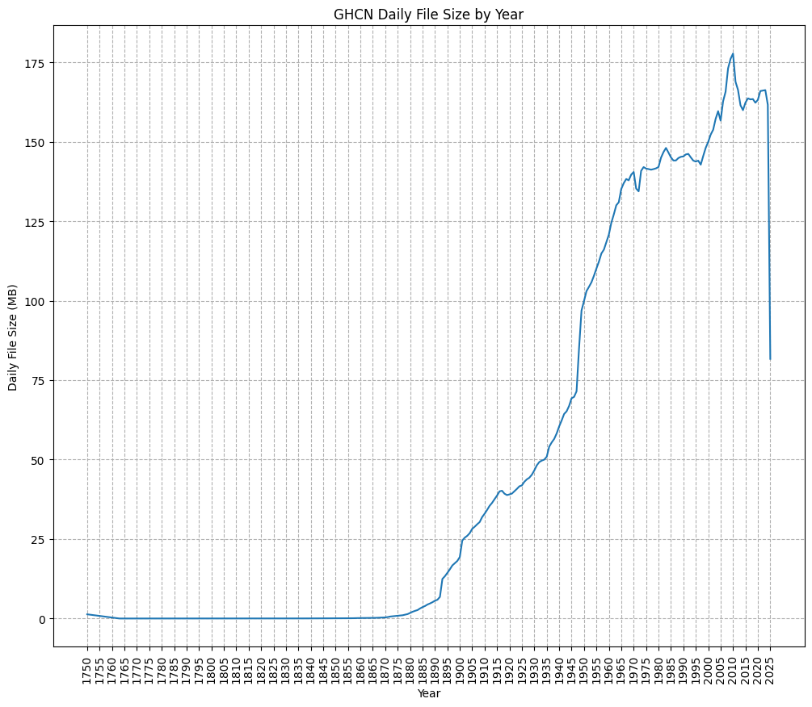

### Spark notebook ###

This notebook will only work in a Jupyter notebook or Jupyter lab session running on the cluster master node in the cloud.

Follow the instructions on the computing resources page to start a cluster and open this notebook.

**Steps**

1. Connect to the Windows server using Windows App.
2. Connect to Kubernetes.
3. Start Jupyter and open this notebook from Jupyter in order to connect to Spark.


```python
# Run this cell to import pyspark and to define start_spark() and stop_spark()

import findspark

findspark.init()

import getpass
import random
import re

import pandas
import pyspark
from IPython.display import HTML, display
from pyspark import SparkContext
from pyspark.sql import SparkSession

# Constants used to interact with Azure Blob Storage using the hdfs command or Spark

global username

username = re.sub("@.*", "", getpass.getuser())

global azure_account_name
global azure_data_container_name
global azure_user_container_name
global azure_user_token

azure_account_name = "madsstorage002"
azure_data_container_name = "campus-data"
azure_user_container_name = "campus-user"
azure_user_token = r"sp=racwdl&st=2025-08-01T09:41:33Z&se=2026-12-30T16:56:33Z&spr=https&sv=2024-11-04&sr=c&sig=GzR1hq7EJ0lRHj92oDO1MBNjkc602nrpfB5H8Cl7FFY%3D"


# Functions used below


def dict_to_html(d):
    """Convert a Python dictionary into a two column table for display."""

    html = []

    html.append(f'<table width="100%" style="width:100%; font-family: monospace;">')
    for k, v in d.items():
        html.append(f'<tr><td style="text-align:left;">{k}</td><td>{v}</td></tr>')
    html.append(f"</table>")

    return "".join(html)


def show_as_html(df, n=20):
    """Leverage existing pandas jupyter integration to show a spark dataframe as html.

    Args:
        n (int): number of rows to show (default: 20)
    """

    display(df.limit(n).toPandas())


def display_spark():
    """Display the status of the active Spark session if one is currently running."""

    if "spark" in globals() and "sc" in globals():

        name = sc.getConf().get("spark.app.name")

        html = [
            f"<p><b>Spark</b></p>",
            f'<p>The spark session is <b><span style="color:green">active</span></b>, look for <code>{name}</code> under the running applications section in the Spark UI.</p>',
            f"<ul>",
            f'<li><a href="http://localhost:{sc.uiWebUrl.split(":")[-1]}" target="_blank">Spark Application UI</a></li>',
            f"</ul>",
            f"<p><b>Config</b></p>",
            dict_to_html(dict(sc.getConf().getAll())),
            f"<p><b>Notes</b></p>",
            f"<ul>",
            f"<li>The spark session <code>spark</code> and spark context <code>sc</code> global variables have been defined by <code>start_spark()</code>.</li>",
            f"<li>Please run <code>stop_spark()</code> before closing the notebook or restarting the kernel or kill <code>{name}</code> by hand using the link in the Spark UI.</li>",
            f"</ul>",
        ]
        display(HTML("".join(html)))

    else:

        html = [
            f"<p><b>Spark</b></p>",
            f'<p>The spark session is <b><span style="color:red">stopped</span></b>, confirm that <code>{username} (notebook)</code> is under the completed applications section in the Spark UI.</p>',
            f"<ul>",
            f'<li><a href="http://mathmadslinux2p.canterbury.ac.nz:8080/" target="_blank">Spark UI</a></li>',
            f"</ul>",
        ]
        display(HTML("".join(html)))


# Functions to start and stop spark


def start_spark(
    executor_instances=2, executor_cores=1, worker_memory=1, master_memory=1
):
    """Start a new Spark session and define globals for SparkSession (spark) and SparkContext (sc).

    Args:
        executor_instances (int): number of executors (default: 2)
        executor_cores (int): number of cores per executor (default: 1)
        worker_memory (float): worker memory (default: 1)
        master_memory (float): master memory (default: 1)
    """

    global spark
    global sc

    cores = executor_instances * executor_cores
    partitions = cores * 4
    port = 4000 + random.randint(1, 999)

    spark = (
        SparkSession.builder.config(
            "spark.driver.extraJavaOptions",
            f"-Dderby.system.home=/tmp/{username}/spark/",
        )
        .config("spark.dynamicAllocation.enabled", "false")
        .config("spark.executor.instances", str(executor_instances))
        .config("spark.executor.cores", str(executor_cores))
        .config("spark.cores.max", str(cores))
        .config("spark.driver.memory", f"{master_memory}g")
        .config("spark.executor.memory", f"{worker_memory}g")
        .config("spark.driver.maxResultSize", "0")
        .config("spark.sql.shuffle.partitions", str(partitions))
        .config(
            "spark.kubernetes.container.image",
            "madsregistry001.azurecr.io/hadoop-spark:v3.3.5-openjdk-8",
        )
        .config("spark.kubernetes.container.image.pullPolicy", "IfNotPresent")
        .config("spark.kubernetes.memoryOverheadFactor", "0.3")
        .config("spark.memory.fraction", "0.1")
        .config(
            f"fs.azure.sas.{azure_user_container_name}.{azure_account_name}.blob.core.windows.net",
            azure_user_token,
        )
        .config("spark.app.name", f"{username} (notebook)")
        .getOrCreate()
    )
    sc = SparkContext.getOrCreate()

    display_spark()


def stop_spark():
    """Stop the active Spark session and delete globals for SparkSession (spark) and SparkContext (sc)."""

    global spark
    global sc

    if "spark" in globals() and "sc" in globals():

        spark.stop()

        del spark
        del sc

    display_spark()


# Make css changes to improve spark output readability

html = [
    "<style>",
    "pre { white-space: pre !important; }",
    "table.dataframe td { white-space: nowrap !important; }",
    "table.dataframe thead th:first-child, table.dataframe tbody th { display: none; }",
    "</style>",
]
display(HTML("".join(html)))
```


<style>pre { white-space: pre !important; }table.dataframe td { white-space: nowrap !important; }table.dataframe thead th:first-child, table.dataframe tbody th { display: none; }</style>


```python
# Run this cell to start a spark session in this notebook

start_spark(executor_instances=4, executor_cores=2, worker_memory=4, master_memory=4)
```

    Warning: Ignoring non-Spark config property: fs.azure.sas.campus-user.madsstorage002.blob.core.windows.net
    Warning: Ignoring non-Spark config property: SPARK_DRIVER_BIND_ADDRESS
    25/09/11 17:59:21 WARN NativeCodeLoader: Unable to load native-hadoop library for your platform... using builtin-java classes where applicable
    Setting default log level to "WARN".
    To adjust logging level use sc.setLogLevel(newLevel). For SparkR, use setLogLevel(newLevel).


<p><b>Spark</b></p><p>The spark session is <b><span style="color:green">active</span></b>, look for <code>yxi75 (notebook)</code> under the running applications section in the Spark UI.</p><ul><li><a href="http://localhost:4045" target="_blank">Spark Application UI</a></li></ul><p><b>Config</b></p><table width="100%" style="width:100%; font-family: monospace;"><tr><td style="text-align:left;">spark.dynamicAllocation.enabled</td><td>false</td></tr><tr><td style="text-align:left;">spark.fs.azure.sas.uco-user.madsstorage002.blob.core.windows.net</td><td>"sp=racwdl&st=2024-09-19T08:00:18Z&se=2025-09-19T16:00:18Z&spr=https&sv=2022-11-02&sr=c&sig=qtg6fCdoFz6k3EJLw7dA8D3D8wN0neAYw8yG4z4Lw2o%3D"</td></tr><tr><td style="text-align:left;">spark.kubernetes.driver.pod.name</td><td>spark-master-driver</td></tr><tr><td style="text-align:left;">spark.executor.instances</td><td>4</td></tr><tr><td style="text-align:left;">spark.driver.memory</td><td>4g</td></tr><tr><td style="text-align:left;">spark.app.name</td><td>yxi75 (notebook)</td></tr><tr><td style="text-align:left;">spark.fs.azure.sas.campus-user.madsstorage002.blob.core.windows.net</td><td>"sp=racwdl&st=2024-09-19T08:03:31Z&se=2025-09-19T16:03:31Z&spr=https&sv=2022-11-02&sr=c&sig=kMP%2BsBsRzdVVR8rrg%2BNbDhkRBNs6Q98kYY695XMRFDU%3D"</td></tr><tr><td style="text-align:left;">spark.kubernetes.container.image.pullPolicy</td><td>IfNotPresent</td></tr><tr><td style="text-align:left;">spark.sql.shuffle.partitions</td><td>32</td></tr><tr><td style="text-align:left;">spark.kubernetes.namespace</td><td>yxi75</td></tr><tr><td style="text-align:left;">spark.serializer.objectStreamReset</td><td>100</td></tr><tr><td style="text-align:left;">spark.driver.maxResultSize</td><td>0</td></tr><tr><td style="text-align:left;">spark.app.startTime</td><td>1757570361973</td></tr><tr><td style="text-align:left;">spark.submit.deployMode</td><td>client</td></tr><tr><td style="text-align:left;">spark.master</td><td>k8s://https://kubernetes.default.svc.cluster.local:443</td></tr><tr><td style="text-align:left;">spark.app.id</td><td>spark-7adcb5083a5b42329c59ab38a40282f7</td></tr><tr><td style="text-align:left;">spark.driver.extraJavaOptions</td><td>-Djava.net.preferIPv6Addresses=false -XX:+IgnoreUnrecognizedVMOptions --add-opens=java.base/java.lang=ALL-UNNAMED --add-opens=java.base/java.lang.invoke=ALL-UNNAMED --add-opens=java.base/java.lang.reflect=ALL-UNNAMED --add-opens=java.base/java.io=ALL-UNNAMED --add-opens=java.base/java.net=ALL-UNNAMED --add-opens=java.base/java.nio=ALL-UNNAMED --add-opens=java.base/java.util=ALL-UNNAMED --add-opens=java.base/java.util.concurrent=ALL-UNNAMED --add-opens=java.base/java.util.concurrent.atomic=ALL-UNNAMED --add-opens=java.base/jdk.internal.ref=ALL-UNNAMED --add-opens=java.base/sun.nio.ch=ALL-UNNAMED --add-opens=java.base/sun.nio.cs=ALL-UNNAMED --add-opens=java.base/sun.security.action=ALL-UNNAMED --add-opens=java.base/sun.util.calendar=ALL-UNNAMED --add-opens=java.security.jgss/sun.security.krb5=ALL-UNNAMED -Djdk.reflect.useDirectMethodHandle=false -Dderby.system.home=/tmp/yxi75/spark/</td></tr><tr><td style="text-align:left;">spark.fs.azure</td><td>org.apache.hadoop.fs.azure.NativeAzureFileSystem</td></tr><tr><td style="text-align:left;">spark.memory.fraction</td><td>0.1</td></tr><tr><td style="text-align:left;">spark.executor.memory</td><td>4g</td></tr><tr><td style="text-align:left;">spark.executor.id</td><td>driver</td></tr><tr><td style="text-align:left;">spark.kubernetes.executor.container.image</td><td>madsregistry001.azurecr.io/hadoop-spark:v3.3.5-openjdk-8-1.0.16</td></tr><tr><td style="text-align:left;">spark.executor.cores</td><td>2</td></tr><tr><td style="text-align:left;">spark.app.submitTime</td><td>1757570361858</td></tr><tr><td style="text-align:left;">spark.kubernetes.memoryOverheadFactor</td><td>0.3</td></tr><tr><td style="text-align:left;">spark.driver.host</td><td>spark-master-svc</td></tr><tr><td style="text-align:left;">spark.kubernetes.executor.podNamePrefix</td><td>yxi75-notebook-78045b99375b6dae</td></tr><tr><td style="text-align:left;">spark.ui.port</td><td>${env:SPARK_UI_PORT}</td></tr><tr><td style="text-align:left;">spark.kubernetes.container.image</td><td>madsregistry001.azurecr.io/hadoop-spark:v3.3.5-openjdk-8</td></tr><tr><td style="text-align:left;">spark.kubernetes.executor.podTemplateFile</td><td>/opt/spark/conf/executor-pod-template.yaml</td></tr><tr><td style="text-align:left;">fs.azure.sas.campus-user.madsstorage002.blob.core.windows.net</td><td>sp=racwdl&st=2025-08-01T09:41:33Z&se=2026-12-30T16:56:33Z&spr=https&sv=2024-11-04&sr=c&sig=GzR1hq7EJ0lRHj92oDO1MBNjkc602nrpfB5H8Cl7FFY%3D</td></tr><tr><td style="text-align:left;">spark.rdd.compress</td><td>True</td></tr><tr><td style="text-align:left;">spark.executor.extraJavaOptions</td><td>-Djava.net.preferIPv6Addresses=false -XX:+IgnoreUnrecognizedVMOptions --add-opens=java.base/java.lang=ALL-UNNAMED --add-opens=java.base/java.lang.invoke=ALL-UNNAMED --add-opens=java.base/java.lang.reflect=ALL-UNNAMED --add-opens=java.base/java.io=ALL-UNNAMED --add-opens=java.base/java.net=ALL-UNNAMED --add-opens=java.base/java.nio=ALL-UNNAMED --add-opens=java.base/java.util=ALL-UNNAMED --add-opens=java.base/java.util.concurrent=ALL-UNNAMED --add-opens=java.base/java.util.concurrent.atomic=ALL-UNNAMED --add-opens=java.base/jdk.internal.ref=ALL-UNNAMED --add-opens=java.base/sun.nio.ch=ALL-UNNAMED --add-opens=java.base/sun.nio.cs=ALL-UNNAMED --add-opens=java.base/sun.security.action=ALL-UNNAMED --add-opens=java.base/sun.util.calendar=ALL-UNNAMED --add-opens=java.security.jgss/sun.security.krb5=ALL-UNNAMED -Djdk.reflect.useDirectMethodHandle=false</td></tr><tr><td style="text-align:left;">spark.cores.max</td><td>8</td></tr><tr><td style="text-align:left;">spark.driver.port</td><td>7077</td></tr><tr><td style="text-align:left;">spark.submit.pyFiles</td><td></td></tr><tr><td style="text-align:left;">spark.ui.showConsoleProgress</td><td>true</td></tr></table><p><b>Notes</b></p><ul><li>The spark session <code>spark</code> and spark context <code>sc</code> global variables have been defined by <code>start_spark()</code>.</li><li>Please run <code>stop_spark()</code> before closing the notebook or restarting the kernel or kill <code>yxi75 (notebook)</code> by hand using the link in the Spark UI.</li></ul>


```python
# Write your imports here or insert cells below

import re
import subprocess
from math import asin, cos, radians, sin, sqrt
from pprint import pprint

import numpy as np
import pandas as pd
from pyspark.sql import functions as F
from pyspark.sql.functions import udf
from pyspark.sql.types import *
```


```python
# Paths global variables
DATA_ROOT = "wasbs://campus-data@madsstorage002.blob.core.windows.net/ghcnd/"
USER_ROOT = "wasbs://campus-user@madsstorage002.blob.core.windows.net/yxi75/"

paths = {
    "daily": DATA_ROOT + "daily/",
    "stations": DATA_ROOT + "ghcnd-stations.txt",
    "countries": DATA_ROOT + "ghcnd-countries.txt",
    "states": DATA_ROOT + "ghcnd-states.txt",
    "inventory": DATA_ROOT + "ghcnd-inventory.txt",
}

paths

stations_enriched_savepath = USER_ROOT + "stations_enriched_parquet"
```


```python
# Use the hdfs command to explore the data in Azure Blob Storage
# hdfs dfs-ls -h :Format file sizes in a human-readable fashion (eg 64.0m instead of 67108864).
# reference: https://hadoop.apache.org/docs/r3.3.5/hadoop-project-dist/hadoop-common/FileSystemShell.html#ls


# show DATA_ROOT Structure
!hdfs dfs -ls -h {DATA_ROOT}
```

    Found 5 items
    drwxrwxrwx   -          0 1970-01-01 12:00 wasbs://campus-data@madsstorage002.blob.core.windows.net/ghcnd/daily
    -rwxrwxrwx   1      3.6 K 2025-08-01 21:31 wasbs://campus-data@madsstorage002.blob.core.windows.net/ghcnd/ghcnd-countries.txt
    -rwxrwxrwx   1     33.6 M 2025-08-01 21:31 wasbs://campus-data@madsstorage002.blob.core.windows.net/ghcnd/ghcnd-inventory.txt
    -rwxrwxrwx   1      1.1 K 2025-08-01 21:31 wasbs://campus-data@madsstorage002.blob.core.windows.net/ghcnd/ghcnd-states.txt
    -rwxrwxrwx   1     10.6 M 2025-08-01 21:31 wasbs://campus-data@madsstorage002.blob.core.windows.net/ghcnd/ghcnd-stations.txt


```python
# show Daily folder structure and export to txt file
!hdfs dfs -ls {paths["daily"]} > ./supplementary/daily_folder_index.txt
```


```python
# load daily folder index info and plot to show data scale trend
daily_folder_index_path = "./supplementary/daily_folder_index.txt"
with open(file=daily_folder_index_path, mode="r") as f:
    lines = f.readlines()

data = []

for line in lines:
    # Skip "Found" line and directory entries
    if line.startswith("Found") or line.startswith("d"):
        continue

    # Unpack line into variables
    file_permissions, replication, size_bytes, mod_date, mod_time, path = line.split()

    # Append row dictionary
    data.append(
        {
            "file_permissions": file_permissions,
            "replication": int(replication),
            "size_bytes": int(size_bytes),
            "mod_date": mod_date,
            "mod_time": mod_time,
            "path": path,
        }
    )

# Convert list of dicts to DataFrame
df = pd.DataFrame(data)

# Add size in MB and extract year
df["size_MB"] = df["size_bytes"] / (1024 * 1024)
df["year"] = df.path.str.split("/").str[5].str.split(".").str[0].astype(int)

import matplotlib.pyplot as plt

plt.figure(figsize=(12, 10))
plt.plot(df["year"], df["size_MB"])
plt.xticks(range(df["year"].min(), df["year"].max() + 1, 5))
plt.xticks(rotation=90)
plt.xlabel("Year")
ymin = df["size_MB"].min()
ymax = df["size_MB"].max()
plt.ylabel("Daily File Size (MB)")
plt.title("GHCN Daily File Size by Year")
plt.grid(visible=True, axis="both", linestyle="--")
plt.savefig("./supplementary/GHCN Daily File Size by Year.png", dpi=300)
plt.show()
```


    

    


# Processing

## Q1 Data loading and simple EDA
First you will investigate the daily, stations, states, countries, and inventory data provided in cloud storage in wasbs://campus-data@madsstorage002.blob.core.windows.net/ghcnd/
using the hdfs command.
Follow the instructions in the notebook provided to explore each dataset using the hdfs command without loading any data into memory and answer the following questions:

### (a) How is the data structured? Are any of the datasets compressed?  

Found 5 items under the directory 'wasbs://campus-data@madsstorage002.blob.core.windows.net/ghcnd/', including 1 directory and 4 text files as shown below:  
- daily (264 csv.gz compressed csv files)  
  -- 1750.csv.gz  
  -- 1751.csv.gz  
  -- ...  
  -- 2025.csv.gz  

- ghcnd-countries.txt  
- ghcnd-inventory.txt  
- ghcnd-states.txt  
- ghcnd-stations.txt


All the CSV files in the ‘daily’ directory are indeed compressed using the .gz format.

### (b) How many years are contained in daily, and how does the size of the data change?
From the year 1750 to the year 2025, there should be 276 years, but only 264 csv.gz files were found, missing daa for 12 years(1751-1762).
Generally, the size of the data increased yearly except for few years, from 10^{-6} MB to 10^{5} MB.
By the end of 2024, the size of the data reached to 10^{5} MB scale.


```python
# find missing years
all_years = set(range(df["year"].min(), df["year"].max() + 1))
print("all year count:", len(all_years))

exisisting_years = set(df["year"])
print("GHCN daily dataset year count:", len(exisisting_years))

missing_year = sorted(all_years - exisisting_years)
print("Missing Years:", missing_year)
print("Missing Years Count:", len(missing_year))
```

    all year count: 276
    GHCN daily dataset year count: 264
    Missing Years: [1751, 1752, 1753, 1754, 1755, 1756, 1757, 1758, 1759, 1760, 1761, 1762]
    Missing Years Count: 12


### (c) What is the total size of the data, and how much of that is daily?


```python
"""
Usage: hadoop fs -du [-s] [-h] [-v] [-x] URI [URI ...]
Displays sizes of files and directories contained in the given directory or the length of a file in case its just a file.
Options:
The -s option will result in an aggregate summary of file lengths being displayed, rather than the individual files. Without the -s option, calculation is done by going 1-level deep from the given path.
The -h option will format file sizes in a “human-readable” fashion (e.g 64.0m instead of 67108864)
The -v option will display the names of columns as a header line.
The -x option will exclude snapshots from the result calculation. Without the -x option (default), the result is always calculated from all INodes, including all snapshots under the given path.
"""

!hdfs dfs -du -s -h -v {DATA_ROOT}
!hdfs dfs -du -s -h -v {paths["daily"]}
```

    SIZE    DISK_SPACE_CONSUMED_WITH_ALL_REPLICAS  FULL_PATH_NAME
    13.1 G  13.1 G                                 wasbs://campus-data@madsstorage002.blob.core.windows.net/ghcnd
    SIZE    DISK_SPACE_CONSUMED_WITH_ALL_REPLICAS  FULL_PATH_NAME
    13.0 G  13.0 G                                 wasbs://campus-data@madsstorage002.blob.core.windows.net/ghcnd/daily


## Q2 DataType and Schema
You will now load each dataset to ensure the descriptions are accurate and that you can apply the schema either as the data is loaded or by casting columns as they are extracted by manually  rocessing the text records. Extend the code example in the notebook provided by following the steps below.

### (a) Define a schema for daily based on the description above or in the GHCN Daily README, using the types defined in pyspark.sql. What do you think is the best way to load the DATE and OBSERVATION TIME columns?


```python
# Define daily_schema
# https://spark.apache.org/docs/latest/api/python/reference/pyspark.sql/api/pyspark.sql.types.StructField.html
daily_schema = StructType(
    [
        StructField("ID", StringType()),  # Character Station code
        StructField(
            "DATE", StringType()
        ),  # Date Observation date formatted as YYYYMMDD
        StructField("ELEMENT", StringType()),  # Character Element type indicator
        StructField("VALUE", DoubleType()),  # Real Data value for ELEMENT
        StructField("MEASUREMENT", StringType()),  # Character Measurement Flag
        StructField("QUALITY", StringType()),  # Character Quality Flag
        StructField("SOURCE", StringType()),  # Character Source Flag
        StructField("TIME", StringType()),  # Time Observation time formatted as HHMM
    ]
)

# load daily
daily = spark.read.csv(
    path=paths["daily"],
    schema=daily_schema,
)

print(type(daily))
daily.printSchema()
daily.show(20)
```

    <class 'pyspark.sql.dataframe.DataFrame'>
    root
     |-- ID: string (nullable = true)
     |-- DATE: string (nullable = true)
     |-- ELEMENT: string (nullable = true)
     |-- VALUE: double (nullable = true)
     |-- MEASUREMENT: string (nullable = true)
     |-- QUALITY: string (nullable = true)
     |-- SOURCE: string (nullable = true)
     |-- TIME: string (nullable = true)
    
    +-----------+--------+-------+-----+-----------+-------+------+----+
    |         ID|    DATE|ELEMENT|VALUE|MEASUREMENT|QUALITY|SOURCE|TIME|
    +-----------+--------+-------+-----+-----------+-------+------+----+
    |ASN00030019|20100101|   PRCP| 24.0|       NULL|   NULL|     a|NULL|
    |ASN00030021|20100101|   PRCP|200.0|       NULL|   NULL|     a|NULL|
    |ASN00030022|20100101|   TMAX|294.0|       NULL|   NULL|     a|NULL|
    |ASN00030022|20100101|   TMIN|215.0|       NULL|   NULL|     a|NULL|
    |ASN00030022|20100101|   PRCP|408.0|       NULL|   NULL|     a|NULL|
    |ASN00029121|20100101|   PRCP|820.0|       NULL|   NULL|     a|NULL|
    |ASN00029126|20100101|   TMAX|371.0|       NULL|   NULL|     S|NULL|
    |ASN00029126|20100101|   TMIN|225.0|       NULL|   NULL|     S|NULL|
    |ASN00029126|20100101|   PRCP|  0.0|       NULL|   NULL|     a|NULL|
    |ASN00029126|20100101|   TAVG|298.0|          H|   NULL|     S|NULL|
    |ASN00029127|20100101|   TMAX|371.0|       NULL|   NULL|     a|NULL|
    |ASN00029127|20100101|   TMIN|225.0|       NULL|   NULL|     a|NULL|
    |ASN00029127|20100101|   PRCP|  8.0|       NULL|   NULL|     a|NULL|
    |ASN00029129|20100101|   PRCP|174.0|       NULL|   NULL|     a|NULL|
    |ASN00029130|20100101|   PRCP| 86.0|       NULL|   NULL|     a|NULL|
    |ASN00029131|20100101|   PRCP| 56.0|       NULL|   NULL|     a|NULL|
    |ASN00029132|20100101|   PRCP|800.0|       NULL|   NULL|     a|NULL|
    |ASN00029136|20100101|   PRCP| 22.0|       NULL|   NULL|     a|NULL|
    |ASN00029137|20100101|   PRCP|  0.0|       NULL|   NULL|     a|NULL|
    |ASN00029139|20100101|   TMAX|298.0|       NULL|   NULL|     a|NULL|
    +-----------+--------+-------+-----+-----------+-------+------+----+
    only showing top 20 rows
    


### (b) Modify the spark.read.csv command to load a subset of the most recent year of daily into Spark so that it uses the schema that you defined in step (a). Did anything go wrong when you tried to use the schema? What data types did you end up using and why?


```python
latest_year = 2025
print(f"load year {latest_year} of daily and show its data schema")

daily_2025 = spark.read.csv(
    path=f"{DATA_ROOT}/daily/{latest_year}.csv.gz", schema=daily_schema
)

# parse DATE col
daily_2025 = daily_2025.withColumn("DATE", F.to_date(F.col("DATE"), "yyyyMMdd"))

# parse TIME
# 1)  DATE：YYYYMMDD -> DateType
daily_2025 = daily_2025.withColumn("DATE", F.to_date(F.col("DATE"), "yyyyMMdd"))

# 2) process TIME col：Null/space/4bit，clean and lpad to 4bit
daily_2025 = daily_2025.withColumn(
    "TIME_CLEAN",
    F.when(F.col("TIME").isNull() | (F.trim(F.col("TIME")) == ""), None)
     .otherwise(F.lpad(F.col("TIME").cast("string"), 4, "0"))
)

# 3) combine “virture date 19700101 + HHmm” and convert to  TimestampType
daily_2025 = daily_2025.withColumn(
    "OBS_TS",
    F.when(F.col("TIME_CLEAN").isNull(), None)
     .otherwise(F.to_timestamp(
         F.concat(F.lit("1970-01-01 "), F.col("TIME_CLEAN")),  # -> "1970-01-01 HHmm"
         "yyyy-MM-dd HHmm"
     ))
)

# 4) "HH:mm" string col for show
daily_2025 = daily_2025.withColumn(
    "OBS_HHMM",
    F.when(F.col("OBS_TS").isNull(), None)
     .otherwise(F.date_format(F.col("OBS_TS"), "HH:mm"))
)

# show the sample of data and print the schema
print(f"type of daily_latest variable:", type(daily_2025))
daily_2025.printSchema()
show_as_html(daily_2025)
```

    load year 2025 of daily and show its data schema
    type of daily_latest variable: <class 'pyspark.sql.dataframe.DataFrame'>
    root
     |-- ID: string (nullable = true)
     |-- DATE: date (nullable = true)
     |-- ELEMENT: string (nullable = true)
     |-- VALUE: double (nullable = true)
     |-- MEASUREMENT: string (nullable = true)
     |-- QUALITY: string (nullable = true)
     |-- SOURCE: string (nullable = true)
     |-- TIME: string (nullable = true)
     |-- TIME_CLEAN: string (nullable = true)
     |-- OBS_TS: timestamp (nullable = true)
     |-- OBS_HHMM: string (nullable = true)
    


<div>
<style scoped>
    .dataframe tbody tr th:only-of-type {
        vertical-align: middle;
    }

    .dataframe tbody tr th {
        vertical-align: top;
    }

    .dataframe thead th {
        text-align: right;
    }
</style>
<table border="1" class="dataframe">
  <thead>
    <tr style="text-align: right;">
      <th></th>
      <th>ID</th>
      <th>DATE</th>
      <th>ELEMENT</th>
      <th>VALUE</th>
      <th>MEASUREMENT</th>
      <th>QUALITY</th>
      <th>SOURCE</th>
      <th>TIME</th>
      <th>TIME_CLEAN</th>
      <th>OBS_TS</th>
      <th>OBS_HHMM</th>
    </tr>
  </thead>
  <tbody>
    <tr>
      <th>0</th>
      <td>ASN00030019</td>
      <td>2025-01-01</td>
      <td>PRCP</td>
      <td>0.0</td>
      <td>None</td>
      <td>None</td>
      <td>a</td>
      <td>None</td>
      <td>None</td>
      <td>NaT</td>
      <td>None</td>
    </tr>
    <tr>
      <th>1</th>
      <td>ASN00030021</td>
      <td>2025-01-01</td>
      <td>PRCP</td>
      <td>0.0</td>
      <td>None</td>
      <td>None</td>
      <td>a</td>
      <td>None</td>
      <td>None</td>
      <td>NaT</td>
      <td>None</td>
    </tr>
    <tr>
      <th>2</th>
      <td>ASN00030022</td>
      <td>2025-01-01</td>
      <td>TMAX</td>
      <td>414.0</td>
      <td>None</td>
      <td>None</td>
      <td>a</td>
      <td>None</td>
      <td>None</td>
      <td>NaT</td>
      <td>None</td>
    </tr>
    <tr>
      <th>3</th>
      <td>ASN00030022</td>
      <td>2025-01-01</td>
      <td>TMIN</td>
      <td>247.0</td>
      <td>None</td>
      <td>None</td>
      <td>a</td>
      <td>None</td>
      <td>None</td>
      <td>NaT</td>
      <td>None</td>
    </tr>
    <tr>
      <th>4</th>
      <td>ASN00030022</td>
      <td>2025-01-01</td>
      <td>PRCP</td>
      <td>0.0</td>
      <td>None</td>
      <td>None</td>
      <td>a</td>
      <td>None</td>
      <td>None</td>
      <td>NaT</td>
      <td>None</td>
    </tr>
    <tr>
      <th>5</th>
      <td>ASN00030025</td>
      <td>2025-01-01</td>
      <td>PRCP</td>
      <td>0.0</td>
      <td>None</td>
      <td>None</td>
      <td>a</td>
      <td>None</td>
      <td>None</td>
      <td>NaT</td>
      <td>None</td>
    </tr>
    <tr>
      <th>6</th>
      <td>ASN00029118</td>
      <td>2025-01-01</td>
      <td>PRCP</td>
      <td>0.0</td>
      <td>None</td>
      <td>None</td>
      <td>a</td>
      <td>None</td>
      <td>None</td>
      <td>NaT</td>
      <td>None</td>
    </tr>
    <tr>
      <th>7</th>
      <td>ASN00029121</td>
      <td>2025-01-01</td>
      <td>PRCP</td>
      <td>0.0</td>
      <td>None</td>
      <td>None</td>
      <td>a</td>
      <td>None</td>
      <td>None</td>
      <td>NaT</td>
      <td>None</td>
    </tr>
    <tr>
      <th>8</th>
      <td>ASN00029126</td>
      <td>2025-01-01</td>
      <td>TMAX</td>
      <td>414.0</td>
      <td>None</td>
      <td>None</td>
      <td>S</td>
      <td>None</td>
      <td>None</td>
      <td>NaT</td>
      <td>None</td>
    </tr>
    <tr>
      <th>9</th>
      <td>ASN00029126</td>
      <td>2025-01-01</td>
      <td>TMIN</td>
      <td>198.0</td>
      <td>None</td>
      <td>None</td>
      <td>S</td>
      <td>None</td>
      <td>None</td>
      <td>NaT</td>
      <td>None</td>
    </tr>
    <tr>
      <th>10</th>
      <td>ASN00029126</td>
      <td>2025-01-01</td>
      <td>PRCP</td>
      <td>0.0</td>
      <td>None</td>
      <td>None</td>
      <td>a</td>
      <td>None</td>
      <td>None</td>
      <td>NaT</td>
      <td>None</td>
    </tr>
    <tr>
      <th>11</th>
      <td>ASN00029126</td>
      <td>2025-01-01</td>
      <td>TAVG</td>
      <td>321.0</td>
      <td>H</td>
      <td>None</td>
      <td>S</td>
      <td>None</td>
      <td>None</td>
      <td>NaT</td>
      <td>None</td>
    </tr>
    <tr>
      <th>12</th>
      <td>ASN00029127</td>
      <td>2025-01-01</td>
      <td>TMAX</td>
      <td>414.0</td>
      <td>None</td>
      <td>None</td>
      <td>a</td>
      <td>None</td>
      <td>None</td>
      <td>NaT</td>
      <td>None</td>
    </tr>
    <tr>
      <th>13</th>
      <td>ASN00029127</td>
      <td>2025-01-01</td>
      <td>TMIN</td>
      <td>198.0</td>
      <td>None</td>
      <td>None</td>
      <td>a</td>
      <td>None</td>
      <td>None</td>
      <td>NaT</td>
      <td>None</td>
    </tr>
    <tr>
      <th>14</th>
      <td>ASN00029127</td>
      <td>2025-01-01</td>
      <td>PRCP</td>
      <td>0.0</td>
      <td>None</td>
      <td>None</td>
      <td>a</td>
      <td>None</td>
      <td>None</td>
      <td>NaT</td>
      <td>None</td>
    </tr>
    <tr>
      <th>15</th>
      <td>ASN00029129</td>
      <td>2025-01-01</td>
      <td>PRCP</td>
      <td>0.0</td>
      <td>None</td>
      <td>None</td>
      <td>a</td>
      <td>None</td>
      <td>None</td>
      <td>NaT</td>
      <td>None</td>
    </tr>
    <tr>
      <th>16</th>
      <td>ASN00029131</td>
      <td>2025-01-01</td>
      <td>PRCP</td>
      <td>0.0</td>
      <td>None</td>
      <td>None</td>
      <td>a</td>
      <td>None</td>
      <td>None</td>
      <td>NaT</td>
      <td>None</td>
    </tr>
    <tr>
      <th>17</th>
      <td>ASN00029132</td>
      <td>2025-01-01</td>
      <td>PRCP</td>
      <td>0.0</td>
      <td>None</td>
      <td>None</td>
      <td>a</td>
      <td>None</td>
      <td>None</td>
      <td>NaT</td>
      <td>None</td>
    </tr>
    <tr>
      <th>18</th>
      <td>ASN00029136</td>
      <td>2025-01-01</td>
      <td>PRCP</td>
      <td>0.0</td>
      <td>None</td>
      <td>None</td>
      <td>a</td>
      <td>None</td>
      <td>None</td>
      <td>NaT</td>
      <td>None</td>
    </tr>
    <tr>
      <th>19</th>
      <td>ASN00029139</td>
      <td>2025-01-01</td>
      <td>TMAX</td>
      <td>347.0</td>
      <td>None</td>
      <td>None</td>
      <td>a</td>
      <td>None</td>
      <td>None</td>
      <td>NaT</td>
      <td>None</td>
    </tr>
  </tbody>
</table>
</div>


### (c) Load each of stations, states, countries, and inventory datasets into Spark and find a way to extract the columns and data types in the descriptions above. You will need to parse the fixed width text formatting by hand, as there is no method to load this format implemented in the standard spark.read library. You should use pyspark.sql.functions.substring to extract the columns based on their character range.


```python
# Q2c: parse fixed-width text（stations/countries/states/inventory）
"""
IV. FORMAT OF "ghcnd-stations.txt"
------------------------------
Variable   Columns   Type
------------------------------
ID            1-11   Character
LATITUDE     13-20   Real
LONGITUDE    22-30   Real
ELEVATION    32-37   Real
STATE        39-40   Character
NAME         42-71   Character
GSN FLAG     73-75   Character
HCN/CRN FLAG 77-79   Character
WMO ID       81-85   Character
------------------------------
"""

stations_raw = spark.read.text(paths["stations"])
stations_df = (
    stations_raw.withColumn("ID", F.substring("value", 1, 11))
    .withColumn("LATITUDE", F.substring("value", 13, 8).cast("double"))
    .withColumn("LONGITUDE", F.substring("value", 22, 9).cast("double"))
    .withColumn("ELEVATION", F.substring("value", 32, 6).cast("double"))
    .withColumn("STATE", F.substring("value", 39, 2))
    .withColumn("NAME", F.substring("value", 42, 30))
    .withColumn("GSN_FLAG", F.substring("value", 73, 3))
    .withColumn("HCN_CRN", F.substring("value", 77, 3))
    .withColumn("WMO_ID", F.substring("value", 81, 5))
    .drop("value")
)

show_as_html(stations_df)
```

                                                                                    


<div>
<style scoped>
    .dataframe tbody tr th:only-of-type {
        vertical-align: middle;
    }

    .dataframe tbody tr th {
        vertical-align: top;
    }

    .dataframe thead th {
        text-align: right;
    }
</style>
<table border="1" class="dataframe">
  <thead>
    <tr style="text-align: right;">
      <th></th>
      <th>ID</th>
      <th>LATITUDE</th>
      <th>LONGITUDE</th>
      <th>ELEVATION</th>
      <th>STATE</th>
      <th>NAME</th>
      <th>GSN_FLAG</th>
      <th>HCN_CRN</th>
      <th>WMO_ID</th>
    </tr>
  </thead>
  <tbody>
    <tr>
      <th>0</th>
      <td>ACW00011604</td>
      <td>17.1167</td>
      <td>-61.7833</td>
      <td>10.1</td>
      <td></td>
      <td>ST JOHNS COOLIDGE FLD</td>
      <td></td>
      <td></td>
      <td></td>
    </tr>
    <tr>
      <th>1</th>
      <td>ACW00011647</td>
      <td>17.1333</td>
      <td>-61.7833</td>
      <td>19.2</td>
      <td></td>
      <td>ST JOHNS</td>
      <td></td>
      <td></td>
      <td></td>
    </tr>
    <tr>
      <th>2</th>
      <td>AE000041196</td>
      <td>25.3330</td>
      <td>55.5170</td>
      <td>34.0</td>
      <td></td>
      <td>SHARJAH INTER. AIRP</td>
      <td>GSN</td>
      <td></td>
      <td>41196</td>
    </tr>
    <tr>
      <th>3</th>
      <td>AEM00041194</td>
      <td>25.2550</td>
      <td>55.3640</td>
      <td>10.4</td>
      <td></td>
      <td>DUBAI INTL</td>
      <td></td>
      <td></td>
      <td>41194</td>
    </tr>
    <tr>
      <th>4</th>
      <td>AEM00041217</td>
      <td>24.4330</td>
      <td>54.6510</td>
      <td>26.8</td>
      <td></td>
      <td>ABU DHABI INTL</td>
      <td></td>
      <td></td>
      <td>41217</td>
    </tr>
    <tr>
      <th>5</th>
      <td>AEM00041218</td>
      <td>24.2620</td>
      <td>55.6090</td>
      <td>264.9</td>
      <td></td>
      <td>AL AIN INTL</td>
      <td></td>
      <td></td>
      <td>41218</td>
    </tr>
    <tr>
      <th>6</th>
      <td>AF000040930</td>
      <td>35.3170</td>
      <td>69.0170</td>
      <td>3366.0</td>
      <td></td>
      <td>NORTH-SALANG</td>
      <td>GSN</td>
      <td></td>
      <td>40930</td>
    </tr>
    <tr>
      <th>7</th>
      <td>AFM00040938</td>
      <td>34.2100</td>
      <td>62.2280</td>
      <td>977.2</td>
      <td></td>
      <td>HERAT</td>
      <td></td>
      <td></td>
      <td>40938</td>
    </tr>
    <tr>
      <th>8</th>
      <td>AFM00040948</td>
      <td>34.5660</td>
      <td>69.2120</td>
      <td>1791.3</td>
      <td></td>
      <td>KABUL INTL</td>
      <td></td>
      <td></td>
      <td>40948</td>
    </tr>
    <tr>
      <th>9</th>
      <td>AFM00040990</td>
      <td>31.5000</td>
      <td>65.8500</td>
      <td>1010.0</td>
      <td></td>
      <td>KANDAHAR AIRPORT</td>
      <td></td>
      <td></td>
      <td>40990</td>
    </tr>
    <tr>
      <th>10</th>
      <td>AG000060390</td>
      <td>36.7167</td>
      <td>3.2500</td>
      <td>24.0</td>
      <td></td>
      <td>ALGER-DAR EL BEIDA</td>
      <td>GSN</td>
      <td></td>
      <td>60390</td>
    </tr>
    <tr>
      <th>11</th>
      <td>AG000060590</td>
      <td>30.5667</td>
      <td>2.8667</td>
      <td>397.0</td>
      <td></td>
      <td>EL-GOLEA</td>
      <td>GSN</td>
      <td></td>
      <td>60590</td>
    </tr>
    <tr>
      <th>12</th>
      <td>AG000060611</td>
      <td>28.0500</td>
      <td>9.6331</td>
      <td>561.0</td>
      <td></td>
      <td>IN-AMENAS</td>
      <td>GSN</td>
      <td></td>
      <td>60611</td>
    </tr>
    <tr>
      <th>13</th>
      <td>AG000060680</td>
      <td>22.8000</td>
      <td>5.4331</td>
      <td>1362.0</td>
      <td></td>
      <td>TAMANRASSET</td>
      <td>GSN</td>
      <td></td>
      <td>60680</td>
    </tr>
    <tr>
      <th>14</th>
      <td>AGE00135039</td>
      <td>35.7297</td>
      <td>0.6500</td>
      <td>50.0</td>
      <td></td>
      <td>ORAN-HOPITAL MILITAIRE</td>
      <td></td>
      <td></td>
      <td></td>
    </tr>
    <tr>
      <th>15</th>
      <td>AGE00147704</td>
      <td>36.9700</td>
      <td>7.7900</td>
      <td>161.0</td>
      <td></td>
      <td>ANNABA-CAP DE GARDE</td>
      <td></td>
      <td></td>
      <td></td>
    </tr>
    <tr>
      <th>16</th>
      <td>AGE00147705</td>
      <td>36.7800</td>
      <td>3.0700</td>
      <td>59.0</td>
      <td></td>
      <td>ALGIERS-VILLE/UNIVERSITE</td>
      <td></td>
      <td></td>
      <td></td>
    </tr>
    <tr>
      <th>17</th>
      <td>AGE00147706</td>
      <td>36.8000</td>
      <td>3.0300</td>
      <td>344.0</td>
      <td></td>
      <td>ALGIERS-BOUZAREAH</td>
      <td></td>
      <td></td>
      <td></td>
    </tr>
    <tr>
      <th>18</th>
      <td>AGE00147707</td>
      <td>36.8000</td>
      <td>3.0400</td>
      <td>38.0</td>
      <td></td>
      <td>ALGIERS-CAP CAXINE</td>
      <td></td>
      <td></td>
      <td></td>
    </tr>
    <tr>
      <th>19</th>
      <td>AGE00147708</td>
      <td>36.7200</td>
      <td>4.0500</td>
      <td>222.0</td>
      <td></td>
      <td>TIZI OUZOU</td>
      <td></td>
      <td></td>
      <td>60395</td>
    </tr>
  </tbody>
</table>
</div>


```python
"""
V. FORMAT OF "ghcnd-countries.txt"

------------------------------
Variable   Columns   Type
------------------------------
CODE          1-2    Character
NAME          4-64   Character
------------------------------

These variables have the following definitions:

CODE       is the FIPS country code of the country where the station is 
           located (from FIPS Publication 10-4 at 
           www.cia.gov/cia/publications/factbook/appendix/appendix-d.html).

NAME       is the name of the country.
"""
countries_df = (
    spark.read.text(paths["countries"])
    .withColumn("CODE", F.substring("value", 1, 2))
    .withColumn("COUNTRY_NAME", F.substring("value", 4, 61))
    .drop("value")
)

show_as_html(countries_df)
```

                                                                                    


<div>
<style scoped>
    .dataframe tbody tr th:only-of-type {
        vertical-align: middle;
    }

    .dataframe tbody tr th {
        vertical-align: top;
    }

    .dataframe thead th {
        text-align: right;
    }
</style>
<table border="1" class="dataframe">
  <thead>
    <tr style="text-align: right;">
      <th></th>
      <th>CODE</th>
      <th>COUNTRY_NAME</th>
    </tr>
  </thead>
  <tbody>
    <tr>
      <th>0</th>
      <td>AC</td>
      <td>Antigua and Barbuda</td>
    </tr>
    <tr>
      <th>1</th>
      <td>AE</td>
      <td>United Arab Emirates</td>
    </tr>
    <tr>
      <th>2</th>
      <td>AF</td>
      <td>Afghanistan</td>
    </tr>
    <tr>
      <th>3</th>
      <td>AG</td>
      <td>Algeria</td>
    </tr>
    <tr>
      <th>4</th>
      <td>AJ</td>
      <td>Azerbaijan</td>
    </tr>
    <tr>
      <th>5</th>
      <td>AL</td>
      <td>Albania</td>
    </tr>
    <tr>
      <th>6</th>
      <td>AM</td>
      <td>Armenia</td>
    </tr>
    <tr>
      <th>7</th>
      <td>AO</td>
      <td>Angola</td>
    </tr>
    <tr>
      <th>8</th>
      <td>AQ</td>
      <td>American Samoa [United States]</td>
    </tr>
    <tr>
      <th>9</th>
      <td>AR</td>
      <td>Argentina</td>
    </tr>
    <tr>
      <th>10</th>
      <td>AS</td>
      <td>Australia</td>
    </tr>
    <tr>
      <th>11</th>
      <td>AU</td>
      <td>Austria</td>
    </tr>
    <tr>
      <th>12</th>
      <td>AY</td>
      <td>Antarctica</td>
    </tr>
    <tr>
      <th>13</th>
      <td>BA</td>
      <td>Bahrain</td>
    </tr>
    <tr>
      <th>14</th>
      <td>BB</td>
      <td>Barbados</td>
    </tr>
    <tr>
      <th>15</th>
      <td>BC</td>
      <td>Botswana</td>
    </tr>
    <tr>
      <th>16</th>
      <td>BD</td>
      <td>Bermuda [United Kingdom]</td>
    </tr>
    <tr>
      <th>17</th>
      <td>BE</td>
      <td>Belgium</td>
    </tr>
    <tr>
      <th>18</th>
      <td>BF</td>
      <td>Bahamas, The</td>
    </tr>
    <tr>
      <th>19</th>
      <td>BG</td>
      <td>Bangladesh</td>
    </tr>
  </tbody>
</table>
</div>


```python
"""
VI. FORMAT OF "ghcnd-states.txt"

------------------------------
Variable   Columns   Type
------------------------------
CODE          1-2    Character
NAME         4-50    Character
------------------------------

These variables have the following definitions:

CODE       is the POSTAL code of the U.S. state/territory or Canadian 
           province where the station is located 

NAME       is the name of the state, territory or province.
"""


states_df = (
    spark.read.text(paths["states"])
    .withColumn("CODE", F.substring("value", 1, 2))
    .withColumn("STATE_NAME", F.substring("value", 4, 47))
    .drop("value")
)
show_as_html(states_df)
```


<div>
<style scoped>
    .dataframe tbody tr th:only-of-type {
        vertical-align: middle;
    }

    .dataframe tbody tr th {
        vertical-align: top;
    }

    .dataframe thead th {
        text-align: right;
    }
</style>
<table border="1" class="dataframe">
  <thead>
    <tr style="text-align: right;">
      <th></th>
      <th>CODE</th>
      <th>STATE_NAME</th>
    </tr>
  </thead>
  <tbody>
    <tr>
      <th>0</th>
      <td>AB</td>
      <td>ALBERTA</td>
    </tr>
    <tr>
      <th>1</th>
      <td>AK</td>
      <td>ALASKA</td>
    </tr>
    <tr>
      <th>2</th>
      <td>AL</td>
      <td>ALABAMA</td>
    </tr>
    <tr>
      <th>3</th>
      <td>AR</td>
      <td>ARKANSAS</td>
    </tr>
    <tr>
      <th>4</th>
      <td>AS</td>
      <td>AMERICAN SAMOA</td>
    </tr>
    <tr>
      <th>5</th>
      <td>AZ</td>
      <td>ARIZONA</td>
    </tr>
    <tr>
      <th>6</th>
      <td>BC</td>
      <td>BRITISH COLUMBIA</td>
    </tr>
    <tr>
      <th>7</th>
      <td>CA</td>
      <td>CALIFORNIA</td>
    </tr>
    <tr>
      <th>8</th>
      <td>CO</td>
      <td>COLORADO</td>
    </tr>
    <tr>
      <th>9</th>
      <td>CT</td>
      <td>CONNECTICUT</td>
    </tr>
    <tr>
      <th>10</th>
      <td>DC</td>
      <td>DISTRICT OF COLUMBIA</td>
    </tr>
    <tr>
      <th>11</th>
      <td>DE</td>
      <td>DELAWARE</td>
    </tr>
    <tr>
      <th>12</th>
      <td>FL</td>
      <td>FLORIDA</td>
    </tr>
    <tr>
      <th>13</th>
      <td>FM</td>
      <td>MICRONESIA</td>
    </tr>
    <tr>
      <th>14</th>
      <td>GA</td>
      <td>GEORGIA</td>
    </tr>
    <tr>
      <th>15</th>
      <td>GU</td>
      <td>GUAM</td>
    </tr>
    <tr>
      <th>16</th>
      <td>HI</td>
      <td>HAWAII</td>
    </tr>
    <tr>
      <th>17</th>
      <td>IA</td>
      <td>IOWA</td>
    </tr>
    <tr>
      <th>18</th>
      <td>ID</td>
      <td>IDAHO</td>
    </tr>
    <tr>
      <th>19</th>
      <td>IL</td>
      <td>ILLINOIS</td>
    </tr>
  </tbody>
</table>
</div>


```python
"""
VII. FORMAT OF "ghcnd-inventory.txt"

------------------------------
Variable   Columns   Type
------------------------------
ID            1-11   Character
LATITUDE     13-20   Real
LONGITUDE    22-30   Real
ELEMENT      32-35   Character
FIRSTYEAR    37-40   Integer
LASTYEAR     42-45   Integer
------------------------------

These variables have the following definitions:

ID         is the station identification code.  Please see "ghcnd-stations.txt"
           for a complete list of stations and their metadata.

LATITUDE   is the latitude of the station (in decimal degrees).

LONGITUDE  is the longitude of the station (in decimal degrees).

ELEMENT    is the element type.  See section III for a definition of elements.

FIRSTYEAR  is the first year of unflagged data for the given element.

LASTYEAR   is the last year of unflagged data for the given element.
"""

inventory_df = (
    spark.read.text(paths["inventory"])
    .withColumn("ID", F.substring("value", 1, 11))
    .withColumn("LATITUDE", F.substring("value", 13, 8).cast("double"))
    .withColumn("LONGITUDE", F.substring("value", 22, 9).cast("double"))
    .withColumn("ELEMENT", F.substring("value", 32, 4))
    .withColumn("FIRSTYEAR", F.substring("value", 37, 4).cast("int"))
    .withColumn("LASTYEAR", F.substring("value", 42, 4).cast("int"))
    .drop("value")
)
show_as_html(inventory_df)
```


<div>
<style scoped>
    .dataframe tbody tr th:only-of-type {
        vertical-align: middle;
    }

    .dataframe tbody tr th {
        vertical-align: top;
    }

    .dataframe thead th {
        text-align: right;
    }
</style>
<table border="1" class="dataframe">
  <thead>
    <tr style="text-align: right;">
      <th></th>
      <th>ID</th>
      <th>LATITUDE</th>
      <th>LONGITUDE</th>
      <th>ELEMENT</th>
      <th>FIRSTYEAR</th>
      <th>LASTYEAR</th>
    </tr>
  </thead>
  <tbody>
    <tr>
      <th>0</th>
      <td>ACW00011604</td>
      <td>17.1167</td>
      <td>-61.7833</td>
      <td>TMAX</td>
      <td>1949</td>
      <td>1949</td>
    </tr>
    <tr>
      <th>1</th>
      <td>ACW00011604</td>
      <td>17.1167</td>
      <td>-61.7833</td>
      <td>TMIN</td>
      <td>1949</td>
      <td>1949</td>
    </tr>
    <tr>
      <th>2</th>
      <td>ACW00011604</td>
      <td>17.1167</td>
      <td>-61.7833</td>
      <td>PRCP</td>
      <td>1949</td>
      <td>1949</td>
    </tr>
    <tr>
      <th>3</th>
      <td>ACW00011604</td>
      <td>17.1167</td>
      <td>-61.7833</td>
      <td>SNOW</td>
      <td>1949</td>
      <td>1949</td>
    </tr>
    <tr>
      <th>4</th>
      <td>ACW00011604</td>
      <td>17.1167</td>
      <td>-61.7833</td>
      <td>SNWD</td>
      <td>1949</td>
      <td>1949</td>
    </tr>
    <tr>
      <th>5</th>
      <td>ACW00011604</td>
      <td>17.1167</td>
      <td>-61.7833</td>
      <td>PGTM</td>
      <td>1949</td>
      <td>1949</td>
    </tr>
    <tr>
      <th>6</th>
      <td>ACW00011604</td>
      <td>17.1167</td>
      <td>-61.7833</td>
      <td>WDFG</td>
      <td>1949</td>
      <td>1949</td>
    </tr>
    <tr>
      <th>7</th>
      <td>ACW00011604</td>
      <td>17.1167</td>
      <td>-61.7833</td>
      <td>WSFG</td>
      <td>1949</td>
      <td>1949</td>
    </tr>
    <tr>
      <th>8</th>
      <td>ACW00011604</td>
      <td>17.1167</td>
      <td>-61.7833</td>
      <td>WT03</td>
      <td>1949</td>
      <td>1949</td>
    </tr>
    <tr>
      <th>9</th>
      <td>ACW00011604</td>
      <td>17.1167</td>
      <td>-61.7833</td>
      <td>WT08</td>
      <td>1949</td>
      <td>1949</td>
    </tr>
    <tr>
      <th>10</th>
      <td>ACW00011604</td>
      <td>17.1167</td>
      <td>-61.7833</td>
      <td>WT16</td>
      <td>1949</td>
      <td>1949</td>
    </tr>
    <tr>
      <th>11</th>
      <td>ACW00011647</td>
      <td>17.1333</td>
      <td>-61.7833</td>
      <td>TMAX</td>
      <td>1961</td>
      <td>1961</td>
    </tr>
    <tr>
      <th>12</th>
      <td>ACW00011647</td>
      <td>17.1333</td>
      <td>-61.7833</td>
      <td>TMIN</td>
      <td>1961</td>
      <td>1961</td>
    </tr>
    <tr>
      <th>13</th>
      <td>ACW00011647</td>
      <td>17.1333</td>
      <td>-61.7833</td>
      <td>PRCP</td>
      <td>1957</td>
      <td>1970</td>
    </tr>
    <tr>
      <th>14</th>
      <td>ACW00011647</td>
      <td>17.1333</td>
      <td>-61.7833</td>
      <td>SNOW</td>
      <td>1957</td>
      <td>1970</td>
    </tr>
    <tr>
      <th>15</th>
      <td>ACW00011647</td>
      <td>17.1333</td>
      <td>-61.7833</td>
      <td>SNWD</td>
      <td>1957</td>
      <td>1970</td>
    </tr>
    <tr>
      <th>16</th>
      <td>ACW00011647</td>
      <td>17.1333</td>
      <td>-61.7833</td>
      <td>WT03</td>
      <td>1961</td>
      <td>1961</td>
    </tr>
    <tr>
      <th>17</th>
      <td>ACW00011647</td>
      <td>17.1333</td>
      <td>-61.7833</td>
      <td>WT16</td>
      <td>1961</td>
      <td>1966</td>
    </tr>
    <tr>
      <th>18</th>
      <td>AE000041196</td>
      <td>25.3330</td>
      <td>55.5170</td>
      <td>TMAX</td>
      <td>1944</td>
      <td>2025</td>
    </tr>
    <tr>
      <th>19</th>
      <td>AE000041196</td>
      <td>25.3330</td>
      <td>55.5170</td>
      <td>TMIN</td>
      <td>1944</td>
      <td>2025</td>
    </tr>
  </tbody>
</table>
</div>


### (d) How many rows are there in each of the metadata tables?


```python
# Q2d–e: rows count
meta_counts = {
    "stations": stations_df.count(),
    "countries": countries_df.count(),
    "states": states_df.count(),
    "inventory": inventory_df.count(),
    "daily": daily.count(),
}

meta_counts
```

                                                                                    


    {'stations': 129657,
     'countries': 219,
     'states': 74,
     'inventory': 766784,
     'daily': 3155140380}


```python
# save meta counts to txt file
with open("./supplementary/meta_counts.txt",mode= "w") as f:
    for k,v in meta_counts.items():
        f.write(f"{k}:{v}\n")
```

### (e) How many rows are there in daily?
Note that this will take a while if you are only using 2 executors and 1 core per executor, and
that the amount of driver and executor memory should not matter unless you actually try to
cache or collect all of daily. You should not try to cache or collect all of daily.


```python
meta_counts.get("daily")
```


    3155140380


## Q3 Metadata Tables Combination
Next you will combine relevant information from the metadata tables by joining on station, state, and country to give an enriched stations table that we can use for filtering based on attributes at a station level.

### (a) Extract the two character country code from each station code in stations and store the output as a new column using the withColumn method.


```python
# Q3a: extract station ID
stations_enriched = stations_df.withColumn("COUNTRY_CODE", F.substring("ID", 1, 2))
show_as_html(stations_enriched,5)
```


<div>
<style scoped>
    .dataframe tbody tr th:only-of-type {
        vertical-align: middle;
    }

    .dataframe tbody tr th {
        vertical-align: top;
    }

    .dataframe thead th {
        text-align: right;
    }
</style>
<table border="1" class="dataframe">
  <thead>
    <tr style="text-align: right;">
      <th></th>
      <th>ID</th>
      <th>LATITUDE</th>
      <th>LONGITUDE</th>
      <th>ELEVATION</th>
      <th>STATE</th>
      <th>NAME</th>
      <th>GSN_FLAG</th>
      <th>HCN_CRN</th>
      <th>WMO_ID</th>
      <th>COUNTRY_CODE</th>
    </tr>
  </thead>
  <tbody>
    <tr>
      <th>0</th>
      <td>ACW00011604</td>
      <td>17.1167</td>
      <td>-61.7833</td>
      <td>10.1</td>
      <td></td>
      <td>ST JOHNS COOLIDGE FLD</td>
      <td></td>
      <td></td>
      <td></td>
      <td>AC</td>
    </tr>
    <tr>
      <th>1</th>
      <td>ACW00011647</td>
      <td>17.1333</td>
      <td>-61.7833</td>
      <td>19.2</td>
      <td></td>
      <td>ST JOHNS</td>
      <td></td>
      <td></td>
      <td></td>
      <td>AC</td>
    </tr>
    <tr>
      <th>2</th>
      <td>AE000041196</td>
      <td>25.3330</td>
      <td>55.5170</td>
      <td>34.0</td>
      <td></td>
      <td>SHARJAH INTER. AIRP</td>
      <td>GSN</td>
      <td></td>
      <td>41196</td>
      <td>AE</td>
    </tr>
    <tr>
      <th>3</th>
      <td>AEM00041194</td>
      <td>25.2550</td>
      <td>55.3640</td>
      <td>10.4</td>
      <td></td>
      <td>DUBAI INTL</td>
      <td></td>
      <td></td>
      <td>41194</td>
      <td>AE</td>
    </tr>
    <tr>
      <th>4</th>
      <td>AEM00041217</td>
      <td>24.4330</td>
      <td>54.6510</td>
      <td>26.8</td>
      <td></td>
      <td>ABU DHABI INTL</td>
      <td></td>
      <td></td>
      <td>41217</td>
      <td>AE</td>
    </tr>
  </tbody>
</table>
</div>


### (b) LEFT JOIN stations with countries using your output from step (a).


```python
# Q3b: LEFT JOIN countries
stations_enriched = stations_enriched.join(
    countries_df.withColumnRenamed(
        "CODE", "COUNTRY_CODE"
    ),  # rename countries_df col as the same as station_enriched col name before on = "colname" called
    on="COUNTRY_CODE",
    how="left",
)
show_as_html(stations_enriched,5)
```

                                                                                    


<div>
<style scoped>
    .dataframe tbody tr th:only-of-type {
        vertical-align: middle;
    }

    .dataframe tbody tr th {
        vertical-align: top;
    }

    .dataframe thead th {
        text-align: right;
    }
</style>
<table border="1" class="dataframe">
  <thead>
    <tr style="text-align: right;">
      <th></th>
      <th>COUNTRY_CODE</th>
      <th>ID</th>
      <th>LATITUDE</th>
      <th>LONGITUDE</th>
      <th>ELEVATION</th>
      <th>STATE</th>
      <th>NAME</th>
      <th>GSN_FLAG</th>
      <th>HCN_CRN</th>
      <th>WMO_ID</th>
      <th>COUNTRY_NAME</th>
    </tr>
  </thead>
  <tbody>
    <tr>
      <th>0</th>
      <td>AC</td>
      <td>ACW00011604</td>
      <td>17.1167</td>
      <td>-61.7833</td>
      <td>10.1</td>
      <td></td>
      <td>ST JOHNS COOLIDGE FLD</td>
      <td></td>
      <td></td>
      <td></td>
      <td>Antigua and Barbuda</td>
    </tr>
    <tr>
      <th>1</th>
      <td>AC</td>
      <td>ACW00011647</td>
      <td>17.1333</td>
      <td>-61.7833</td>
      <td>19.2</td>
      <td></td>
      <td>ST JOHNS</td>
      <td></td>
      <td></td>
      <td></td>
      <td>Antigua and Barbuda</td>
    </tr>
    <tr>
      <th>2</th>
      <td>AE</td>
      <td>AE000041196</td>
      <td>25.3330</td>
      <td>55.5170</td>
      <td>34.0</td>
      <td></td>
      <td>SHARJAH INTER. AIRP</td>
      <td>GSN</td>
      <td></td>
      <td>41196</td>
      <td>United Arab Emirates</td>
    </tr>
    <tr>
      <th>3</th>
      <td>AE</td>
      <td>AEM00041194</td>
      <td>25.2550</td>
      <td>55.3640</td>
      <td>10.4</td>
      <td></td>
      <td>DUBAI INTL</td>
      <td></td>
      <td></td>
      <td>41194</td>
      <td>United Arab Emirates</td>
    </tr>
    <tr>
      <th>4</th>
      <td>AE</td>
      <td>AEM00041217</td>
      <td>24.4330</td>
      <td>54.6510</td>
      <td>26.8</td>
      <td></td>
      <td>ABU DHABI INTL</td>
      <td></td>
      <td></td>
      <td>41217</td>
      <td>United Arab Emirates</td>
    </tr>
  </tbody>
</table>
</div>


### (c) LEFT JOIN stations and states, allowing for the fact that state codes are only provided for stations in the US.


```python
show_as_html(states_df,2)

# check stations_enriched non-empty col "STATE" status
stations_enriched.filter(F.trim(F.col("STATE")).isNotNull() & (F.trim(F.col("STATE"))!="")).show()

```

                                                                                    


<div>
<style scoped>
    .dataframe tbody tr th:only-of-type {
        vertical-align: middle;
    }

    .dataframe tbody tr th {
        vertical-align: top;
    }

    .dataframe thead th {
        text-align: right;
    }
</style>
<table border="1" class="dataframe">
  <thead>
    <tr style="text-align: right;">
      <th></th>
      <th>CODE</th>
      <th>STATE_NAME</th>
    </tr>
  </thead>
  <tbody>
    <tr>
      <th>0</th>
      <td>AB</td>
      <td>ALBERTA</td>
    </tr>
    <tr>
      <th>1</th>
      <td>AK</td>
      <td>ALASKA</td>
    </tr>
  </tbody>
</table>
</div>


    +------------+-----------+--------+---------+---------+-----+--------------------+--------+-------+------+--------------------+
    |COUNTRY_CODE|         ID|LATITUDE|LONGITUDE|ELEVATION|STATE|                NAME|GSN_FLAG|HCN_CRN|WMO_ID|        COUNTRY_NAME|
    +------------+-----------+--------+---------+---------+-----+--------------------+--------+-------+------+--------------------+
    |          AQ|AQC00914000|-14.3167|-170.7667|    408.4|   AS|AASUFOU          ...|        |       |      |American Samoa [U...|
    |          AQ|AQC00914005|-14.2667|  -170.65|    182.9|   AS|AFONO            ...|        |       |      |American Samoa [U...|
    |          AQ|AQC00914021|-14.2667|-170.5833|      6.1|   AS|AMOULI TUTUILA   ...|        |       |      |American Samoa [U...|
    |          AQ|AQC00914060|-14.2667|-170.6833|     80.8|   AS|ATUU             ...|        |       |      |American Samoa [U...|
    |          AQ|AQC00914135|   -14.3|   -170.7|    249.9|   AS|FAGA ALU RSVR    ...|        |       |      |American Samoa [U...|
    |          AQ|AQC00914138|-14.2833|-170.6833|     24.1|   AS|FAGA ALU STREAM  ...|        |       |      |American Samoa [U...|
    |          AQ|AQC00914141|-14.2667|-170.6167|      4.6|   AS|FAGAITUA         ...|        |       |      |American Samoa [U...|
    |          AQ|AQC00914145|-14.2833|-170.7167|     14.9|   AS|FAGASA TUTUILA   ...|        |       |      |American Samoa [U...|
    |          AQ|AQC00914149|-14.2833|-170.6833|     57.0|   AS|FAGA TOGO        ...|        |       |      |American Samoa [U...|
    |          AQ|AQC00914188|-14.2167|-168.5333|      6.1|   AS|FALEASAO TAU     ...|        |       |      |American Samoa [U...|
    |          AQ|AQC00914248|-14.2333|-169.5167|      4.9|   AS|FALEASAO VILLAGE ...|        |       |      |American Samoa [U...|
    |          AQ|AQC00914397|  -14.35|-170.7833|      6.1|   AS|LEONE            ...|        |       |      |American Samoa [U...|
    |          AQ|AQC00914424|-14.2333|-169.5167|      6.1|   AS|LUMA VILLAGE     ...|        |       |      |American Samoa [U...|
    |          AQ|AQC00914594|-14.3333|-170.7667|     42.4|   AS|MALAELOA         ...|        |       |      |American Samoa [U...|
    |          AQ|AQC00914650|-14.1667|-169.7167|      3.0|   AS|OFU              ...|        |       |      |American Samoa [U...|
    |          AQ|AQC00914822|  -11.05|-171.0833|      3.0|   AS|SWAIN ISLAND     ...|        |       |      |American Samoa [U...|
    |          AQ|AQC00914869|-14.3333|-170.7167|      3.0|   AS|TAFUNA AP TUTUILA...|        |       |      |American Samoa [U...|
    |          AQ|AQC00914873|  -14.35|-170.7667|     14.9|   AS|TAPUTIMU TUTUILA ...|        |       |      |American Samoa [U...|
    |          AQ|AQC00914902|-14.2728|-170.6922|     80.8|   AS|VAIPITO          ...|        |       |      |American Samoa [U...|
    |          AQ|AQC00914912|  -14.25|-170.6667|      3.0|   AS|VATIA            ...|        |       |      |American Samoa [U...|
    +------------+-----------+--------+---------+---------+-----+--------------------+--------+-------+------+--------------------+
    only showing top 20 rows
    


```python
# as we already check above cell, we should rename states_df col "CODE" to col "STATE" as to match
# station_enriched col "STATE"
stations_enriched = stations_enriched.join(
    states_df.withColumnRenamed("CODE", "STATE"), on="STATE", how="left"
)

show_as_html(stations_enriched)
```


<div>
<style scoped>
    .dataframe tbody tr th:only-of-type {
        vertical-align: middle;
    }

    .dataframe tbody tr th {
        vertical-align: top;
    }

    .dataframe thead th {
        text-align: right;
    }
</style>
<table border="1" class="dataframe">
  <thead>
    <tr style="text-align: right;">
      <th></th>
      <th>STATE</th>
      <th>COUNTRY_CODE</th>
      <th>ID</th>
      <th>LATITUDE</th>
      <th>LONGITUDE</th>
      <th>ELEVATION</th>
      <th>NAME</th>
      <th>GSN_FLAG</th>
      <th>HCN_CRN</th>
      <th>WMO_ID</th>
      <th>COUNTRY_NAME</th>
      <th>STATE_NAME</th>
    </tr>
  </thead>
  <tbody>
    <tr>
      <th>0</th>
      <td></td>
      <td>AC</td>
      <td>ACW00011604</td>
      <td>17.1167</td>
      <td>-61.7833</td>
      <td>10.1</td>
      <td>ST JOHNS COOLIDGE FLD</td>
      <td></td>
      <td></td>
      <td></td>
      <td>Antigua and Barbuda</td>
      <td>None</td>
    </tr>
    <tr>
      <th>1</th>
      <td></td>
      <td>AC</td>
      <td>ACW00011647</td>
      <td>17.1333</td>
      <td>-61.7833</td>
      <td>19.2</td>
      <td>ST JOHNS</td>
      <td></td>
      <td></td>
      <td></td>
      <td>Antigua and Barbuda</td>
      <td>None</td>
    </tr>
    <tr>
      <th>2</th>
      <td></td>
      <td>AE</td>
      <td>AE000041196</td>
      <td>25.3330</td>
      <td>55.5170</td>
      <td>34.0</td>
      <td>SHARJAH INTER. AIRP</td>
      <td>GSN</td>
      <td></td>
      <td>41196</td>
      <td>United Arab Emirates</td>
      <td>None</td>
    </tr>
    <tr>
      <th>3</th>
      <td></td>
      <td>AE</td>
      <td>AEM00041194</td>
      <td>25.2550</td>
      <td>55.3640</td>
      <td>10.4</td>
      <td>DUBAI INTL</td>
      <td></td>
      <td></td>
      <td>41194</td>
      <td>United Arab Emirates</td>
      <td>None</td>
    </tr>
    <tr>
      <th>4</th>
      <td></td>
      <td>AE</td>
      <td>AEM00041217</td>
      <td>24.4330</td>
      <td>54.6510</td>
      <td>26.8</td>
      <td>ABU DHABI INTL</td>
      <td></td>
      <td></td>
      <td>41217</td>
      <td>United Arab Emirates</td>
      <td>None</td>
    </tr>
    <tr>
      <th>5</th>
      <td></td>
      <td>AE</td>
      <td>AEM00041218</td>
      <td>24.2620</td>
      <td>55.6090</td>
      <td>264.9</td>
      <td>AL AIN INTL</td>
      <td></td>
      <td></td>
      <td>41218</td>
      <td>United Arab Emirates</td>
      <td>None</td>
    </tr>
    <tr>
      <th>6</th>
      <td></td>
      <td>AF</td>
      <td>AF000040930</td>
      <td>35.3170</td>
      <td>69.0170</td>
      <td>3366.0</td>
      <td>NORTH-SALANG</td>
      <td>GSN</td>
      <td></td>
      <td>40930</td>
      <td>Afghanistan</td>
      <td>None</td>
    </tr>
    <tr>
      <th>7</th>
      <td></td>
      <td>AF</td>
      <td>AFM00040938</td>
      <td>34.2100</td>
      <td>62.2280</td>
      <td>977.2</td>
      <td>HERAT</td>
      <td></td>
      <td></td>
      <td>40938</td>
      <td>Afghanistan</td>
      <td>None</td>
    </tr>
    <tr>
      <th>8</th>
      <td></td>
      <td>AF</td>
      <td>AFM00040948</td>
      <td>34.5660</td>
      <td>69.2120</td>
      <td>1791.3</td>
      <td>KABUL INTL</td>
      <td></td>
      <td></td>
      <td>40948</td>
      <td>Afghanistan</td>
      <td>None</td>
    </tr>
    <tr>
      <th>9</th>
      <td></td>
      <td>AF</td>
      <td>AFM00040990</td>
      <td>31.5000</td>
      <td>65.8500</td>
      <td>1010.0</td>
      <td>KANDAHAR AIRPORT</td>
      <td></td>
      <td></td>
      <td>40990</td>
      <td>Afghanistan</td>
      <td>None</td>
    </tr>
    <tr>
      <th>10</th>
      <td></td>
      <td>AG</td>
      <td>AG000060390</td>
      <td>36.7167</td>
      <td>3.2500</td>
      <td>24.0</td>
      <td>ALGER-DAR EL BEIDA</td>
      <td>GSN</td>
      <td></td>
      <td>60390</td>
      <td>Algeria</td>
      <td>None</td>
    </tr>
    <tr>
      <th>11</th>
      <td></td>
      <td>AG</td>
      <td>AG000060590</td>
      <td>30.5667</td>
      <td>2.8667</td>
      <td>397.0</td>
      <td>EL-GOLEA</td>
      <td>GSN</td>
      <td></td>
      <td>60590</td>
      <td>Algeria</td>
      <td>None</td>
    </tr>
    <tr>
      <th>12</th>
      <td></td>
      <td>AG</td>
      <td>AG000060611</td>
      <td>28.0500</td>
      <td>9.6331</td>
      <td>561.0</td>
      <td>IN-AMENAS</td>
      <td>GSN</td>
      <td></td>
      <td>60611</td>
      <td>Algeria</td>
      <td>None</td>
    </tr>
    <tr>
      <th>13</th>
      <td></td>
      <td>AG</td>
      <td>AG000060680</td>
      <td>22.8000</td>
      <td>5.4331</td>
      <td>1362.0</td>
      <td>TAMANRASSET</td>
      <td>GSN</td>
      <td></td>
      <td>60680</td>
      <td>Algeria</td>
      <td>None</td>
    </tr>
    <tr>
      <th>14</th>
      <td></td>
      <td>AG</td>
      <td>AGE00135039</td>
      <td>35.7297</td>
      <td>0.6500</td>
      <td>50.0</td>
      <td>ORAN-HOPITAL MILITAIRE</td>
      <td></td>
      <td></td>
      <td></td>
      <td>Algeria</td>
      <td>None</td>
    </tr>
    <tr>
      <th>15</th>
      <td></td>
      <td>AG</td>
      <td>AGE00147704</td>
      <td>36.9700</td>
      <td>7.7900</td>
      <td>161.0</td>
      <td>ANNABA-CAP DE GARDE</td>
      <td></td>
      <td></td>
      <td></td>
      <td>Algeria</td>
      <td>None</td>
    </tr>
    <tr>
      <th>16</th>
      <td></td>
      <td>AG</td>
      <td>AGE00147705</td>
      <td>36.7800</td>
      <td>3.0700</td>
      <td>59.0</td>
      <td>ALGIERS-VILLE/UNIVERSITE</td>
      <td></td>
      <td></td>
      <td></td>
      <td>Algeria</td>
      <td>None</td>
    </tr>
    <tr>
      <th>17</th>
      <td></td>
      <td>AG</td>
      <td>AGE00147706</td>
      <td>36.8000</td>
      <td>3.0300</td>
      <td>344.0</td>
      <td>ALGIERS-BOUZAREAH</td>
      <td></td>
      <td></td>
      <td></td>
      <td>Algeria</td>
      <td>None</td>
    </tr>
    <tr>
      <th>18</th>
      <td></td>
      <td>AG</td>
      <td>AGE00147707</td>
      <td>36.8000</td>
      <td>3.0400</td>
      <td>38.0</td>
      <td>ALGIERS-CAP CAXINE</td>
      <td></td>
      <td></td>
      <td></td>
      <td>Algeria</td>
      <td>None</td>
    </tr>
    <tr>
      <th>19</th>
      <td></td>
      <td>AG</td>
      <td>AGE00147708</td>
      <td>36.7200</td>
      <td>4.0500</td>
      <td>222.0</td>
      <td>TIZI OUZOU</td>
      <td></td>
      <td></td>
      <td>60395</td>
      <td>Algeria</td>
      <td>None</td>
    </tr>
  </tbody>
</table>
</div>


### (d) Based on inventory, what was the first and last year that each station was active and collected any element at all?
How many different elements has each station collected overall?
Further, count separately the number of core elements and the number of ”other” elements that each station has collected overall. 
How many stations collect all five core elements?
How many collect only precipitation and no other elements?

Note that we could also determine the set of elements that each station has collected and
store this output as a new column using pyspark.sql.functions.collect set but it will
be more efficient to first filter inventory by element type using the element column and
then to join against that output as necessary.


```python
show_as_html(inventory_df)
```


<div>
<style scoped>
    .dataframe tbody tr th:only-of-type {
        vertical-align: middle;
    }

    .dataframe tbody tr th {
        vertical-align: top;
    }

    .dataframe thead th {
        text-align: right;
    }
</style>
<table border="1" class="dataframe">
  <thead>
    <tr style="text-align: right;">
      <th></th>
      <th>ID</th>
      <th>LATITUDE</th>
      <th>LONGITUDE</th>
      <th>ELEMENT</th>
      <th>FIRSTYEAR</th>
      <th>LASTYEAR</th>
    </tr>
  </thead>
  <tbody>
    <tr>
      <th>0</th>
      <td>ACW00011604</td>
      <td>17.1167</td>
      <td>-61.7833</td>
      <td>TMAX</td>
      <td>1949</td>
      <td>1949</td>
    </tr>
    <tr>
      <th>1</th>
      <td>ACW00011604</td>
      <td>17.1167</td>
      <td>-61.7833</td>
      <td>TMIN</td>
      <td>1949</td>
      <td>1949</td>
    </tr>
    <tr>
      <th>2</th>
      <td>ACW00011604</td>
      <td>17.1167</td>
      <td>-61.7833</td>
      <td>PRCP</td>
      <td>1949</td>
      <td>1949</td>
    </tr>
    <tr>
      <th>3</th>
      <td>ACW00011604</td>
      <td>17.1167</td>
      <td>-61.7833</td>
      <td>SNOW</td>
      <td>1949</td>
      <td>1949</td>
    </tr>
    <tr>
      <th>4</th>
      <td>ACW00011604</td>
      <td>17.1167</td>
      <td>-61.7833</td>
      <td>SNWD</td>
      <td>1949</td>
      <td>1949</td>
    </tr>
    <tr>
      <th>5</th>
      <td>ACW00011604</td>
      <td>17.1167</td>
      <td>-61.7833</td>
      <td>PGTM</td>
      <td>1949</td>
      <td>1949</td>
    </tr>
    <tr>
      <th>6</th>
      <td>ACW00011604</td>
      <td>17.1167</td>
      <td>-61.7833</td>
      <td>WDFG</td>
      <td>1949</td>
      <td>1949</td>
    </tr>
    <tr>
      <th>7</th>
      <td>ACW00011604</td>
      <td>17.1167</td>
      <td>-61.7833</td>
      <td>WSFG</td>
      <td>1949</td>
      <td>1949</td>
    </tr>
    <tr>
      <th>8</th>
      <td>ACW00011604</td>
      <td>17.1167</td>
      <td>-61.7833</td>
      <td>WT03</td>
      <td>1949</td>
      <td>1949</td>
    </tr>
    <tr>
      <th>9</th>
      <td>ACW00011604</td>
      <td>17.1167</td>
      <td>-61.7833</td>
      <td>WT08</td>
      <td>1949</td>
      <td>1949</td>
    </tr>
    <tr>
      <th>10</th>
      <td>ACW00011604</td>
      <td>17.1167</td>
      <td>-61.7833</td>
      <td>WT16</td>
      <td>1949</td>
      <td>1949</td>
    </tr>
    <tr>
      <th>11</th>
      <td>ACW00011647</td>
      <td>17.1333</td>
      <td>-61.7833</td>
      <td>TMAX</td>
      <td>1961</td>
      <td>1961</td>
    </tr>
    <tr>
      <th>12</th>
      <td>ACW00011647</td>
      <td>17.1333</td>
      <td>-61.7833</td>
      <td>TMIN</td>
      <td>1961</td>
      <td>1961</td>
    </tr>
    <tr>
      <th>13</th>
      <td>ACW00011647</td>
      <td>17.1333</td>
      <td>-61.7833</td>
      <td>PRCP</td>
      <td>1957</td>
      <td>1970</td>
    </tr>
    <tr>
      <th>14</th>
      <td>ACW00011647</td>
      <td>17.1333</td>
      <td>-61.7833</td>
      <td>SNOW</td>
      <td>1957</td>
      <td>1970</td>
    </tr>
    <tr>
      <th>15</th>
      <td>ACW00011647</td>
      <td>17.1333</td>
      <td>-61.7833</td>
      <td>SNWD</td>
      <td>1957</td>
      <td>1970</td>
    </tr>
    <tr>
      <th>16</th>
      <td>ACW00011647</td>
      <td>17.1333</td>
      <td>-61.7833</td>
      <td>WT03</td>
      <td>1961</td>
      <td>1961</td>
    </tr>
    <tr>
      <th>17</th>
      <td>ACW00011647</td>
      <td>17.1333</td>
      <td>-61.7833</td>
      <td>WT16</td>
      <td>1961</td>
      <td>1966</td>
    </tr>
    <tr>
      <th>18</th>
      <td>AE000041196</td>
      <td>25.3330</td>
      <td>55.5170</td>
      <td>TMAX</td>
      <td>1944</td>
      <td>2025</td>
    </tr>
    <tr>
      <th>19</th>
      <td>AE000041196</td>
      <td>25.3330</td>
      <td>55.5170</td>
      <td>TMIN</td>
      <td>1944</td>
      <td>2025</td>
    </tr>
  </tbody>
</table>
</div>


```python
# 1) Basic station-level statistics (without using collect_set)
base_stats = (
    inventory_df
    .groupBy("ID")
    .agg(
        F.min("FIRSTYEAR").alias("FIRSTYEAR_ANY"),
        F.max("LASTYEAR").alias("LASTYEAR_ANY"),
        F.countDistinct("ELEMENT").alias("N_ELEMENTS")
    )
)


# 2) Filter by element type first (as suggested in the assignment)
#    Create one-hot indicator columns for the core elements
core = ["TMAX", "TMIN", "PRCP", "SNOW", "SNWD"]

# Keep only core elements and deduplicate by (station, element)
core_pairs = (
    inventory_df
    .filter(F.col("ELEMENT").isin(core))
    .select("ID", "ELEMENT")
    .distinct()
)

# Pivot to wide format (each core element becomes a 0/1 indicator)
# Note: use count(*) > 0 → converted to 1/0
core_flags = (
    core_pairs
    .groupBy("ID")
    .pivot("ELEMENT", core)
    .agg(F.count(F.lit(1)))
    .na.fill(0)
)

# Optionally: convert counts to explicit 0/1 (can be omitted if already 0/1)
for el in core:
    core_flags = core_flags.withColumn(el, (F.col(el) > 0).cast("int"))

# -----------------------------
# 3) Merge: base stats + core element indicators
# -----------------------------
inv_by_station = (
    base_stats
    .join(core_flags, on="ID", how="left")
    .na.fill(0, subset=core)  # fill missing core elements with 0
    .withColumn("N_CORE_ELEMENTS", sum(F.col(el) for el in core))
)

show_as_html(inv_by_station)
```

                                                                                    


<div>
<style scoped>
    .dataframe tbody tr th:only-of-type {
        vertical-align: middle;
    }

    .dataframe tbody tr th {
        vertical-align: top;
    }

    .dataframe thead th {
        text-align: right;
    }
</style>
<table border="1" class="dataframe">
  <thead>
    <tr style="text-align: right;">
      <th></th>
      <th>ID</th>
      <th>FIRSTYEAR_ANY</th>
      <th>LASTYEAR_ANY</th>
      <th>N_ELEMENTS</th>
      <th>TMAX</th>
      <th>TMIN</th>
      <th>PRCP</th>
      <th>SNOW</th>
      <th>SNWD</th>
      <th>N_CORE_ELEMENTS</th>
    </tr>
  </thead>
  <tbody>
    <tr>
      <th>0</th>
      <td>AE000041196</td>
      <td>1944</td>
      <td>2025</td>
      <td>4</td>
      <td>1</td>
      <td>1</td>
      <td>1</td>
      <td>0</td>
      <td>0</td>
      <td>3</td>
    </tr>
    <tr>
      <th>1</th>
      <td>AEM00041218</td>
      <td>1994</td>
      <td>2025</td>
      <td>4</td>
      <td>1</td>
      <td>1</td>
      <td>1</td>
      <td>0</td>
      <td>0</td>
      <td>3</td>
    </tr>
    <tr>
      <th>2</th>
      <td>AGE00147715</td>
      <td>1879</td>
      <td>1938</td>
      <td>3</td>
      <td>1</td>
      <td>1</td>
      <td>1</td>
      <td>0</td>
      <td>0</td>
      <td>3</td>
    </tr>
    <tr>
      <th>3</th>
      <td>AGE00147717</td>
      <td>1880</td>
      <td>1938</td>
      <td>3</td>
      <td>1</td>
      <td>1</td>
      <td>1</td>
      <td>0</td>
      <td>0</td>
      <td>3</td>
    </tr>
    <tr>
      <th>4</th>
      <td>AGE00147719</td>
      <td>1888</td>
      <td>2025</td>
      <td>4</td>
      <td>1</td>
      <td>1</td>
      <td>1</td>
      <td>0</td>
      <td>0</td>
      <td>3</td>
    </tr>
    <tr>
      <th>5</th>
      <td>AGM00060425</td>
      <td>1943</td>
      <td>2025</td>
      <td>5</td>
      <td>1</td>
      <td>1</td>
      <td>1</td>
      <td>0</td>
      <td>1</td>
      <td>4</td>
    </tr>
    <tr>
      <th>6</th>
      <td>AGM00060430</td>
      <td>1957</td>
      <td>2025</td>
      <td>5</td>
      <td>1</td>
      <td>1</td>
      <td>1</td>
      <td>0</td>
      <td>1</td>
      <td>4</td>
    </tr>
    <tr>
      <th>7</th>
      <td>AGM00060490</td>
      <td>1957</td>
      <td>2025</td>
      <td>5</td>
      <td>1</td>
      <td>1</td>
      <td>1</td>
      <td>0</td>
      <td>1</td>
      <td>4</td>
    </tr>
    <tr>
      <th>8</th>
      <td>AGM00060514</td>
      <td>1995</td>
      <td>2025</td>
      <td>5</td>
      <td>1</td>
      <td>1</td>
      <td>1</td>
      <td>0</td>
      <td>1</td>
      <td>4</td>
    </tr>
    <tr>
      <th>9</th>
      <td>AGM00060515</td>
      <td>1984</td>
      <td>2025</td>
      <td>4</td>
      <td>1</td>
      <td>1</td>
      <td>1</td>
      <td>0</td>
      <td>0</td>
      <td>3</td>
    </tr>
    <tr>
      <th>10</th>
      <td>AGM00060522</td>
      <td>1976</td>
      <td>2025</td>
      <td>5</td>
      <td>1</td>
      <td>1</td>
      <td>1</td>
      <td>0</td>
      <td>1</td>
      <td>4</td>
    </tr>
    <tr>
      <th>11</th>
      <td>AGM00060536</td>
      <td>1981</td>
      <td>2025</td>
      <td>5</td>
      <td>1</td>
      <td>1</td>
      <td>1</td>
      <td>0</td>
      <td>1</td>
      <td>4</td>
    </tr>
    <tr>
      <th>12</th>
      <td>AGM00060555</td>
      <td>1958</td>
      <td>2025</td>
      <td>4</td>
      <td>1</td>
      <td>1</td>
      <td>1</td>
      <td>0</td>
      <td>0</td>
      <td>3</td>
    </tr>
    <tr>
      <th>13</th>
      <td>AGM00060580</td>
      <td>1957</td>
      <td>2025</td>
      <td>4</td>
      <td>1</td>
      <td>1</td>
      <td>1</td>
      <td>0</td>
      <td>0</td>
      <td>3</td>
    </tr>
    <tr>
      <th>14</th>
      <td>AJ000037742</td>
      <td>1955</td>
      <td>1987</td>
      <td>1</td>
      <td>0</td>
      <td>0</td>
      <td>1</td>
      <td>0</td>
      <td>0</td>
      <td>1</td>
    </tr>
    <tr>
      <th>15</th>
      <td>AJ000037747</td>
      <td>1955</td>
      <td>2025</td>
      <td>5</td>
      <td>1</td>
      <td>1</td>
      <td>1</td>
      <td>0</td>
      <td>1</td>
      <td>4</td>
    </tr>
    <tr>
      <th>16</th>
      <td>AJ000037756</td>
      <td>1955</td>
      <td>2025</td>
      <td>5</td>
      <td>1</td>
      <td>1</td>
      <td>1</td>
      <td>0</td>
      <td>1</td>
      <td>4</td>
    </tr>
    <tr>
      <th>17</th>
      <td>AJ000037816</td>
      <td>1963</td>
      <td>1991</td>
      <td>1</td>
      <td>0</td>
      <td>0</td>
      <td>1</td>
      <td>0</td>
      <td>0</td>
      <td>1</td>
    </tr>
    <tr>
      <th>18</th>
      <td>AJ000037899</td>
      <td>1936</td>
      <td>1991</td>
      <td>5</td>
      <td>1</td>
      <td>1</td>
      <td>1</td>
      <td>0</td>
      <td>1</td>
      <td>4</td>
    </tr>
    <tr>
      <th>19</th>
      <td>AJ000037914</td>
      <td>1955</td>
      <td>1991</td>
      <td>1</td>
      <td>0</td>
      <td>0</td>
      <td>1</td>
      <td>0</td>
      <td>0</td>
      <td>1</td>
    </tr>
  </tbody>
</table>
</div>


```python
# # How many stations collect all five core elements?
n_all_five_core = inv_by_station.filter(F.col("N_CORE_ELEMENTS") == 5).count()

n_all_five_core
```


    20504


```python
# How many stations collect only preciptitation and no other elements?
# only PRCP and no other elements
n_prcp_only = inv_by_station.filter(
    (F.col("N_ELEMENTS") == 1) & (F.col("PRCP") == 1)
).count()

n_prcp_only
```

                                                                                    


    16267


```python
stations_enriched = stations_enriched.join(
    inv_by_station.withColumnRenamed("ID", "ID"), on="ID", how="left"
)

show_as_html(stations_enriched)
```

                                                                                    


<div>
<style scoped>
    .dataframe tbody tr th:only-of-type {
        vertical-align: middle;
    }

    .dataframe tbody tr th {
        vertical-align: top;
    }

    .dataframe thead th {
        text-align: right;
    }
</style>
<table border="1" class="dataframe">
  <thead>
    <tr style="text-align: right;">
      <th></th>
      <th>ID</th>
      <th>STATE</th>
      <th>COUNTRY_CODE</th>
      <th>LATITUDE</th>
      <th>LONGITUDE</th>
      <th>ELEVATION</th>
      <th>NAME</th>
      <th>GSN_FLAG</th>
      <th>HCN_CRN</th>
      <th>WMO_ID</th>
      <th>...</th>
      <th>STATE_NAME</th>
      <th>FIRSTYEAR_ANY</th>
      <th>LASTYEAR_ANY</th>
      <th>N_ELEMENTS</th>
      <th>TMAX</th>
      <th>TMIN</th>
      <th>PRCP</th>
      <th>SNOW</th>
      <th>SNWD</th>
      <th>N_CORE_ELEMENTS</th>
    </tr>
  </thead>
  <tbody>
    <tr>
      <th>0</th>
      <td>AE000041196</td>
      <td></td>
      <td>AE</td>
      <td>25.3330</td>
      <td>55.5170</td>
      <td>34.0</td>
      <td>SHARJAH INTER. AIRP</td>
      <td>GSN</td>
      <td></td>
      <td>41196</td>
      <td>...</td>
      <td>None</td>
      <td>1944</td>
      <td>2025</td>
      <td>4</td>
      <td>1</td>
      <td>1</td>
      <td>1</td>
      <td>0</td>
      <td>0</td>
      <td>3</td>
    </tr>
    <tr>
      <th>1</th>
      <td>AEM00041218</td>
      <td></td>
      <td>AE</td>
      <td>24.2620</td>
      <td>55.6090</td>
      <td>264.9</td>
      <td>AL AIN INTL</td>
      <td></td>
      <td></td>
      <td>41218</td>
      <td>...</td>
      <td>None</td>
      <td>1994</td>
      <td>2025</td>
      <td>4</td>
      <td>1</td>
      <td>1</td>
      <td>1</td>
      <td>0</td>
      <td>0</td>
      <td>3</td>
    </tr>
    <tr>
      <th>2</th>
      <td>RSM00030934</td>
      <td></td>
      <td>RS</td>
      <td>50.6000</td>
      <td>107.5830</td>
      <td>638.0</td>
      <td>BICURA</td>
      <td></td>
      <td></td>
      <td>30934</td>
      <td>...</td>
      <td>None</td>
      <td>1936</td>
      <td>2001</td>
      <td>5</td>
      <td>1</td>
      <td>1</td>
      <td>1</td>
      <td>0</td>
      <td>1</td>
      <td>4</td>
    </tr>
    <tr>
      <th>3</th>
      <td>US1VAAP0001</td>
      <td>VA</td>
      <td>US</td>
      <td>37.4083</td>
      <td>-78.9638</td>
      <td>219.5</td>
      <td>CONCORD 4.6 NNE</td>
      <td></td>
      <td></td>
      <td></td>
      <td>...</td>
      <td>VIRGINIA</td>
      <td>2013</td>
      <td>2015</td>
      <td>5</td>
      <td>0</td>
      <td>0</td>
      <td>1</td>
      <td>1</td>
      <td>1</td>
      <td>3</td>
    </tr>
    <tr>
      <th>4</th>
      <td>US1VAAR0018</td>
      <td>VA</td>
      <td>US</td>
      <td>38.8719</td>
      <td>-77.1190</td>
      <td>78.0</td>
      <td>ARLINGTON 1.0 WSW</td>
      <td></td>
      <td></td>
      <td></td>
      <td>...</td>
      <td>VIRGINIA</td>
      <td>2021</td>
      <td>2025</td>
      <td>4</td>
      <td>0</td>
      <td>0</td>
      <td>1</td>
      <td>1</td>
      <td>0</td>
      <td>2</td>
    </tr>
    <tr>
      <th>5</th>
      <td>US1VABC0003</td>
      <td>VA</td>
      <td>US</td>
      <td>37.2187</td>
      <td>-82.1094</td>
      <td>367.3</td>
      <td>VANSANT 1.4 SW</td>
      <td></td>
      <td></td>
      <td></td>
      <td>...</td>
      <td>VIRGINIA</td>
      <td>2011</td>
      <td>2015</td>
      <td>7</td>
      <td>0</td>
      <td>0</td>
      <td>1</td>
      <td>1</td>
      <td>1</td>
      <td>3</td>
    </tr>
    <tr>
      <th>6</th>
      <td>US1VABD0010</td>
      <td>VA</td>
      <td>US</td>
      <td>37.2762</td>
      <td>-79.8406</td>
      <td>359.7</td>
      <td>VINTON 2.6 E</td>
      <td></td>
      <td></td>
      <td></td>
      <td>...</td>
      <td>VIRGINIA</td>
      <td>2014</td>
      <td>2024</td>
      <td>3</td>
      <td>0</td>
      <td>0</td>
      <td>1</td>
      <td>1</td>
      <td>1</td>
      <td>3</td>
    </tr>
    <tr>
      <th>7</th>
      <td>AG000060590</td>
      <td></td>
      <td>AG</td>
      <td>30.5667</td>
      <td>2.8667</td>
      <td>397.0</td>
      <td>EL-GOLEA</td>
      <td>GSN</td>
      <td></td>
      <td>60590</td>
      <td>...</td>
      <td>None</td>
      <td>1892</td>
      <td>2025</td>
      <td>4</td>
      <td>1</td>
      <td>1</td>
      <td>1</td>
      <td>0</td>
      <td>0</td>
      <td>3</td>
    </tr>
    <tr>
      <th>8</th>
      <td>AGE00147705</td>
      <td></td>
      <td>AG</td>
      <td>36.7800</td>
      <td>3.0700</td>
      <td>59.0</td>
      <td>ALGIERS-VILLE/UNIVERSITE</td>
      <td></td>
      <td></td>
      <td></td>
      <td>...</td>
      <td>None</td>
      <td>1877</td>
      <td>1938</td>
      <td>3</td>
      <td>1</td>
      <td>1</td>
      <td>1</td>
      <td>0</td>
      <td>0</td>
      <td>3</td>
    </tr>
    <tr>
      <th>9</th>
      <td>AGE00147706</td>
      <td></td>
      <td>AG</td>
      <td>36.8000</td>
      <td>3.0300</td>
      <td>344.0</td>
      <td>ALGIERS-BOUZAREAH</td>
      <td></td>
      <td></td>
      <td></td>
      <td>...</td>
      <td>None</td>
      <td>1893</td>
      <td>1920</td>
      <td>3</td>
      <td>1</td>
      <td>1</td>
      <td>1</td>
      <td>0</td>
      <td>0</td>
      <td>3</td>
    </tr>
    <tr>
      <th>10</th>
      <td>RSM00030856</td>
      <td></td>
      <td>RS</td>
      <td>51.4830</td>
      <td>114.5330</td>
      <td>877.0</td>
      <td>SEDLOVAJA</td>
      <td></td>
      <td></td>
      <td>30856</td>
      <td>...</td>
      <td>None</td>
      <td>1938</td>
      <td>1994</td>
      <td>5</td>
      <td>1</td>
      <td>1</td>
      <td>1</td>
      <td>0</td>
      <td>1</td>
      <td>4</td>
    </tr>
    <tr>
      <th>11</th>
      <td>US1VAAM0002</td>
      <td>VA</td>
      <td>US</td>
      <td>37.3009</td>
      <td>-78.1609</td>
      <td>118.0</td>
      <td>JETERSVILLE 3.6 W</td>
      <td></td>
      <td></td>
      <td></td>
      <td>...</td>
      <td>VIRGINIA</td>
      <td>2016</td>
      <td>2025</td>
      <td>7</td>
      <td>0</td>
      <td>0</td>
      <td>1</td>
      <td>1</td>
      <td>1</td>
      <td>3</td>
    </tr>
    <tr>
      <th>12</th>
      <td>US1VAAR0005</td>
      <td>VA</td>
      <td>US</td>
      <td>38.8554</td>
      <td>-77.0698</td>
      <td>41.5</td>
      <td>ALEXANDRIA 2.4 NE</td>
      <td></td>
      <td></td>
      <td></td>
      <td>...</td>
      <td>VIRGINIA</td>
      <td>2006</td>
      <td>2010</td>
      <td>7</td>
      <td>0</td>
      <td>0</td>
      <td>1</td>
      <td>1</td>
      <td>1</td>
      <td>3</td>
    </tr>
    <tr>
      <th>13</th>
      <td>US1VAAR0016</td>
      <td>VA</td>
      <td>US</td>
      <td>38.8920</td>
      <td>-77.1617</td>
      <td>109.7</td>
      <td>ARLINGTON 3.3 WNW</td>
      <td></td>
      <td></td>
      <td></td>
      <td>...</td>
      <td>VIRGINIA</td>
      <td>2021</td>
      <td>2025</td>
      <td>7</td>
      <td>0</td>
      <td>0</td>
      <td>1</td>
      <td>1</td>
      <td>1</td>
      <td>3</td>
    </tr>
    <tr>
      <th>14</th>
      <td>AF000040930</td>
      <td></td>
      <td>AF</td>
      <td>35.3170</td>
      <td>69.0170</td>
      <td>3366.0</td>
      <td>NORTH-SALANG</td>
      <td>GSN</td>
      <td></td>
      <td>40930</td>
      <td>...</td>
      <td>None</td>
      <td>1973</td>
      <td>1992</td>
      <td>5</td>
      <td>1</td>
      <td>1</td>
      <td>1</td>
      <td>0</td>
      <td>1</td>
      <td>4</td>
    </tr>
    <tr>
      <th>15</th>
      <td>AGE00147704</td>
      <td></td>
      <td>AG</td>
      <td>36.9700</td>
      <td>7.7900</td>
      <td>161.0</td>
      <td>ANNABA-CAP DE GARDE</td>
      <td></td>
      <td></td>
      <td></td>
      <td>...</td>
      <td>None</td>
      <td>1909</td>
      <td>1937</td>
      <td>3</td>
      <td>1</td>
      <td>1</td>
      <td>1</td>
      <td>0</td>
      <td>0</td>
      <td>3</td>
    </tr>
    <tr>
      <th>16</th>
      <td>AGE00147708</td>
      <td></td>
      <td>AG</td>
      <td>36.7200</td>
      <td>4.0500</td>
      <td>222.0</td>
      <td>TIZI OUZOU</td>
      <td></td>
      <td></td>
      <td>60395</td>
      <td>...</td>
      <td>None</td>
      <td>1879</td>
      <td>2025</td>
      <td>5</td>
      <td>1</td>
      <td>1</td>
      <td>1</td>
      <td>0</td>
      <td>1</td>
      <td>4</td>
    </tr>
    <tr>
      <th>17</th>
      <td>RSM00030862</td>
      <td></td>
      <td>RS</td>
      <td>51.8670</td>
      <td>116.0330</td>
      <td>597.0</td>
      <td>SHILKA</td>
      <td></td>
      <td></td>
      <td>30862</td>
      <td>...</td>
      <td>None</td>
      <td>1936</td>
      <td>2025</td>
      <td>5</td>
      <td>1</td>
      <td>1</td>
      <td>1</td>
      <td>0</td>
      <td>1</td>
      <td>4</td>
    </tr>
    <tr>
      <th>18</th>
      <td>RSM00030935</td>
      <td></td>
      <td>RS</td>
      <td>50.3700</td>
      <td>108.7500</td>
      <td>770.0</td>
      <td>KRASNYJ CHIKOJ</td>
      <td></td>
      <td></td>
      <td>30935</td>
      <td>...</td>
      <td>None</td>
      <td>1913</td>
      <td>2025</td>
      <td>5</td>
      <td>1</td>
      <td>1</td>
      <td>1</td>
      <td>0</td>
      <td>1</td>
      <td>4</td>
    </tr>
    <tr>
      <th>19</th>
      <td>US1VAAR0017</td>
      <td>VA</td>
      <td>US</td>
      <td>38.7986</td>
      <td>-77.0431</td>
      <td>10.4</td>
      <td>HUNTINGTON 1.6 ENE</td>
      <td></td>
      <td></td>
      <td></td>
      <td>...</td>
      <td>VIRGINIA</td>
      <td>2021</td>
      <td>2025</td>
      <td>4</td>
      <td>0</td>
      <td>0</td>
      <td>1</td>
      <td>1</td>
      <td>0</td>
      <td>2</td>
    </tr>
  </tbody>
</table>
<p>20 rows × 21 columns</p>
</div>


### (e) save combined table stations_enriched in parquet format


```python
stations_enriched.count()
size_bytes = stations_enriched.rdd.map(lambda row: len(str(row))).sum()
print("Approx size in MB:", size_bytes / (1024 * 1024))
```

    [Stage 153:======================================>                  (6 + 3) / 9]

    Approx size in MB: 43.822248458862305


                                                                                    


```python
stations_enriched_savepath = USER_ROOT + "stations_enriched_parquet"
stations_enriched_savepath
# Save the stations_enriched to savepah
stations_enriched.write.mode("overwrite").parquet(stations_enriched_savepath)
```


```python
# check save result
!hdfs dfs -ls -h {stations_enriched_savepath}
```

    Found 10 items
    -rw-r--r--   1 yxi75 supergroup          0 2025-09-11 18:30 wasbs://campus-user@madsstorage002.blob.core.windows.net/yxi75/stations_enriched_parquet/_SUCCESS
    -rw-r--r--   1 yxi75 supergroup    606.8 K 2025-09-11 18:30 wasbs://campus-user@madsstorage002.blob.core.windows.net/yxi75/stations_enriched_parquet/part-00000-c868daeb-d1cf-4e71-b664-ad3f443e115a-c000.snappy.parquet
    -rw-r--r--   1 yxi75 supergroup    582.7 K 2025-09-11 18:30 wasbs://campus-user@madsstorage002.blob.core.windows.net/yxi75/stations_enriched_parquet/part-00001-c868daeb-d1cf-4e71-b664-ad3f443e115a-c000.snappy.parquet
    -rw-r--r--   1 yxi75 supergroup    447.8 K 2025-09-11 18:30 wasbs://campus-user@madsstorage002.blob.core.windows.net/yxi75/stations_enriched_parquet/part-00002-c868daeb-d1cf-4e71-b664-ad3f443e115a-c000.snappy.parquet
    -rw-r--r--   1 yxi75 supergroup    579.3 K 2025-09-11 18:30 wasbs://campus-user@madsstorage002.blob.core.windows.net/yxi75/stations_enriched_parquet/part-00003-c868daeb-d1cf-4e71-b664-ad3f443e115a-c000.snappy.parquet
    -rw-r--r--   1 yxi75 supergroup    459.8 K 2025-09-11 18:30 wasbs://campus-user@madsstorage002.blob.core.windows.net/yxi75/stations_enriched_parquet/part-00004-c868daeb-d1cf-4e71-b664-ad3f443e115a-c000.snappy.parquet
    -rw-r--r--   1 yxi75 supergroup    457.0 K 2025-09-11 18:30 wasbs://campus-user@madsstorage002.blob.core.windows.net/yxi75/stations_enriched_parquet/part-00005-c868daeb-d1cf-4e71-b664-ad3f443e115a-c000.snappy.parquet
    -rw-r--r--   1 yxi75 supergroup    582.2 K 2025-09-11 18:30 wasbs://campus-user@madsstorage002.blob.core.windows.net/yxi75/stations_enriched_parquet/part-00006-c868daeb-d1cf-4e71-b664-ad3f443e115a-c000.snappy.parquet
    -rw-r--r--   1 yxi75 supergroup    589.7 K 2025-09-11 18:30 wasbs://campus-user@madsstorage002.blob.core.windows.net/yxi75/stations_enriched_parquet/part-00007-c868daeb-d1cf-4e71-b664-ad3f443e115a-c000.snappy.parquet
    -rw-r--r--   1 yxi75 supergroup    452.8 K 2025-09-11 18:30 wasbs://campus-user@madsstorage002.blob.core.windows.net/yxi75/stations_enriched_parquet/part-00008-c868daeb-d1cf-4e71-b664-ad3f443e115a-c000.snappy.parquet


## Q4 Check for missing stations in daily


```python
# load stations_enriched from Azure storage and cache it for frequently usage
stations_enriched = spark.read.parquet(stations_enriched_savepath)
stations_enriched.cache()
show_as_html(stations_enriched)
```

                                                                                    


<div>
<style scoped>
    .dataframe tbody tr th:only-of-type {
        vertical-align: middle;
    }

    .dataframe tbody tr th {
        vertical-align: top;
    }

    .dataframe thead th {
        text-align: right;
    }
</style>
<table border="1" class="dataframe">
  <thead>
    <tr style="text-align: right;">
      <th></th>
      <th>ID</th>
      <th>STATE</th>
      <th>COUNTRY_CODE</th>
      <th>LATITUDE</th>
      <th>LONGITUDE</th>
      <th>ELEVATION</th>
      <th>NAME</th>
      <th>GSN_FLAG</th>
      <th>HCN_CRN</th>
      <th>WMO_ID</th>
      <th>...</th>
      <th>STATE_NAME</th>
      <th>FIRSTYEAR_ANY</th>
      <th>LASTYEAR_ANY</th>
      <th>N_ELEMENTS</th>
      <th>TMAX</th>
      <th>TMIN</th>
      <th>PRCP</th>
      <th>SNOW</th>
      <th>SNWD</th>
      <th>N_CORE_ELEMENTS</th>
    </tr>
  </thead>
  <tbody>
    <tr>
      <th>0</th>
      <td>AE000041196</td>
      <td></td>
      <td>AE</td>
      <td>25.3330</td>
      <td>55.5170</td>
      <td>34.0</td>
      <td>SHARJAH INTER. AIRP</td>
      <td>GSN</td>
      <td></td>
      <td>41196</td>
      <td>...</td>
      <td>None</td>
      <td>1944</td>
      <td>2025</td>
      <td>4</td>
      <td>1</td>
      <td>1</td>
      <td>1</td>
      <td>0</td>
      <td>0</td>
      <td>3</td>
    </tr>
    <tr>
      <th>1</th>
      <td>AEM00041218</td>
      <td></td>
      <td>AE</td>
      <td>24.2620</td>
      <td>55.6090</td>
      <td>264.9</td>
      <td>AL AIN INTL</td>
      <td></td>
      <td></td>
      <td>41218</td>
      <td>...</td>
      <td>None</td>
      <td>1994</td>
      <td>2025</td>
      <td>4</td>
      <td>1</td>
      <td>1</td>
      <td>1</td>
      <td>0</td>
      <td>0</td>
      <td>3</td>
    </tr>
    <tr>
      <th>2</th>
      <td>AGE00147715</td>
      <td></td>
      <td>AG</td>
      <td>35.4200</td>
      <td>8.1197</td>
      <td>863.0</td>
      <td>TEBESSA</td>
      <td></td>
      <td></td>
      <td></td>
      <td>...</td>
      <td>None</td>
      <td>1879</td>
      <td>1938</td>
      <td>3</td>
      <td>1</td>
      <td>1</td>
      <td>1</td>
      <td>0</td>
      <td>0</td>
      <td>3</td>
    </tr>
    <tr>
      <th>3</th>
      <td>AGE00147717</td>
      <td></td>
      <td>AG</td>
      <td>35.2000</td>
      <td>0.6300</td>
      <td>476.0</td>
      <td>SIDI-BEL-ABBES</td>
      <td></td>
      <td></td>
      <td></td>
      <td>...</td>
      <td>None</td>
      <td>1880</td>
      <td>1938</td>
      <td>3</td>
      <td>1</td>
      <td>1</td>
      <td>1</td>
      <td>0</td>
      <td>0</td>
      <td>3</td>
    </tr>
    <tr>
      <th>4</th>
      <td>AGE00147719</td>
      <td></td>
      <td>AG</td>
      <td>33.7997</td>
      <td>2.8900</td>
      <td>767.0</td>
      <td>LAGHOUAT</td>
      <td></td>
      <td></td>
      <td>60545</td>
      <td>...</td>
      <td>None</td>
      <td>1888</td>
      <td>2025</td>
      <td>4</td>
      <td>1</td>
      <td>1</td>
      <td>1</td>
      <td>0</td>
      <td>0</td>
      <td>3</td>
    </tr>
    <tr>
      <th>5</th>
      <td>AGM00060425</td>
      <td></td>
      <td>AG</td>
      <td>36.2130</td>
      <td>1.3320</td>
      <td>141.1</td>
      <td>ECH CHELIFF</td>
      <td></td>
      <td></td>
      <td>60425</td>
      <td>...</td>
      <td>None</td>
      <td>1943</td>
      <td>2025</td>
      <td>5</td>
      <td>1</td>
      <td>1</td>
      <td>1</td>
      <td>0</td>
      <td>1</td>
      <td>4</td>
    </tr>
    <tr>
      <th>6</th>
      <td>AGM00060430</td>
      <td></td>
      <td>AG</td>
      <td>36.3000</td>
      <td>2.2330</td>
      <td>721.0</td>
      <td>MILIANA</td>
      <td></td>
      <td></td>
      <td>60430</td>
      <td>...</td>
      <td>None</td>
      <td>1957</td>
      <td>2025</td>
      <td>5</td>
      <td>1</td>
      <td>1</td>
      <td>1</td>
      <td>0</td>
      <td>1</td>
      <td>4</td>
    </tr>
    <tr>
      <th>7</th>
      <td>AGM00060490</td>
      <td></td>
      <td>AG</td>
      <td>35.6240</td>
      <td>-0.6210</td>
      <td>89.9</td>
      <td>ES SENIA</td>
      <td></td>
      <td></td>
      <td>60490</td>
      <td>...</td>
      <td>None</td>
      <td>1957</td>
      <td>2025</td>
      <td>5</td>
      <td>1</td>
      <td>1</td>
      <td>1</td>
      <td>0</td>
      <td>1</td>
      <td>4</td>
    </tr>
    <tr>
      <th>8</th>
      <td>AGM00060514</td>
      <td></td>
      <td>AG</td>
      <td>35.1670</td>
      <td>2.3170</td>
      <td>801.0</td>
      <td>KSAR CHELLALA</td>
      <td></td>
      <td></td>
      <td>60514</td>
      <td>...</td>
      <td>None</td>
      <td>1995</td>
      <td>2025</td>
      <td>5</td>
      <td>1</td>
      <td>1</td>
      <td>1</td>
      <td>0</td>
      <td>1</td>
      <td>4</td>
    </tr>
    <tr>
      <th>9</th>
      <td>AGM00060515</td>
      <td></td>
      <td>AG</td>
      <td>35.3330</td>
      <td>4.2060</td>
      <td>459.0</td>
      <td>BOU SAADA</td>
      <td></td>
      <td></td>
      <td>60515</td>
      <td>...</td>
      <td>None</td>
      <td>1984</td>
      <td>2025</td>
      <td>4</td>
      <td>1</td>
      <td>1</td>
      <td>1</td>
      <td>0</td>
      <td>0</td>
      <td>3</td>
    </tr>
    <tr>
      <th>10</th>
      <td>AGM00060522</td>
      <td></td>
      <td>AG</td>
      <td>34.8200</td>
      <td>-1.7700</td>
      <td>426.0</td>
      <td>MAGHNIA</td>
      <td></td>
      <td></td>
      <td>60522</td>
      <td>...</td>
      <td>None</td>
      <td>1976</td>
      <td>2025</td>
      <td>5</td>
      <td>1</td>
      <td>1</td>
      <td>1</td>
      <td>0</td>
      <td>1</td>
      <td>4</td>
    </tr>
    <tr>
      <th>11</th>
      <td>AGM00060536</td>
      <td></td>
      <td>AG</td>
      <td>34.8670</td>
      <td>0.1500</td>
      <td>752.0</td>
      <td>SAIDA</td>
      <td></td>
      <td></td>
      <td>60536</td>
      <td>...</td>
      <td>None</td>
      <td>1981</td>
      <td>2025</td>
      <td>5</td>
      <td>1</td>
      <td>1</td>
      <td>1</td>
      <td>0</td>
      <td>1</td>
      <td>4</td>
    </tr>
    <tr>
      <th>12</th>
      <td>AGM00060555</td>
      <td></td>
      <td>AG</td>
      <td>33.0680</td>
      <td>6.0890</td>
      <td>85.0</td>
      <td>SIDI MAHDI</td>
      <td></td>
      <td></td>
      <td>60555</td>
      <td>...</td>
      <td>None</td>
      <td>1958</td>
      <td>2025</td>
      <td>4</td>
      <td>1</td>
      <td>1</td>
      <td>1</td>
      <td>0</td>
      <td>0</td>
      <td>3</td>
    </tr>
    <tr>
      <th>13</th>
      <td>AGM00060580</td>
      <td></td>
      <td>AG</td>
      <td>31.9170</td>
      <td>5.4130</td>
      <td>150.0</td>
      <td>OUARGLA</td>
      <td></td>
      <td></td>
      <td>60580</td>
      <td>...</td>
      <td>None</td>
      <td>1957</td>
      <td>2025</td>
      <td>4</td>
      <td>1</td>
      <td>1</td>
      <td>1</td>
      <td>0</td>
      <td>0</td>
      <td>3</td>
    </tr>
    <tr>
      <th>14</th>
      <td>AJ000037742</td>
      <td></td>
      <td>AJ</td>
      <td>40.9000</td>
      <td>47.3000</td>
      <td>313.0</td>
      <td>ORDJONIKIDZE,ZERNOSOVHOZ</td>
      <td></td>
      <td></td>
      <td>37742</td>
      <td>...</td>
      <td>None</td>
      <td>1955</td>
      <td>1987</td>
      <td>1</td>
      <td>0</td>
      <td>0</td>
      <td>1</td>
      <td>0</td>
      <td>0</td>
      <td>1</td>
    </tr>
    <tr>
      <th>15</th>
      <td>AJ000037747</td>
      <td></td>
      <td>AJ</td>
      <td>40.6170</td>
      <td>47.1500</td>
      <td>15.0</td>
      <td>EVLAKH AIRPORT</td>
      <td></td>
      <td></td>
      <td>37747</td>
      <td>...</td>
      <td>None</td>
      <td>1955</td>
      <td>2025</td>
      <td>5</td>
      <td>1</td>
      <td>1</td>
      <td>1</td>
      <td>0</td>
      <td>1</td>
      <td>4</td>
    </tr>
    <tr>
      <th>16</th>
      <td>AJ000037756</td>
      <td></td>
      <td>AJ</td>
      <td>40.5330</td>
      <td>48.9330</td>
      <td>755.0</td>
      <td>MARAZA</td>
      <td></td>
      <td></td>
      <td>37756</td>
      <td>...</td>
      <td>None</td>
      <td>1955</td>
      <td>2025</td>
      <td>5</td>
      <td>1</td>
      <td>1</td>
      <td>1</td>
      <td>0</td>
      <td>1</td>
      <td>4</td>
    </tr>
    <tr>
      <th>17</th>
      <td>AJ000037816</td>
      <td></td>
      <td>AJ</td>
      <td>40.5000</td>
      <td>46.1000</td>
      <td>1655.0</td>
      <td>DASHKESAN</td>
      <td></td>
      <td></td>
      <td>37816</td>
      <td>...</td>
      <td>None</td>
      <td>1963</td>
      <td>1991</td>
      <td>1</td>
      <td>0</td>
      <td>0</td>
      <td>1</td>
      <td>0</td>
      <td>0</td>
      <td>1</td>
    </tr>
    <tr>
      <th>18</th>
      <td>AJ000037899</td>
      <td></td>
      <td>AJ</td>
      <td>39.7670</td>
      <td>46.7500</td>
      <td>1355.0</td>
      <td>SHUSHA</td>
      <td></td>
      <td></td>
      <td>37899</td>
      <td>...</td>
      <td>None</td>
      <td>1936</td>
      <td>1991</td>
      <td>5</td>
      <td>1</td>
      <td>1</td>
      <td>1</td>
      <td>0</td>
      <td>1</td>
      <td>4</td>
    </tr>
    <tr>
      <th>19</th>
      <td>AJ000037914</td>
      <td></td>
      <td>AJ</td>
      <td>39.9000</td>
      <td>48.0000</td>
      <td>-1.0</td>
      <td>IMISLY</td>
      <td></td>
      <td></td>
      <td>37914</td>
      <td>...</td>
      <td>None</td>
      <td>1955</td>
      <td>1991</td>
      <td>1</td>
      <td>0</td>
      <td>0</td>
      <td>1</td>
      <td>0</td>
      <td>0</td>
      <td>1</td>
    </tr>
  </tbody>
</table>
<p>20 rows × 21 columns</p>
</div>


```python
# show loaded daily_2025,  a subset of daily to check missing id algorithm
show_as_html(daily_2025)
```


<div>
<style scoped>
    .dataframe tbody tr th:only-of-type {
        vertical-align: middle;
    }

    .dataframe tbody tr th {
        vertical-align: top;
    }

    .dataframe thead th {
        text-align: right;
    }
</style>
<table border="1" class="dataframe">
  <thead>
    <tr style="text-align: right;">
      <th></th>
      <th>ID</th>
      <th>DATE</th>
      <th>ELEMENT</th>
      <th>VALUE</th>
      <th>MEASUREMENT</th>
      <th>QUALITY</th>
      <th>SOURCE</th>
      <th>TIME</th>
      <th>TIME_CLEAN</th>
      <th>OBS_TS</th>
      <th>OBS_HHMM</th>
    </tr>
  </thead>
  <tbody>
    <tr>
      <th>0</th>
      <td>ASN00030019</td>
      <td>2025-01-01</td>
      <td>PRCP</td>
      <td>0.0</td>
      <td>None</td>
      <td>None</td>
      <td>a</td>
      <td>None</td>
      <td>None</td>
      <td>NaT</td>
      <td>None</td>
    </tr>
    <tr>
      <th>1</th>
      <td>ASN00030021</td>
      <td>2025-01-01</td>
      <td>PRCP</td>
      <td>0.0</td>
      <td>None</td>
      <td>None</td>
      <td>a</td>
      <td>None</td>
      <td>None</td>
      <td>NaT</td>
      <td>None</td>
    </tr>
    <tr>
      <th>2</th>
      <td>ASN00030022</td>
      <td>2025-01-01</td>
      <td>TMAX</td>
      <td>414.0</td>
      <td>None</td>
      <td>None</td>
      <td>a</td>
      <td>None</td>
      <td>None</td>
      <td>NaT</td>
      <td>None</td>
    </tr>
    <tr>
      <th>3</th>
      <td>ASN00030022</td>
      <td>2025-01-01</td>
      <td>TMIN</td>
      <td>247.0</td>
      <td>None</td>
      <td>None</td>
      <td>a</td>
      <td>None</td>
      <td>None</td>
      <td>NaT</td>
      <td>None</td>
    </tr>
    <tr>
      <th>4</th>
      <td>ASN00030022</td>
      <td>2025-01-01</td>
      <td>PRCP</td>
      <td>0.0</td>
      <td>None</td>
      <td>None</td>
      <td>a</td>
      <td>None</td>
      <td>None</td>
      <td>NaT</td>
      <td>None</td>
    </tr>
    <tr>
      <th>5</th>
      <td>ASN00030025</td>
      <td>2025-01-01</td>
      <td>PRCP</td>
      <td>0.0</td>
      <td>None</td>
      <td>None</td>
      <td>a</td>
      <td>None</td>
      <td>None</td>
      <td>NaT</td>
      <td>None</td>
    </tr>
    <tr>
      <th>6</th>
      <td>ASN00029118</td>
      <td>2025-01-01</td>
      <td>PRCP</td>
      <td>0.0</td>
      <td>None</td>
      <td>None</td>
      <td>a</td>
      <td>None</td>
      <td>None</td>
      <td>NaT</td>
      <td>None</td>
    </tr>
    <tr>
      <th>7</th>
      <td>ASN00029121</td>
      <td>2025-01-01</td>
      <td>PRCP</td>
      <td>0.0</td>
      <td>None</td>
      <td>None</td>
      <td>a</td>
      <td>None</td>
      <td>None</td>
      <td>NaT</td>
      <td>None</td>
    </tr>
    <tr>
      <th>8</th>
      <td>ASN00029126</td>
      <td>2025-01-01</td>
      <td>TMAX</td>
      <td>414.0</td>
      <td>None</td>
      <td>None</td>
      <td>S</td>
      <td>None</td>
      <td>None</td>
      <td>NaT</td>
      <td>None</td>
    </tr>
    <tr>
      <th>9</th>
      <td>ASN00029126</td>
      <td>2025-01-01</td>
      <td>TMIN</td>
      <td>198.0</td>
      <td>None</td>
      <td>None</td>
      <td>S</td>
      <td>None</td>
      <td>None</td>
      <td>NaT</td>
      <td>None</td>
    </tr>
    <tr>
      <th>10</th>
      <td>ASN00029126</td>
      <td>2025-01-01</td>
      <td>PRCP</td>
      <td>0.0</td>
      <td>None</td>
      <td>None</td>
      <td>a</td>
      <td>None</td>
      <td>None</td>
      <td>NaT</td>
      <td>None</td>
    </tr>
    <tr>
      <th>11</th>
      <td>ASN00029126</td>
      <td>2025-01-01</td>
      <td>TAVG</td>
      <td>321.0</td>
      <td>H</td>
      <td>None</td>
      <td>S</td>
      <td>None</td>
      <td>None</td>
      <td>NaT</td>
      <td>None</td>
    </tr>
    <tr>
      <th>12</th>
      <td>ASN00029127</td>
      <td>2025-01-01</td>
      <td>TMAX</td>
      <td>414.0</td>
      <td>None</td>
      <td>None</td>
      <td>a</td>
      <td>None</td>
      <td>None</td>
      <td>NaT</td>
      <td>None</td>
    </tr>
    <tr>
      <th>13</th>
      <td>ASN00029127</td>
      <td>2025-01-01</td>
      <td>TMIN</td>
      <td>198.0</td>
      <td>None</td>
      <td>None</td>
      <td>a</td>
      <td>None</td>
      <td>None</td>
      <td>NaT</td>
      <td>None</td>
    </tr>
    <tr>
      <th>14</th>
      <td>ASN00029127</td>
      <td>2025-01-01</td>
      <td>PRCP</td>
      <td>0.0</td>
      <td>None</td>
      <td>None</td>
      <td>a</td>
      <td>None</td>
      <td>None</td>
      <td>NaT</td>
      <td>None</td>
    </tr>
    <tr>
      <th>15</th>
      <td>ASN00029129</td>
      <td>2025-01-01</td>
      <td>PRCP</td>
      <td>0.0</td>
      <td>None</td>
      <td>None</td>
      <td>a</td>
      <td>None</td>
      <td>None</td>
      <td>NaT</td>
      <td>None</td>
    </tr>
    <tr>
      <th>16</th>
      <td>ASN00029131</td>
      <td>2025-01-01</td>
      <td>PRCP</td>
      <td>0.0</td>
      <td>None</td>
      <td>None</td>
      <td>a</td>
      <td>None</td>
      <td>None</td>
      <td>NaT</td>
      <td>None</td>
    </tr>
    <tr>
      <th>17</th>
      <td>ASN00029132</td>
      <td>2025-01-01</td>
      <td>PRCP</td>
      <td>0.0</td>
      <td>None</td>
      <td>None</td>
      <td>a</td>
      <td>None</td>
      <td>None</td>
      <td>NaT</td>
      <td>None</td>
    </tr>
    <tr>
      <th>18</th>
      <td>ASN00029136</td>
      <td>2025-01-01</td>
      <td>PRCP</td>
      <td>0.0</td>
      <td>None</td>
      <td>None</td>
      <td>a</td>
      <td>None</td>
      <td>None</td>
      <td>NaT</td>
      <td>None</td>
    </tr>
    <tr>
      <th>19</th>
      <td>ASN00029139</td>
      <td>2025-01-01</td>
      <td>TMAX</td>
      <td>347.0</td>
      <td>None</td>
      <td>None</td>
      <td>a</td>
      <td>None</td>
      <td>None</td>
      <td>NaT</td>
      <td>None</td>
    </tr>
  </tbody>
</table>
</div>


```python
# extract year 2025 daily show up station IDs（scalable in yera range）
daily_station_ids_2025 = (
    daily_2025.select("ID").distinct().withColumnRenamed("ID", "ID_IN_DAILY")
)

# use left anti join to find missing stations in daily_2025
missing_in_daily_2025 = stations_enriched.join(
    daily_station_ids_2025,
    stations_enriched.ID == daily_station_ids_2025.ID_IN_DAILY,
    how="left_anti",
)

missing_stations_count_2025 = missing_in_daily_2025.count()
missing_stations_count_2025
```

                                                                                    


    89941


```python
# extract all the year daily show up station IDs（expand to all yera range）
daily_station_ids_total = (
    daily.select("ID").distinct().withColumnRenamed("ID", "ID_IN_DAILY")
)

# use left anti join to find missing stations in daily all years
missing_in_daily_total = stations_enriched.join(
    daily_station_ids_total,
    stations_enriched.ID == daily_station_ids_total.ID_IN_DAILY,
    how="left_anti",
)

missing_stations_count_total = missing_in_daily_total.count()
missing_stations_count_total
```

                                                                                    


    38


```python
# save to supplementary
with open("./supplementary/missing_in_daily.txt","w") as f:
    f.write(f"missing_stations_count_2025:{missing_stations_count_2025}\n")
    f.write(f"missing_stations_count_total:{missing_stations_count_total}\n")
    
```


```python
stop_spark()
```

    25/09/11 19:26:51 WARN ExecutorPodsWatchSnapshotSource: Kubernetes client has been closed.


<p><b>Spark</b></p><p>The spark session is <b><span style="color:red">stopped</span></b>, confirm that <code>yxi75 (notebook)</code> is under the completed applications section in the Spark UI.</p><ul><li><a href="http://mathmadslinux2p.canterbury.ac.nz:8080/" target="_blank">Spark UI</a></li></ul>

